# Oracle JD Edwards EnterpriseOne Toolkit on GCP | JD Edwards Demo 

This folder provides Terraform configurations and Makefile automation to deploy Oracle JD Edwards EnterpriseOne infrastructure on Google Cloud Platform.

## Purpose

This artifact provides a fully automated framework to deploy an  **Oracle JD Edwards EnterpriseOne** environment onto a clean Google Cloud Platform (GCP) project. Utilizing Terraform for infrastructure-as-code and automated staging/installation scripts and One-Click provisioning, this toolkit eliminates the manual complexity typically associated with provisioning Oracle JDE.

The primary goals of this repository are to:

* **Accelerate Evaluation:** Allow enterprise architects, administrators, and business users to rapidly stand up an operational JDE Enterprise One instance to evaluate its functionality, workflow engine, and user experience on GCP.
* **Benchmark Performance:** Provide an isolated sandbox environment to test, review, and baseline the performance capabilities of Oracle workloads running on Google Cloud Compute Engine and SSD Persistent Disks.
* **Demonstrate Best Practices:**  Serve as a reference implementation for cloud infrastructure layout, Identity-Aware Proxy (IAP) secure tunneling, and automated deployment patterns for legacy enterprise applications.

*Note: This environment is intended for demonstration, testing, and proof-of-concept (PoC) purposes and is not intended for production workloads.*


## Architectural Diagram

### Oracle JD Edwards Demo on GCP
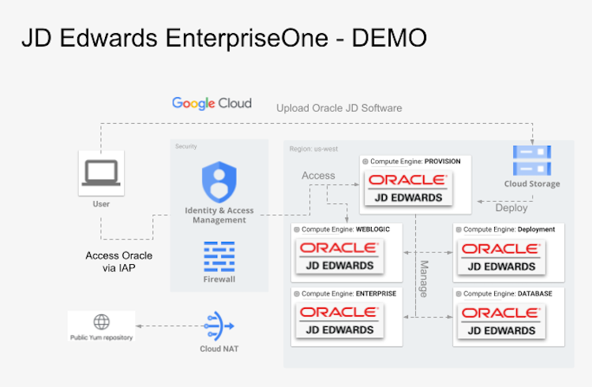


## Prerequisites

Before starting, ensure the following requirements are met:

### Environment
- GCP Project: A Google Cloud project must already exist for this deployment. Note the `PROJECT_ID`.
- Make: Install the `make` tool (version >= 4.3 recommended).

### Quota Requirements
Before deploying Toolkit, verify that your GCP project has sufficient resource quotas in the target region.

Minimum recommended quotas:
- Persistent Disk SSD (GB): ~ 1T 

Check your current quotas with:

```
gcloud compute regions describe <REGION> --project=<PROJECT_ID> \
  --format="flattened(quotas[].metric,quotas[].limit,quotas[].usage)" | grep SSD
  ```

Action if insufficient:

 - Go to Google Cloud Console – Quotas: https://console.cloud.google.com/iam-admin/quotas

 - Filter for Persistent Disk SSD (GB) in your region.

 - Click EDIT QUOTAS and request the desired increase.

 - Once the quotas are approved, proceed with the next steps.

### IAM

Ensure your GCP account has the following IAM roles:

- `roles/iam.serviceAccountUser` – Use service accounts for VM access  
- `roles/iap.tunnelResourceAccessor` – Connect to VMs using IAP tunneling  
- `roles/compute.osAdminLogin` – SSH/RDP access to VMs via OS Login  
- `roles/compute.instanceAdmin.v1` – Start, stop, and manage VM instances  
- **Storage access (choose one):**  
  - `roles/storage.admin` – Full control of Cloud Storage (buckets and objects), **or**  
  - `roles/storage.objectAdmin` – Object-level control only (least privilege option) 

#### Alternatively, the GCP account can have broad roles like:
- `roles/owner`
- `roles/editor`

## Oracle JD Edwards EnterpriseOne Demo Deployment

All Makefile commands should be run from the project root for all the deployments.

### 1. Setup the environment

```bash
# Install required tools
make setup

# Verify GCP account and project
gcloud config list

# Verify GCP access and IAM roles
make verify-gcp-access
```

---

### 2. Authenticate with GCP and configure Application Default Credentials:

Terraform uses Application Default Credentials (ADC) to interact with GCP. Run the following command before initializing Terraform:

```bash
gcloud auth login
```

---

### 3. Deploy Oracle JD Edwards EnterpriseOne Infrastructure

Run the commands below to deploy the Oracle JD Edwards EnterpriseOne environment that consists of 5 servers:

```bash
# Initialize Terraform backend and modules
make init

# IMPORTANT: Verify the disk type and disk sizes in the infra.auto.tfvars file

# Plan the changes
make jde_demo_plan

# Deploy the changes
make jde_demo_deploy
```

---

### 4. Stage Oracle JD Edwards EnterpriseOne required  Media files

To deploy Oracle JD Edwards EnterpriseOne using the [One-Click deployment](https://docs.oracle.com/en/applications/jd-edwards/one-click-provisioning/9.2/eoiol/index.html) process, you'll need to stage Oracle Software from EDelivery, My Oracle Support, and Oracle downloads.

Software from edelivery.oracle.com 
  - JD Edwards One-Click Provisioning 3.15 for Apps 9.2 Tools 9.2.26.1

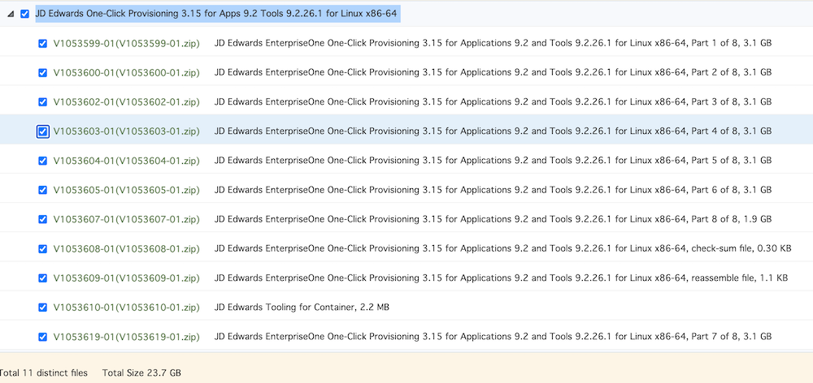

 - Oracle WebLogic 14c

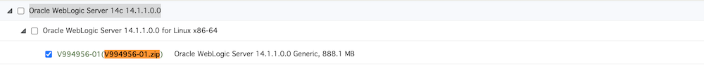

Oracle.com downloads
 - Oracle Database 19c Enterprise Edition 19.3.0.0.0 https://www.oracle.com/database/technologies/oracle19c-linux-downloads.html file (LINUX.X64_193000_db_home.zip)
 - Oracle JDBC driver: https://www.oracle.com/database/technologies/appdev/jdbc-downloads.html file (ojdbc8-full.tar.gz)

Software from support.oracle.com:
  - Oracle OPatch for 19c Database https://updates.oracle.com/download/6880880.html (OPatch 12.2.0.1.52 for DB 19.0.0.0.0)
  - Oracle Database CPU Patch #39034528 https://updates.oracle.com/download/39034528.html
  - Oracle WebLogic CPU patch #39796866 https://updates.oracle.com/download/39796866.html
  - Oracle OPatch for 14c WebWebLogiclogic #28186730 https://updates.oracle.com/download/28186730.html
  
Upload all the Oracle media to the Bucket created by running the jde_demo_deploy process (see output of make jde_demo_deploy)

```bash
# Example
gcloud storage cp jde_media/* $BUCKET/

# Verify that all required files are present in the bucket - if not please review download criteria and stage properly
./scripts/check_oracle_media_on_bucket.sh $BUCKET
  OK      LINUX.X64_193000_db_home.zip
  OK      V1045131-01.zip
  OK      V1053599-01.zip
  OK      V1053600-01.zip
  OK      V1053602-01.zip
  OK      V1053603-01.zip
  OK      V1053604-01.zip
  OK      V1053605-01.zip
  OK      V1053607-01.zip
  OK      V1053608-01.zip
  OK      V1053609-01.zip
  OK      V1053610-01.zip
  OK      V1053619-01.zip
  OK      V1055306-01.zip
  OK      V994956-01.zip
  OK      ojdbc8-full.tar.gz
  OK      p28186730_1394224_Generic.zip
  OK      p39034528_190000_Linux-x86-64.zip
  OK      p39796866_141100_Generic.zip
  OK      p6880880_190000_Linux-x86-64.zip

  All required Oracle media files are present in $BUCKET.

# Note: all remaining steps expecte this specific media and version to be in place (as automated processes)
```

---

### 5. Prepare JD Edwards servers and setup

This requires server setup, and software will be installed on the servers. . The following actions are being completed:
 - Common OS account opc created and SSH keys distributed for communication
 - Required software staged from the bucket to appropriate servers
 - Created and started JDE Provisioning server
 - Provisioned and configured Oracle Database and Listener
 - Provisioned Oracle WebLogic server and domain created
 - Prepared Windows Deployment Server (optional)


```bash
# Deploy JD EntOne required software - runtime ~ 1h15mins
make jde_demo_deploy_soft
```

For IAP tunneling purposes, add the below entries to /etc/hosts (win: C:\Windows\System32\drivers\etc\hosts)

```bash
# Mac hosts file 
cat /etc/hosts
127.0.0.1 jde-demo-prov.c.$PROJECT_ID$ jde-demo-prov
127.0.0.1 jde-demo-db.c.$PROJECT_ID$ jde-demo-db
127.0.0.1 jde-demo-ent.c.$PROJECT_ID$ jde-demo-ent
127.0.0.1 jde-demo-web.c.$PROJECT_ID$ jde-demo-web
127.0.0.1 jde-demo-dep.c.$PROJECT_ID$ jde-demo-dep

```

Open IAP tunnel

```bash

# open 2 tunnels for provisioning server and JD EntONe
gcloud compute ssh --zone "$ZONE$" "jde-demo-prov" --tunnel-through-iap  \
  --project "$PROJECT_ID$"  -- -L 3000:localhost:3000 -L 8998:localhost:8998
gcloud compute ssh --zone "$ZONE$" "jde-demo-web" --tunnel-through-iap  \
  --project "$PROJECT_ID$"   -- -L 7001:localhost:7001 -L 8000:localhost:8000


```

---

### 6. Deploy JD Enterprise One using OneClick Deployment

#### 6.1 Configure Server Manager Account
Documentation: https://docs.oracle.com/en/applications/jd-edwards/one-click-provisioning/9.2/eoiol/configuring-server-manager-account-lc.html

- Once tunnels are open, open a browser and access the provisioning server on port 3000

*Note: this will be an insecure connection, so you must accept to connect*

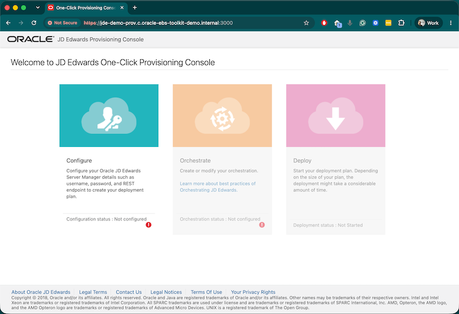

- Click Configure and provide 
  - Server Manager Admin Password
  - WebLogic Server Password 
- These are passwords to connect to Provisioning Server Manager

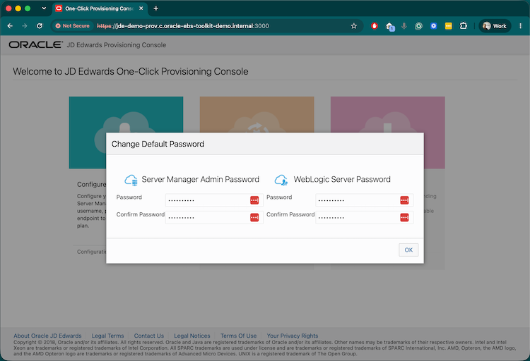

- Changing the default password wheel will take a few minutes; this process provisions Service Manager (SM) Console with the provided passwords.
- Server log: root@jde-demo-prov:/u01/SMConsole/SCFMC/logs/e1agent_0.log

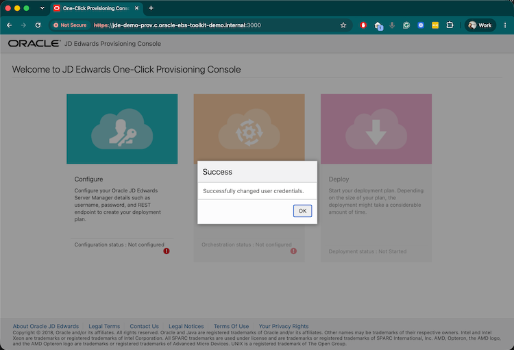

#### 6.2 Create Deployment plan
Documentation: https://docs.oracle.com/en/applications/jd-edwards/one-click-provisioning/9.2/eoiol/orchestrating-using-advanced-mode-lc.html#Orchestrating-an-Advanced-Deployment-Plan

- Click the Configure Tile and provide the jde_admin password (entered in the previous step), then Save Configuration


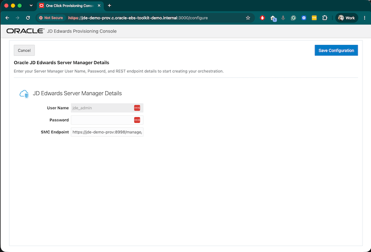


- Provide passwords and SSH keys for the provisioning server
  - Look at ssh key file downloaded into the root dir: jde_oneclick_key.openssh
  - For Windows deployment server, use user: **opc**, password: **Your_Password+132**
  - JDE user password is for FrontEnd access 
  - Site Key passphrase can be skipped

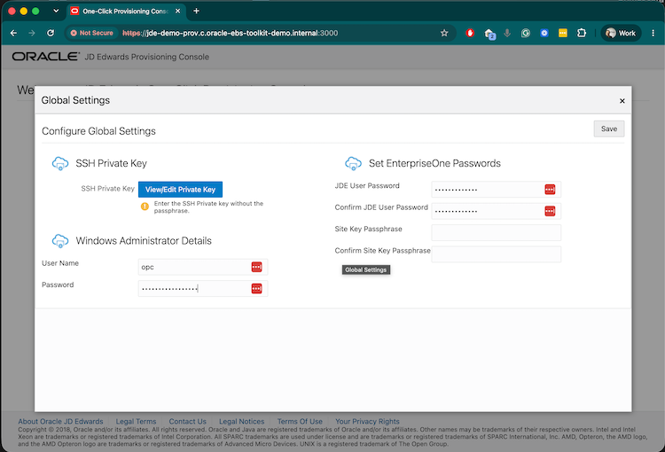

- Click on the Advanced Tile and Add Database Server
  - Instance name: **JDEORCL**
  - Hostname name: **jde-demo-db.c.$DOMAIN** *Note: It is important to have the full domain*
  - DB Install Path: **/u01/app/oracle/product/19.0.0/db_1**
  - DB Admin Password: **Manager123**  *Note: This is PDB:JDEORCL system password*
  - Net Service Name: **JDEORCL**
  - Use ASM feature: **Disabled**
  - JDE DB Install Directory: **/u01/DataDB**
  - JDE DB Table Directory: **/u01/ORATABLE**
  - DE DB Index Directory: **/u01/ORAINDEX**
  - Net Service Name: **JDEORCL**
  - Schemas: **Shared Prototype Pristine Development**
  - Demo Data: **Development Prototype**
- Click OK, this will trigger input validation
- Validation logfile: *[root@jde-demo-prov ~]# tail -f /u01/E1ProvisionPrime/InputValidation/log/JDEORCL_databaseServer_debug.log*

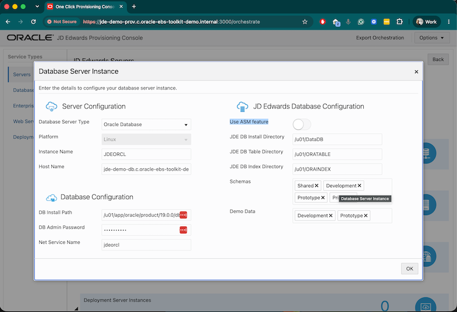

- Click on Advanced Tile and Add Enterprise Server
  - Instance name: **DemoEnt**
  - Hostname name: **jde-demo-ent.c.$DOMAIN** *Note: It is important to have the full domain*
  - HA Enabled: **Disabled**
  - Provide JDBC drivers - part of the previously downloaded ojdbc8-full.tar.gz file
  - Server Type: **Batch Logic** 
  - Database Instance: **JDEORCL**
  - Patchcodes: **Development Prototype Pristing**
- Click OK, this will trigger input validation
- Validation logfile: *[root@jde-demo-prov ~]# tail -f /u01/E1ProvisionPrime/InputValidation/log/DemoEnt_entServer_debug.log*

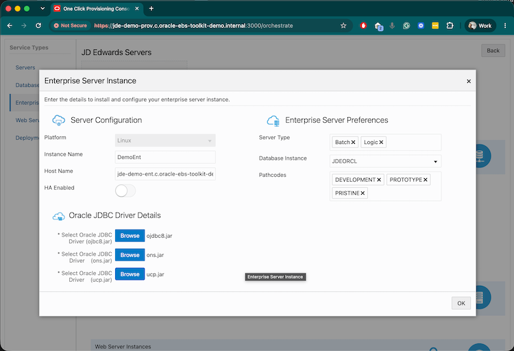

- Click on Advanced Tile and Add Web Server:
  - Instance name: **DedicatedHTML**
  - Hostname name: **jde-demo-web.c.$DOMAIN** *Note: It is important to have the full domain*
  - Port: **8001**
  - Type: **HTML Server**
  - Enterprise Server Instance: **DemoEnt** 
  - PathCode: **DEVELOPMENT**
  - Standard JAS: **Disabled**
  - User Name: **weblogic**
  - Password: **AdminPassword123** *Note: User created in previous steps**
  - Admin Port: **7001**
  - Install Path: **/u01/app/wls**
  - JDK Install Path: **/u01/jdk**
  - HA Enabled: **Disabled**
- Click OK, this will trigger input validation
- Validation logfile: *[root@jde-demo-prov ~]# tail -f /u01/E1ProvisionPrime/InputValidation/log/DedicatedHTML_webServer_debug.log*

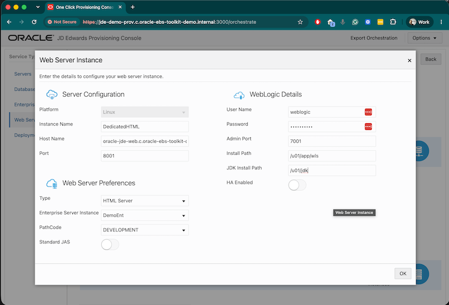


- [!!! OPTIONAL !!!] Only if required - Click on Advanced Tile and Add Deployment Server:
  - Instance name: **DemoDEP**
  - Hostname name: **jde-demo-dep.c.$DOMAIN** *Note: It is important to have the full domain*
  - Location: **US**
  - Installation Drive: **C:**
- Click OK, this will trigger input validation
- Validation logfile: *[root@jde-demo-prov ~]# tail -f /u01/E1ProvisionPrime/InputValidation/log/DemoDEP_depServer_debug.log*

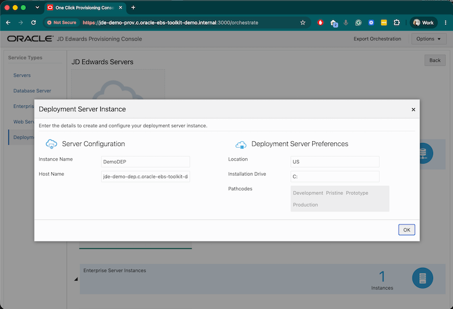

#### 6.2 Deploy JD EntOne
Documentation: https://docs.oracle.com/en/applications/jd-edwards/one-click-provisioning/9.2/eoiol/deploying-an-orchestration-lc.html#Adding-Additional-Pathcodes-Post-Deployment

From Orchestration, navigate to the Deployment tile:
- Review the high-level deployment plan and click Start Deployment
- deployment logs written to *[root@jde-demo-prov ~]# cd /u01/E1ProvisionPrime/log*

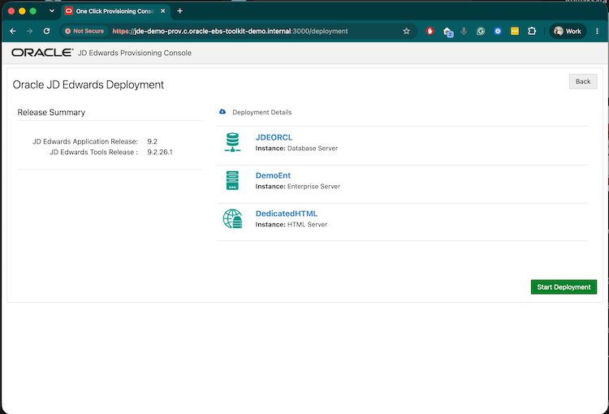

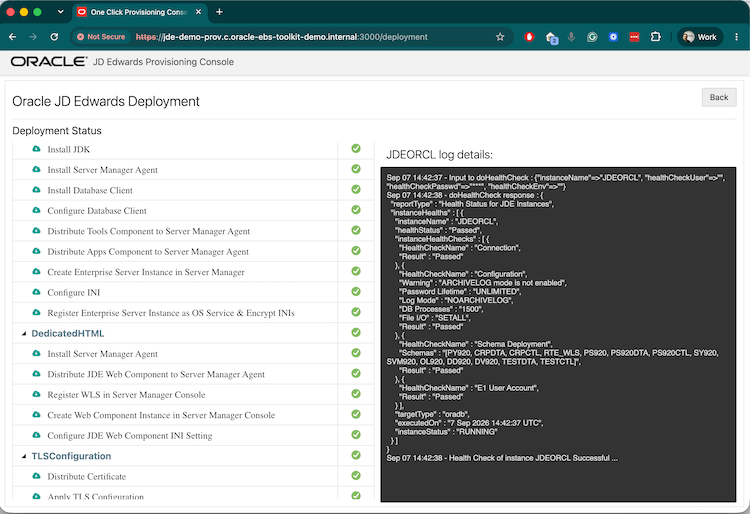

#### 6.3 Connect JDE and Admin console
Documentation: https://docs.oracle.com/en/applications/jd-edwards/one-click-provisioning/9.2/eoiol/deploying-an-orchestration-lc.html#Adding-Additional-Pathcodes-Post-Deployment

Once deployment is complete, do IAP port forwarding for the web tier (see infrastructure provisioning output):
 - tunneling example: *gcloud compute ssh --zone "<zone>" "jde-demo-web" --tunnel-through-iap --project "<project>"  -- -L 7001:localhost:7001 -L 8001:localhost:8001*
 - URL: *https://jde-demo-web.c.<PROJECT>.internal:8001/*
 - User: *JDE*, password: *one supplied in the second step JDE user password*

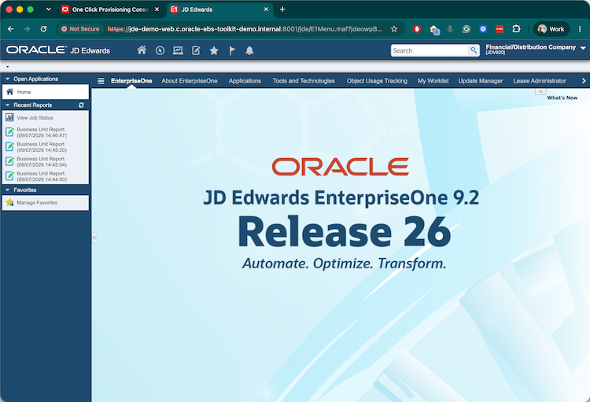

- Manger console URL: *https://jde-demo-prov.c.<PROJECT>>.internal:8998/manage/home*
- User: *jde_admin*, password: *one supplied in the first step Server Manager Admin password*

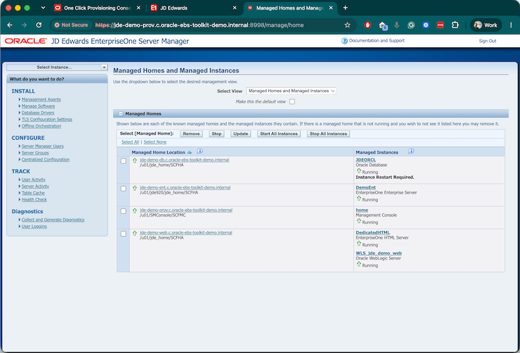

---

### 7. Destroy Oracle JD Edwards EnterpriseOne Demo environment

```bash
# Destroy JD infrastructure (including buckets, networks and VM)

make jde_demo_destroy

```
---

### Notes

- `PROJECT_ID` is auto-detected from `gcloud config` or can be passed explicitly

- Run `make verify-gcp-access` **once** to confirm IAM roles; it is not required for each Terraform command.
