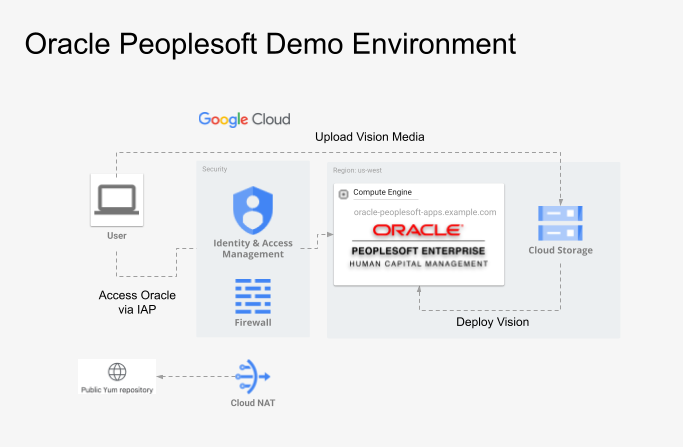
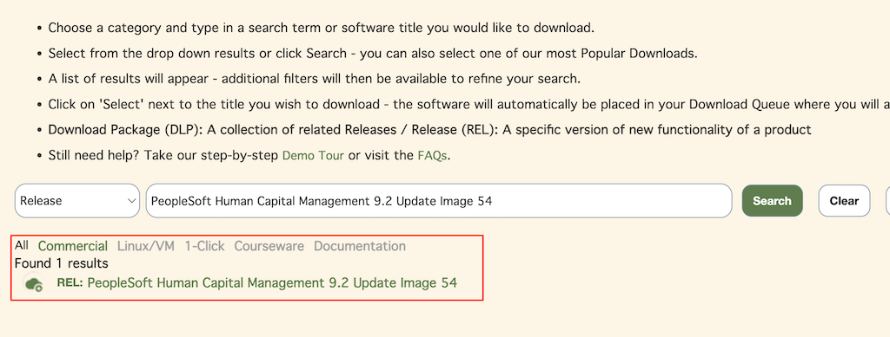
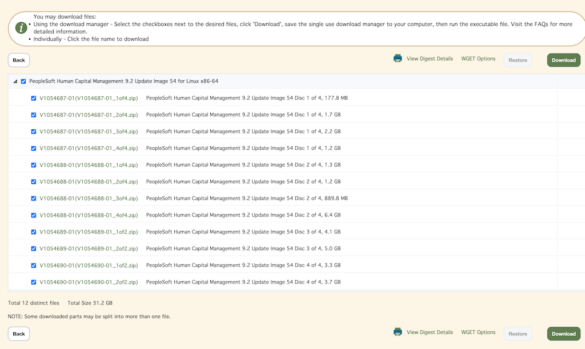

# Oracle PeopleSoft Toolkit on GCP | Oracle PeopleSoft PUM (Demo data)

 - follow [README_customer_data.md](README_customer_data.md) to Setup Oracle PeopleSoft environment with customer data

## Purpose

This artifact provides a fully automated framework to deploy a single-node **Oracle Peoplesoft (PUM) Demo** environment onto a clean Google Cloud Platform (GCP) project. Utilizing Terraform for infrastructure-as-code and automated staging/installation scripts, this toolkit eliminates the manual complexity typically associated with provisioning Oracle Peoplesoft. 

The primary goals of this repository are to:
* **Accelerate Evaluation:** Allow enterprise architects, administrators, and business users to rapidly stand up an operational Oracle Peoplesoft Demo instance to evaluate its functionality, workflow engine, and user experience on GCP.
* **Benchmark Performance:** Provide an isolated sandbox environment to test, review, and baseline the performance capabilities of Oracle workloads running on Google Cloud Compute Engine and SSD Persistent Disks.
* **Demonstrate Best Practices:** Serve as a reference implementation for cloud infrastructure layout, Identity-Aware Proxy (IAP) secure tunneling, and automated deployment patterns for legacy enterprise applications.

*Note: This environment is intended for demonstration, testing, and proof-of-concept (PoC) purposes and is not intended for production workloads.*

## Architectural Diagram

### Oracle PeopleSoft on GCP



## Prerequisites

Before starting, ensure the following requirements are met:

### Environment
- GCP Project: A Google Cloud project must already exist for this deployment. Note the `PROJECT_ID`.
- Make: Install the `make` tool (version >= 4.3 recommended).
- GCLOUD CLI

### Quota Requirements
Before deploying Toolkit, verify that your GCP project has sufficient resource quotas in the target region.

Minimum recommended quotas:
- Persistent Disk SSD (GB): ≥ 300GB

Check your current quotas with:

```
gcloud compute regions describe <REGION> --project=<PROJECT_ID> \
  --format="flattened(quotas[].metric,quotas[].limit,quotas[].usage)" | grep SSD
  ```

Action if insufficient:

 - Go to Google Cloud Console – Quotas: https://console.cloud.google.com/iam-admin/quotas

 - Filter for Persistent Disk SSD (GB) in your region.

 - Click EDIT QUOTAS and request the desired increase.

 - Once the quotas are approved, proceed with the next steps.

### IAM

Ensure your GCP account has the following IAM roles:

- `roles/iam.serviceAccountUser` – Use service accounts for VM access  
- `roles/iap.tunnelResourceAccessor` – Connect to VMs using IAP tunneling  
- `roles/compute.osAdminLogin` – SSH/RDP access to VMs via OS Login  
- `roles/compute.instanceAdmin.v1` – Start, stop, and manage VM instances  
- **Storage access (choose one):**  
  - `roles/storage.admin` – Full control of Cloud Storage (buckets and objects), **or**  
  - `roles/storage.objectAdmin` – Object-level control only (least privilege option) 

#### Alternatively, the GCP account can have broad roles like:
- `roles/owner`

- `roles/editor`

## Oracle PeopleSoft PUM (Demo data) Deployment

All Makefile commands should be run from the project root for all the deployments.

### 1. Setup the environment

```bash
# Install required tools
make setup

# Verify GCP account and project
gcloud config list

# Verify GCP access and IAM roles
make verify-gcp-access
```

---

### 2. Authenticate with GCP and configure Application Default Credentials:

Terraform uses Application Default Credentials (ADC) to interact with GCP. Run the following command before initializing Terraform:

```bash
gcloud auth application-default login
```

---

### 3. Deploy PeopleSoft PUM (Demo) Infrastructure

Run the commands below to deploy the Oracle PeopleSoft single-node demo environment:

```bash
# Initialize Terraform backend and modules
make init

# IMPORTANT: Verify the disk type and disk sizes in the infra.auto.tfvars file

# Plan the changes
make plan

# Deploy the changes
make deploy
```

---

### 4. Stage Vision Media files

1) Login to https://edelivery.oracle.com using your Oracle account
2) Search for "PeopleSoft Human Capital Management 9.2 Update Image 54" or later and download the media (~ 15 V*.zip files)
3) Copy those Oracle Peoplsesoft media to the GCP bucket created by the steps above 




*Note: this toolkit can be used to deploy all PeopleSoft pillars like hcm, crm, cs, elm, fscm, ih* 


```bash
# Example
gcloud storage cp V*.zip gs://oracle-peoplesoft-toolkit-storage-bucket-d184e6a3/

gcloud storage ls //oracle-peoplesoft-toolkit-storage-bucket-d184e6a3/
gs://oracle-peoplesoft-toolkit-storage-bucket-d184e6a3/V100750-01.zip
gs://oracle-peoplesoft-toolkit-storage-bucket-d184e6a3/V1054248-01.zip
gs://oracle-peoplesoft-toolkit-storage-bucket-d184e6a3/V1054561-01.zip
gs://oracle-peoplesoft-toolkit-storage-bucket-d184e6a3/V1054687-01_1of4.zip
gs://oracle-peoplesoft-toolkit-storage-bucket-d184e6a3/V1054687-01_2of4.zip
gs://oracle-peoplesoft-toolkit-storage-bucket-d184e6a3/V1054687-01_3of4.zip
gs://oracle-peoplesoft-toolkit-storage-bucket-d184e6a3/V1054687-01_4of4.zip
gs://oracle-peoplesoft-toolkit-storage-bucket-d184e6a3/V1054688-01_1of4.zip
gs://oracle-peoplesoft-toolkit-storage-bucket-d184e6a3/V1054688-01_2of4.zip
gs://oracle-peoplesoft-toolkit-storage-bucket-d184e6a3/V1054688-01_3of4.zip
gs://oracle-peoplesoft-toolkit-storage-bucket-d184e6a3/V1054688-01_4of4.zip
gs://oracle-peoplesoft-toolkit-storage-bucket-d184e6a3/V1054689-01_1of2.zip
gs://oracle-peoplesoft-toolkit-storage-bucket-d184e6a3/V1054689-01_2of2.zip
gs://oracle-peoplesoft-toolkit-storage-bucket-d184e6a3/V1054690-01_1of2.zip
gs://oracle-peoplesoft-toolkit-storage-bucket-d184e6a3/V1054690-01_2of2.zip

```

---

### 5. Deploy Oracle PeopleSoft Demo environment

This process lasts ~90-120 minutes

```bash
# Deploy changes
make deploy_peoplesoft
```

Add the following line (127.0.0.1 oracle-peoplesoft-apps.c.oracle-ebs-toolkit-demo.internal oracle-peoplesoft-apps) to the local hosts file:

```bash
# Mac hosts file 
cat /etc/hosts
    127.0.0.1 oracle-peoplesoft-apps.c.oracle-ebs-toolkit-demo.internal oracle-peoplesoft-apps

# Windows hosts file
C:\windows\system32\drivers\etc\hosts
    127.0.0.1 oracle-peoplesoft-apps.c.oracle-ebs-toolkit-demo.internal oracle-peoplesoft-apps
```

Open IAP tunnel

```bash
# open tunnel
gcloud compute ssh "oracle-peoplesoft-apps" --tunnel-through-iap  \
 --project "oracle-ebs-toolkit" -- -L 8000:localhost:8000

```

Open a browser and login to http://oracle-peoplesoft-apps.c.oracle-ebs-toolkit-demo.internal:8000 using PS/Manager123

---

### 6. Available additional commands

After the Oracle PeopleSoft Demo environment deployment process, a few extra functions are available. 
Also, the server can be stoped/started, and Oracle PeopleSoft will autostart/stop along.

```bash
# Review PeopleSoft Demo environment details for troubleshooting deployment
make peoplesoft_stop

# Start PeopleSoft Demo environment
make peoplesoft_start

```

---

### 7. Destroy Vision Media

```bash
# Destroy Vision infrastructure (including buckets and VM)
make destroy
```
---

### Notes

- `PROJECT_ID` is auto-detected from `gcloud config` or can be passed explicitly

- Run `make verify-gcp-access` **once** to confirm IAM roles; it is not required for each Terraform command.
