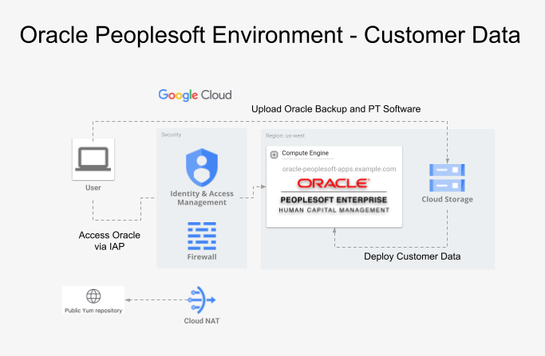

# Oracle PeopleSoft Toolkit on GCP | Oracle PeopleSoft (Customer data)

## Purpose

This artifact provides a fully automated framework to deploy a single-node **Oracle PeopleSoft Customer** environment onto a clean Google Cloud Platform (GCP) project. Utilizing Terraform for infrastructure-as-code and automated staging/installation scripts, this toolkit eliminates the manual complexity typically associated with provisioning Oracle PeopleSoft. 

The primary goals of this repository are to:
* **Accelerate Evaluation:** Enable enterprise architects, administrators, and business users to rapidly stand up an operational Oracle PeopleSoft instance to evaluate its functionality, workflow engine, and user experience on GCP.
* **Benchmark Performance:** Provide an isolated sandbox environment to test, review, and baseline the performance capabilities of Oracle workloads running on Google Cloud Compute Engine and SSD Persistent Disks.
* **Demonstrate Best Practices:** Serve as a reference implementation for cloud infrastructure layout, Identity-Aware Proxy (IAP) secure tunneling, and automated deployment patterns for legacy enterprise applications.

*Note: This environment is intended for demonstration, testing, and proof-of-concept (PoC) purposes and is not intended for production workloads.*

## Architectural Diagram

### Oracle PeopleSoft on GCP



## Prerequisites

Before starting, ensure the following requirements are met:

### Environment
- GCP Project: A Google Cloud project must already exist for this deployment. Note the `PROJECT_ID`.
- Make: Install the `make` tool (version >= 4.3 recommended).
- GCLOUD CLI

### Quota Requirements
Before deploying Toolkit, verify that your GCP project has sufficient resource quotas in the target region.

Minimum recommended quotas:
- Persistent Disk SSD (GB): ≥ 300GB

Check your current quotas with:

```
gcloud compute regions describe <REGION> --project=<PROJECT_ID> \
  --format="flattened(quotas[].metric,quotas[].limit,quotas[].usage)" | grep SSD
  ```

Action if insufficient:

 - Go to Google Cloud Console – Quotas: https://console.cloud.google.com/iam-admin/quotas

 - Filter for Persistent Disk SSD (GB) in your region.

 - Click EDIT QUOTAS and request the desired increase.

 - Once the quotas are approved, proceed with the next steps.

### IAM

Ensure your GCP account has the following IAM roles:

- `roles/iam.serviceAccountUser` – Use service accounts for VM access  
- `roles/iap.tunnelResourceAccessor` – Connect to VMs using IAP tunneling  
- `roles/compute.osAdminLogin` – SSH/RDP access to VMs via OS Login  
- `roles/compute.instanceAdmin.v1` – Start, stop, and manage VM instances  
- **Storage access (choose one):**  
  - `roles/storage.admin` – Full control of Cloud Storage (buckets and objects), **or**  
  - `roles/storage.objectAdmin` – Object-level control only (least privilege option) 

#### Alternatively, the GCP account can have broad roles like:
- `roles/owner`

- `roles/editor`

## Oracle PeopleSoft (Customer data) Deployment

All Makefile commands should be run from the project root for all the deployments.

### 1. Setup the environment

```bash
# Install required tools
make setup

# Verify GCP account and project
gcloud config list

# Verify GCP access and IAM roles
make verify-gcp-access
```

---

### 2. Authenticate with GCP and configure Application Default Credentials:

Terraform uses Application Default Credentials (ADC) to interact with GCP. Run the following command before initializing Terraform:

```bash
gcloud auth application-default login
```

---

### 3. Deploy PeopleSoft Infrastructure

Run the commands below to deploy the Oracle PeopleSoft single-node environment for customer data:

```bash
# Initialize Terraform backend and modules
make init

# IMPORTANT: Verify the disk type and disk sizes in the infra.auto.tfvars file

# Plan the changes
make plan

# Deploy the changes
make deploy
```

---
#### 3.1 Prepare Oracle PeopleSoft database to be packed for GCP

Pack the RDBMS Oracle home and Oracle RMAN backup as shown below:

```bash
# BACKUP_DIR can be any directory with enough space to hold backup data

BACKUP_DIR=/home/oracle/
mkdir -p $BACKUP_DIR/RMAN_TO_GCP

export ORACLE_HOME=<Oracle Home location>
export ORACLE_SID=<Oracle Sid>
export PATH=$ORACLE_HOME/bin:$PATH

cd $BACKUP_DIR
time tar -czf RDBMS_TO_GCP.tar.gz -C $(dirname $ORACLE_HOME	) $(basename ${ORACLE_HOME})

# navigate to the target directory capable of storing RMAN backup

cd $BACKUP_DIR/RMAN_TO_GCP

# trigger RMAN full cold backup

# parallelism can be altered and needs to set BACKUP_DIR

time rman target / <<EOF
RUN {
    CONFIGURE DEVICE TYPE DISK PARALLELISM 8 BACKUP TYPE TO BACKUPSET;
    CONFIGURE CHANNEL DEVICE TYPE DISK MAXPIECESIZE 30G;
    BACKUP AS COMPRESSED BACKUPSET SPFILE FORMAT '${BACKUP_DIR}/spfile_%d_%T_%U.bkp' TAG='FULL_COLD_SPFILE';
    BACKUP AS COMPRESSED BACKUPSET CURRENT CONTROLFILE FORMAT '${BACKUP_DIR}/controlfile_%d_%T_%U.bkp' TAG='FULL_COLD_CONTROL';
    BACKUP AS COMPRESSED BACKUPSET DATABASE FORMAT '${BACKUP_DIR}/full_%d_%T_ch%U.bkp' TAG='FULL_COLD_BACKUP';
    BACKUP AS COMPRESSED BACKUPSET ARCHIVELOG ALL FORMAT '${BACKUP_DIR}/ARCH_%d_%T_ch%U.bkp' TAG='FULL_COLD_BACKUP'; }
EXIT;
EOF

```

---
#### 3.2 Prepare Oracle PeopleSoft Application FS to be packed for GCP

Pack the entire PeopleSoft Peopletools (pt) directory. 

```bash

# Source the environment file and archive PeopleTools
source psft.env
tar -czf PT_TO_GCP.tar.gz -C $PS_APP_HOME/../ . 

```

Pack the PeopleSoft configuration home (PS_CFG_HOME). 

```bash

# Source the environment file and archive Configuration
source psft.env
tar -czf PS_CFG_HOME_TO_GCP.tar.gz -C $PS_CFG_HOME . 

```

Additionally, create a file named `domaininfo.txt` with the following contents:
 - APP_DOMAIN_NAME is the name of your environment's application server domain name.
 - PRCS_DOMAIN_NAME is the name of your environment's process server domain name.
 - WEB_DOMAIN_NAME is the name of your environment's weblogic server domain name.


An example is shown below, please ensure correct values and format since this file is read by the automation code and used to setup PeopleSoft environment on GCP:

```bash

cat domaininfo.txt

APP_DOMAIN_NAME=APPDOM
PRCS_DOMAIN_NAME=PRCSDOM
WEB_DOMAIN_NAME=peoplesoft

```

Lastly, a locate and copy of the environment file named `psft.env`

---
#### 3.3 Copy media to the GCP bucket

Copy packed media to the GCP bucket

```bash

# Copy 

GCP_BUCKET=$(gcloud storage ls | grep oracle-peoplesoft-toolkit-storage-bucket)
gcloud storage cp RDBMS_TO_GCP.tar.gz ${GCP_BUCKET}
gcloud storage cp PT_TO_GCP.tar.gz ${GCP_BUCKET}
gcloud storage cp PS_CFG_HOME_TO_GCP.tar.gz ${GCP_BUCKET}
gcloud storage cp domaininfo.txt ${GCP_BUCKET}
gcloud storage cp psft.env ${GCP_BUCKET}
gcloud storage cp -r ${BACKUP_DIR}/RMAN_TO_GCP/* ${GCP_BUCKET}

```

### 4. Deploy Oracle PeopleSoft environment
This process lasts ~90-120 minutes

```bash
# Deploy changes
make deploy_customer_peoplesoft
```

Add the following line (127.0.0.1 oracle-peoplesoft-apps.c.oracle-ebs-toolkit-demo.internal oracle-peoplesoft-apps) to the local hosts file:

```bash
# Mac hosts file 
cat /etc/hosts
    127.0.0.1 oracle-peoplesoft-apps.c.oracle-ebs-toolkit-demo.internal oracle-peoplesoft-apps

# Windows hosts file
C:\windows\system32\drivers\etc\hosts
    127.0.0.1 oracle-peoplesoft-apps.c.oracle-ebs-toolkit-demo.internal oracle-peoplesoft-apps
```

Open IAP tunnel

```bash
# open tunnel
gcloud compute ssh "oracle-peoplesoft-apps" --tunnel-through-iap  \
 --project "oracle-ebs-toolkit" -- -L 8001:localhost:8001

```

Open a browser and login to http://oracle-peoplesoft-apps.c.oracle-ebs-toolkit-demo.internal:8001 
use your normal credentials to login.


---

### 5. Destroy Oracle PeopleSoft infrastructure

```bash
# Destroy Oracle PeopleSoft infrastructure (including networking, buckets and VM)
make destroy
```
---

### Notes

- `PROJECT_ID` is auto-detected from `gcloud config` or can be passed explicitly

- Run `make verify-gcp-access` **once** to confirm IAM roles; it is not required for each Terraform command.
