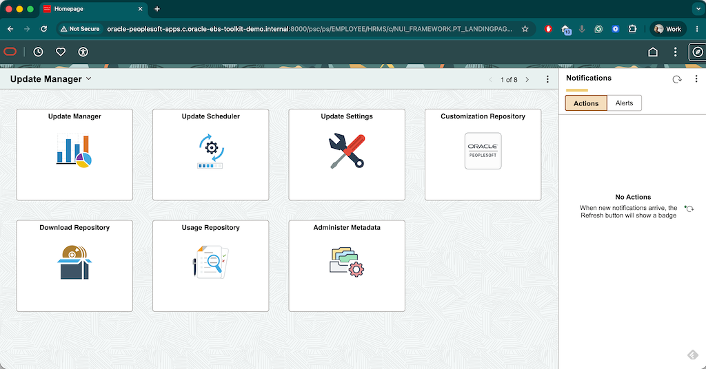

# Oracle Peoplesoft Toolkit on GCP Demo logfile output example

This file shows example of exeucing Oracle Peoplesoft DEMO on GCP deployment log and outputs as well as timings and expected resutls


### 1. Setup the environment

```bash
Last login: Wed May 20 14:09:06 on ttys002

[user@host] ~ % cd GitHub/architecture-center-samples/oracle-peoplesoft-framework
[user@host] oracle-peoplesoft-framework % ls -l
total 136
-rw-r--r--@ 1 user  staff   407 May 20 14:21 backend.tf
-rw-r--r--@ 1 user  staff   684 May 20 14:21 buckets.tf
-rw-r--r--@ 1 user  staff  2771 May 20 14:21 firewall-rules.tf
-rw-r--r--@ 1 user  staff   849 May 20 14:21 infra.auto.tfvars
-rw-r--r--@ 1 user  staff   359 May 20 14:21 locals.tf
-rw-r--r--@ 1 user  staff  5309 May 20 14:21 Makefile
-rw-r--r--@ 1 user  staff  1173 May 20 14:21 output.tf
-rw-r--r--@ 1 user  staff   434 May 20 14:21 project.tf
-rw-r--r--@ 1 user  staff   149 May 20 14:21 provider.tf
-rw-r--r--@ 1 user  staff  5468 May 20 14:29 README.md
drwxr-xr-x@ 5 user  staff   160 May 20 14:21 scripts
-rw-r--r--@ 1 user  staff   407 May 20 14:21 service-accounts.tf
-rw-r--r--@ 1 user  staff  6259 May 20 14:21 variables.tf
-rw-r--r--@ 1 user  staff  2855 May 20 14:21 vm.tf
-rw-r--r--@ 1 user  staff  2284 May 20 14:21 vpc.tf
[user@host] oracle-peoplesoft-framework % make setup
Running setup...
bash scripts/install.sh
gcloud already exists.
✔ Terraform already installed: 1.13.0
✔ terraform-docs already installed: 0.20.0
All tools installed and configured.
Setup complete.
Make sure you are setup with gcloud init with the project that will be used for this deployment and proceed to verify-gcp-access'.
[user@host] oracle-peoplesoft-framework % gcloud config list
[core]
account = user@example.com
disable_usage_reporting = False
project = oracle-plpsft-toolkit-demo

Your active configuration is: [default]
[environment: untagged] Read more to tag: g.co/cloud/project-env-tag.
[user@host] oracle-peoplesoft-framework % make verify-gcp-access
 Verifying GCP access for project: oracle-plpsft-toolkit-demo
Access to project oracle-plpsft-toolkit-demo confirmed.
 Checking IAM roles for user@example.com...
 User has Owner/Editor role → skipping fine-grained permission checks.

 GCP access check passed for project: oracle-plpsft-toolkit-demo
```

---

### 3. Deploy Peoplesoft PUM (Demo) Infrastructure

Run the commands below to deploy the Oracle Peoplesoft single-node demo environment:

```bash


[user@host] oracle-peoplesoft-framework % make init
Checking if backend bucket gs://oracle-plpsft-toolkit-demo-119724395047-terraform-state exists...
Initializing Terraform in ....
Initializing the backend...

Successfully configured the backend "gcs"! Terraform will automatically
use this backend unless the backend configuration changes.
Initializing modules...
Downloading registry.terraform.io/terraform-google-modules/cloud-router/google 6.1.0 for cloud_router...
- cloud_router in .terraform/modules/cloud_router
Downloading registry.terraform.io/terraform-google-modules/network/google 18.1.0 for firewall_rules...
- firewall_rules in .terraform/modules/firewall_rules/modules/firewall-rules
Downloading registry.terraform.io/terraform-google-modules/network/google 18.1.0 for nat_gateway_route...
- nat_gateway_route in .terraform/modules/nat_gateway_route/modules/routes
Downloading registry.terraform.io/terraform-google-modules/network/google 18.1.0 for network...
- network in .terraform/modules/network
- network.firewall_rules in .terraform/modules/network/modules/firewall-rules
- network.private_service_access in .terraform/modules/network/modules/private-service-access
- network.routes in .terraform/modules/network/modules/routes
- network.subnets in .terraform/modules/network/modules/subnets
- network.vpc in .terraform/modules/network/modules/vpc
Downloading registry.terraform.io/terraform-google-modules/cloud-storage/google 12.3.0 for peoplesoft_storage_bucket...
- peoplesoft_storage_bucket in .terraform/modules/peoplesoft_storage_bucket/modules/simple_bucket
Downloading registry.terraform.io/terraform-google-modules/kms/google 4.1.2 for peoplesoft_storage_bucket.encryption_key...
- peoplesoft_storage_bucket.encryption_key in .terraform/modules/peoplesoft_storage_bucket.encryption_key
Downloading registry.terraform.io/terraform-google-modules/project-factory/google 18.2.0 for project_services...
- project_services in .terraform/modules/project_services/modules/project_services
Initializing provider plugins...
- Finding hashicorp/google-beta versions matching ">= 3.43.0, >= 4.64.0, >= 6.18.0, >= 6.19.0, >= 6.37.0, < 8.0.0"...
- Finding hashicorp/google versions matching ">= 3.33.0, >= 3.43.0, >= 3.83.0, >= 4.51.0, >= 4.64.0, >= 5.31.0, >= 6.18.0, >= 6.19.0, >= 6.28.0, >= 6.37.0, < 7.0.0, < 8.0.0"...
- Finding latest version of hashicorp/random...
- Finding latest version of hashicorp/null...
- Installing hashicorp/google-beta v7.33.0...
- Installed hashicorp/google-beta v7.33.0 (signed by HashiCorp)
- Installing hashicorp/google v6.50.0...
- Installed hashicorp/google v6.50.0 (signed by HashiCorp)
- Installing hashicorp/random v3.9.0...
- Installed hashicorp/random v3.9.0 (signed by HashiCorp)
- Installing hashicorp/null v3.3.0...
- Installed hashicorp/null v3.3.0 (signed by HashiCorp)
Terraform has created a lock file .terraform.lock.hcl to record the provider
selections it made above. Include this file in your version control repository
so that Terraform can guarantee to make the same selections by default when
you run "terraform init" in the future.

Terraform has been successfully initialized!

You may now begin working with Terraform. Try running "terraform plan" to see
any changes that are required for your infrastructure. All Terraform commands
should now work.

If you ever set or change modules or backend configuration for Terraform,
rerun this command to reinitialize your working directory. If you forget, other
commands will detect it and remind you to do so if necessary.
Terraform initialized successfully.
[user@host] oracle-peoplesoft-framework % make plan
terraform -chdir=. plan \
	  -var="project_id=oracle-plpsft-toolkit-demo" \
	  -var="project_service_account_email=project-service-account@oracle-plpsft-toolkit-demo.iam.gserviceaccount.com"
data.google_compute_image.apps_image: Reading...
module.peoplesoft_storage_bucket.data.google_storage_project_service_account.gcs_account: Reading...
data.google_compute_image.apps_image: Read complete after 1s [id=projects/oracle-linux-cloud/global/images/oracle-linux-8-v20260513]
module.peoplesoft_storage_bucket.data.google_storage_project_service_account.gcs_account: Read complete after 1s [id=service-119724395047@gs-project-accounts.iam.gserviceaccount.com]

Terraform used the selected providers to generate the following execution plan. Resource actions are indicated with the following symbols:
  + create

Terraform will perform the following actions:

  # google_compute_address.nat_ip["oracle-peoplesoft-toolkit-nat-01"] will be created
  + resource "google_compute_address" "nat_ip" {
      + address            = (known after apply)
      + address_type       = "EXTERNAL"
      + creation_timestamp = (known after apply)
      + effective_labels   = {
          + "goog-terraform-provisioned" = "true"
        }
      + id                 = (known after apply)
      + label_fingerprint  = (known after apply)
      + name               = "oracle-peoplesoft-toolkit-nat-01"
      + network_tier       = (known after apply)
      + prefix_length      = (known after apply)
      + project            = "oracle-plpsft-toolkit-demo"
      + purpose            = (known after apply)
      + region             = "us-central1"
      + self_link          = (known after apply)
      + subnetwork         = (known after apply)
      + terraform_labels   = {
          + "goog-terraform-provisioned" = "true"
        }
      + users              = (known after apply)
    }

  # google_compute_address.peoplesoft_apps_server_internal_ip will be created
  + resource "google_compute_address" "peoplesoft_apps_server_internal_ip" {
      + address            = "10.115.0.20"
      + address_type       = "INTERNAL"
      + creation_timestamp = (known after apply)
      + effective_labels   = {
          + "goog-terraform-provisioned" = "true"
        }
      + id                 = (known after apply)
      + label_fingerprint  = (known after apply)
      + name               = "peoplesoft-apps-server-internal-ip"
      + network_tier       = (known after apply)
      + prefix_length      = (known after apply)
      + project            = "oracle-plpsft-toolkit-demo"
      + purpose            = (known after apply)
      + region             = "us-central1"
      + self_link          = (known after apply)
      + subnetwork         = "oracle-peoplesoft-toolkit-subnet-01"
      + terraform_labels   = {
          + "goog-terraform-provisioned" = "true"
        }
      + users              = (known after apply)
    }

  # google_compute_instance.apps will be created
  + resource "google_compute_instance" "apps" {
      + can_ip_forward       = false
      + cpu_platform         = (known after apply)
      + creation_timestamp   = (known after apply)
      + current_status       = (known after apply)
      + deletion_protection  = false
      + effective_labels     = {
          + "goog-terraform-provisioned" = "true"
          + "managed-by"                 = "terraform"
        }
      + id                   = (known after apply)
      + instance_id          = (known after apply)
      + label_fingerprint    = (known after apply)
      + labels               = {
          + "managed-by" = "terraform"
        }
      + machine_type         = "e2-highmem-8"
      + metadata             = {
          + "enable-oslogin" = "TRUE"
          + "startup-script" = <<-EOT
                #!/bin/bash
                set -e

                # NOTE: This is Peoplesoft server boot script - all the updates add here

                # Update packages - skipping due to this is time consuming
                # dnf update -y

                # Enable Google Cloud repo
                tee /etc/yum.repos.d/google-cloud-sdk.repo << 'EOF'
                [google-cloud-cli]
                name=Google Cloud CLI
                baseurl=https://packages.cloud.google.com/yum/repos/cloud-sdk-el8-x86_64
                enabled=1
                gpgcheck=1
                repo_gpgcheck=0
                gpgkey=https://packages.cloud.google.com/yum/doc/rpm-package-key.gpg
                EOF

                # Install Cloud SDK
                dnf install -y google-cloud-cli

                # Verify installation
                gcloud --version
                gcloud storage ls

                # disable IPV6
                sudo sysctl -w net.ipv6.conf.all.disable_ipv6=1
                sudo sysctl -w net.ipv6.conf.default.disable_ipv6=1
                sysctl -p

                # dnf oracle packages
                dnf config-manager --set-enabled ol8_addons
                dnf install oracle-ebs-server-R12-preinstall -y
                dnf install oracle-database-preinstall-19c -y
                dnf install gcc gcc-c++ elfutils-libelf-devel fontconfig-devel libXrender-devel librdmacm-devel unixODBC libnsl.i686 libnsl2.i686 policycoreutils-python-utils tmux expect -y

                # dnf cleanup
                dnf clean all

                # dir precreate and owberships
                mkdir -v -p /u01 /u02
                chown oracle:oinstall /u01
                chown oracle:oinstall /u02

                # Peoplesoft directories for PUM preinstall prerequisites
                mkdir -pv  /u01/install/ /ds2 /srv/dpk/oracle /ds2/dpk/PT862P05B_2509240500-retail-orasrvlnx/oracleserver-2623528/oracle-server/product/19.3.0.0/bin/ /u02/db/oracle-server/admin/CDBCRM/adump
                chown -Rf oracle:oinstall /u02 /u01 /ds2 /srv/
                touch  /etc/oratab
                chown  oracle:oinstall /etc/oratab

                # remove profiles
                mv -v /etc/profile.d/modules.sh /etc/profile.d/modules.sh.back
                mv -v /etc/profile.d/scl-init.sh /etc/profile.d/scl-init.sh.back
                mv -v /etc/profile.d/which2.sh /etc/profile.d/which2.sh.back

                # link libs
                ln -s /usr/lib/libXm.so.4.0.4 /usr/lib/libXm.so.2

                # unset witch for oracle (Preinstall RPM install oracle)
                if [[ $(grep which /home/oracle/.bash_profile | wc -l) -eq 0 ]]; then echo "unset which" >> /home/oracle/.bash_profile ; fi

                # function to source env on
                if [[ $(grep funct.sh /home/oracle/.bash_profile | wc -l) -eq 0 ]]; then echo "source /scripts/funct.sh" >> /home/oracle/.bash_profile ; fi

                # swap | 20g
                fallocate -l 20G /swapfile
                chmod 600 /swapfile
                mkswap /swapfile
                swapon /swapfile

                # Make it persistent by adding it to /etc/fstab (if not already there)
                if ! grep -q '/swapfile' /etc/fstab; then
                    echo '/swapfile none swap sw 0 0' >> /etc/fstab
                fi
            EOT
        }
      + metadata_fingerprint = (known after apply)
      + min_cpu_platform     = (known after apply)
      + name                 = "oracle-peoplesoft-apps"
      + project              = "oracle-plpsft-toolkit-demo"
      + self_link            = (known after apply)
      + tags                 = [
          + "egress-nat",
          + "external-app-access",
          + "http-server",
          + "https-server",
          + "iap-access",
          + "icmp-access",
          + "internal-access",
          + "lb-health-check",
          + "oracle-peoplesoft-apps",
        ]
      + tags_fingerprint     = (known after apply)
      + terraform_labels     = {
          + "goog-terraform-provisioned" = "true"
          + "managed-by"                 = "terraform"
        }
      + zone                 = "us-central1-a"

      + boot_disk {
          + auto_delete                = true
          + device_name                = (known after apply)
          + disk_encryption_key_sha256 = (known after apply)
          + guest_os_features          = (known after apply)
          + kms_key_self_link          = (known after apply)
          + mode                       = "READ_WRITE"
          + source                     = (known after apply)

          + initialize_params {
              + architecture           = (known after apply)
              + image                  = "https://www.googleapis.com/compute/v1/projects/oracle-linux-cloud/global/images/oracle-linux-8-v20260513"
              + labels                 = (known after apply)
              + provisioned_iops       = (known after apply)
              + provisioned_throughput = (known after apply)
              + resource_policies      = (known after apply)
              + size                   = 512
              + snapshot               = (known after apply)
              + type                   = "pd-balanced"
            }
        }

      + confidential_instance_config (known after apply)

      + guest_accelerator (known after apply)

      + network_interface {
          + internal_ipv6_prefix_length = (known after apply)
          + ipv6_access_type            = (known after apply)
          + ipv6_address                = (known after apply)
          + name                        = (known after apply)
          + network                     = (known after apply)
          + network_attachment          = (known after apply)
          + network_ip                  = "10.115.0.20"
          + stack_type                  = (known after apply)
          + subnetwork                  = (known after apply)
          + subnetwork_project          = (known after apply)
        }

      + reservation_affinity {
          + type = "ANY_RESERVATION"
        }

      + scheduling {
          + automatic_restart   = true
          + on_host_maintenance = "MIGRATE"
          + preemptible         = false
          + provisioning_model  = "STANDARD"
        }

      + service_account {
          + email  = "project-service-account@oracle-plpsft-toolkit-demo.iam.gserviceaccount.com"
          + scopes = [
              + "https://www.googleapis.com/auth/cloud-platform",
            ]
        }

      + shielded_instance_config {
          + enable_integrity_monitoring = true
          + enable_secure_boot          = true
          + enable_vtpm                 = true
        }
    }

  # google_project_iam_member.project_sa_roles["roles/compute.instanceAdmin.v1"] will be created
  + resource "google_project_iam_member" "project_sa_roles" {
      + etag    = (known after apply)
      + id      = (known after apply)
      + member  = "serviceAccount:project-service-account@oracle-plpsft-toolkit-demo.iam.gserviceaccount.com"
      + project = "oracle-plpsft-toolkit-demo"
      + role    = "roles/compute.instanceAdmin.v1"
    }

  # google_project_iam_member.project_sa_roles["roles/iam.serviceAccountUser"] will be created
  + resource "google_project_iam_member" "project_sa_roles" {
      + etag    = (known after apply)
      + id      = (known after apply)
      + member  = "serviceAccount:project-service-account@oracle-plpsft-toolkit-demo.iam.gserviceaccount.com"
      + project = "oracle-plpsft-toolkit-demo"
      + role    = "roles/iam.serviceAccountUser"
    }

  # google_project_iam_member.project_sa_roles["roles/iap.tunnelResourceAccessor"] will be created
  + resource "google_project_iam_member" "project_sa_roles" {
      + etag    = (known after apply)
      + id      = (known after apply)
      + member  = "serviceAccount:project-service-account@oracle-plpsft-toolkit-demo.iam.gserviceaccount.com"
      + project = "oracle-plpsft-toolkit-demo"
      + role    = "roles/iap.tunnelResourceAccessor"
    }

  # google_project_iam_member.project_sa_roles["roles/logging.logWriter"] will be created
  + resource "google_project_iam_member" "project_sa_roles" {
      + etag    = (known after apply)
      + id      = (known after apply)
      + member  = "serviceAccount:project-service-account@oracle-plpsft-toolkit-demo.iam.gserviceaccount.com"
      + project = "oracle-plpsft-toolkit-demo"
      + role    = "roles/logging.logWriter"
    }

  # google_project_iam_member.project_sa_roles["roles/monitoring.metricWriter"] will be created
  + resource "google_project_iam_member" "project_sa_roles" {
      + etag    = (known after apply)
      + id      = (known after apply)
      + member  = "serviceAccount:project-service-account@oracle-plpsft-toolkit-demo.iam.gserviceaccount.com"
      + project = "oracle-plpsft-toolkit-demo"
      + role    = "roles/monitoring.metricWriter"
    }

  # google_project_iam_member.project_sa_roles["roles/secretmanager.secretAccessor"] will be created
  + resource "google_project_iam_member" "project_sa_roles" {
      + etag    = (known after apply)
      + id      = (known after apply)
      + member  = "serviceAccount:project-service-account@oracle-plpsft-toolkit-demo.iam.gserviceaccount.com"
      + project = "oracle-plpsft-toolkit-demo"
      + role    = "roles/secretmanager.secretAccessor"
    }

  # google_project_iam_member.project_sa_roles["roles/storage.admin"] will be created
  + resource "google_project_iam_member" "project_sa_roles" {
      + etag    = (known after apply)
      + id      = (known after apply)
      + member  = "serviceAccount:project-service-account@oracle-plpsft-toolkit-demo.iam.gserviceaccount.com"
      + project = "oracle-plpsft-toolkit-demo"
      + role    = "roles/storage.admin"
    }

  # google_service_account.project_sa will be created
  + resource "google_service_account" "project_sa" {
      + account_id   = "project-service-account"
      + disabled     = false
      + display_name = "Project Service Account"
      + email        = "project-service-account@oracle-plpsft-toolkit-demo.iam.gserviceaccount.com"
      + id           = (known after apply)
      + member       = "serviceAccount:project-service-account@oracle-plpsft-toolkit-demo.iam.gserviceaccount.com"
      + name         = (known after apply)
      + project      = "oracle-plpsft-toolkit-demo"
      + unique_id    = (known after apply)
    }

  # google_storage_bucket_iam_member.bucket_object_admin will be created
  + resource "google_storage_bucket_iam_member" "bucket_object_admin" {
      + bucket = (known after apply)
      + etag   = (known after apply)
      + id     = (known after apply)
      + member = "serviceAccount:project-service-account@oracle-plpsft-toolkit-demo.iam.gserviceaccount.com"
      + role   = "roles/storage.objectAdmin"
    }

  # null_resource.push_scripts will be created
  + resource "null_resource" "push_scripts" {
      + id       = (known after apply)
      + triggers = {
          + "always_run" = (known after apply)
        }
    }

  # random_id.bucket_suffix will be created
  + resource "random_id" "bucket_suffix" {
      + b64_std     = (known after apply)
      + b64_url     = (known after apply)
      + byte_length = 4
      + dec         = (known after apply)
      + hex         = (known after apply)
      + id          = (known after apply)
    }

  # module.cloud_router.google_compute_router.router will be created
  + resource "google_compute_router" "router" {
      + creation_timestamp = (known after apply)
      + id                 = (known after apply)
      + name               = "oracle-peoplesoft-toolkit-network-cloud-router"
      + network            = "oracle-peoplesoft-toolkit-network"
      + project            = "oracle-plpsft-toolkit-demo"
      + region             = "us-central1"
      + self_link          = (known after apply)
    }

  # module.cloud_router.google_compute_router_nat.nats["oracle-peoplesoft-toolkit-nat-01"] will be created
  + resource "google_compute_router_nat" "nats" {
      + auto_network_tier                   = (known after apply)
      + drain_nat_ips                       = (known after apply)
      + enable_dynamic_port_allocation      = (known after apply)
      + enable_endpoint_independent_mapping = (known after apply)
      + endpoint_types                      = (known after apply)
      + icmp_idle_timeout_sec               = 30
      + id                                  = (known after apply)
      + min_ports_per_vm                    = (known after apply)
      + name                                = "oracle-peoplesoft-toolkit-nat-01"
      + nat_ip_allocate_option              = "MANUAL_ONLY"
      + nat_ips                             = (known after apply)
      + project                             = "oracle-plpsft-toolkit-demo"
      + region                              = "us-central1"
      + router                              = "oracle-peoplesoft-toolkit-network-cloud-router"
      + source_subnetwork_ip_ranges_to_nat  = "LIST_OF_SUBNETWORKS"
      + tcp_established_idle_timeout_sec    = 1200
      + tcp_time_wait_timeout_sec           = 120
      + tcp_transitory_idle_timeout_sec     = 30
      + type                                = "PUBLIC"
      + udp_idle_timeout_sec                = 30

      + log_config {
          + enable = true
          + filter = "ALL"
        }

      + subnetwork {
          + name                     = "oracle-peoplesoft-toolkit-subnet-01"
          + secondary_ip_range_names = []
          + source_ip_ranges_to_nat  = [
              + "ALL_IP_RANGES",
            ]
        }
    }

  # module.firewall_rules.google_compute_firewall.rules_ingress_egress["allow-external-app-access"] will be created
  + resource "google_compute_firewall" "rules_ingress_egress" {
      + creation_timestamp = (known after apply)
      + description        = "Allow external access to Oracle EBS Apps"
      + destination_ranges = (known after apply)
      + direction          = "INGRESS"
      + enable_logging     = (known after apply)
      + id                 = (known after apply)
      + name               = "allow-external-app-access"
      + network            = "oracle-peoplesoft-toolkit-network"
      + priority           = 1000
      + project            = "oracle-plpsft-toolkit-demo"
      + self_link          = (known after apply)
      + source_ranges      = [
          + "0.0.0.0/0",
        ]
      + target_tags        = [
          + "external-app-access",
        ]

      + allow {
          + ports    = [
              + "8000",
              + "4443",
            ]
          + protocol = "tcp"
        }

      + log_config {
          + metadata = "INCLUDE_ALL_METADATA"
        }
    }

  # module.firewall_rules.google_compute_firewall.rules_ingress_egress["allow-external-db-access"] will be created
  + resource "google_compute_firewall" "rules_ingress_egress" {
      + creation_timestamp = (known after apply)
      + description        = "Allow external access to Oracle EBS DB"
      + destination_ranges = (known after apply)
      + direction          = "INGRESS"
      + enable_logging     = (known after apply)
      + id                 = (known after apply)
      + name               = "allow-external-db-access"
      + network            = "oracle-peoplesoft-toolkit-network"
      + priority           = 1000
      + project            = "oracle-plpsft-toolkit-demo"
      + self_link          = (known after apply)
      + source_ranges      = [
          + "0.0.0.0/0",
        ]
      + target_tags        = [
          + "external-db-access",
        ]

      + allow {
          + ports    = [
              + "1521",
            ]
          + protocol = "tcp"
        }

      + log_config {
          + metadata = "INCLUDE_ALL_METADATA"
        }
    }

  # module.firewall_rules.google_compute_firewall.rules_ingress_egress["allow-http-in"] will be created
  + resource "google_compute_firewall" "rules_ingress_egress" {
      + creation_timestamp = (known after apply)
      + description        = "Allow HTTP traffic inbound"
      + destination_ranges = (known after apply)
      + direction          = "INGRESS"
      + enable_logging     = (known after apply)
      + id                 = (known after apply)
      + name               = "allow-http-in"
      + network            = "oracle-peoplesoft-toolkit-network"
      + priority           = 1000
      + project            = "oracle-plpsft-toolkit-demo"
      + self_link          = (known after apply)
      + source_ranges      = [
          + "0.0.0.0/0",
        ]
      + target_tags        = [
          + "http-server",
        ]

      + allow {
          + ports    = [
              + "80",
            ]
          + protocol = "tcp"
        }

      + log_config {
          + metadata = "INCLUDE_ALL_METADATA"
        }
    }

  # module.firewall_rules.google_compute_firewall.rules_ingress_egress["allow-https-in"] will be created
  + resource "google_compute_firewall" "rules_ingress_egress" {
      + creation_timestamp = (known after apply)
      + description        = "Allow HTTPS traffic inbound"
      + destination_ranges = (known after apply)
      + direction          = "INGRESS"
      + enable_logging     = (known after apply)
      + id                 = (known after apply)
      + name               = "allow-https-in"
      + network            = "oracle-peoplesoft-toolkit-network"
      + priority           = 1000
      + project            = "oracle-plpsft-toolkit-demo"
      + self_link          = (known after apply)
      + source_ranges      = [
          + "0.0.0.0/0",
        ]
      + target_tags        = [
          + "https-server",
        ]

      + allow {
          + ports    = [
              + "443",
            ]
          + protocol = "tcp"
        }

      + log_config {
          + metadata = "INCLUDE_ALL_METADATA"
        }
    }

  # module.firewall_rules.google_compute_firewall.rules_ingress_egress["allow-iap-in"] will be created
  + resource "google_compute_firewall" "rules_ingress_egress" {
      + creation_timestamp = (known after apply)
      + description        = "Allow IAP traffic inbound"
      + destination_ranges = (known after apply)
      + direction          = "INGRESS"
      + enable_logging     = (known after apply)
      + id                 = (known after apply)
      + name               = "allow-iap-in"
      + network            = "oracle-peoplesoft-toolkit-network"
      + priority           = 1000
      + project            = "oracle-plpsft-toolkit-demo"
      + self_link          = (known after apply)
      + source_ranges      = [
          + "35.235.240.0/20",
        ]
      + target_tags        = [
          + "iap-access",
        ]

      + allow {
          + ports    = []
          + protocol = "tcp"
        }

      + log_config {
          + metadata = "INCLUDE_ALL_METADATA"
        }
    }

  # module.firewall_rules.google_compute_firewall.rules_ingress_egress["allow-icmp-in"] will be created
  + resource "google_compute_firewall" "rules_ingress_egress" {
      + creation_timestamp = (known after apply)
      + description        = "Allow ICMP traffic inbound"
      + destination_ranges = (known after apply)
      + direction          = "INGRESS"
      + enable_logging     = (known after apply)
      + id                 = (known after apply)
      + name               = "allow-icmp-in"
      + network            = "oracle-peoplesoft-toolkit-network"
      + priority           = 1000
      + project            = "oracle-plpsft-toolkit-demo"
      + self_link          = (known after apply)
      + source_ranges      = [
          + "35.235.240.0/20",
        ]
      + target_tags        = [
          + "icmp-access",
        ]

      + allow {
          + ports    = []
          + protocol = "icmp"
        }

      + log_config {
          + metadata = "INCLUDE_ALL_METADATA"
        }
    }

  # module.firewall_rules.google_compute_firewall.rules_ingress_egress["allow-internal-access"] will be created
  + resource "google_compute_firewall" "rules_ingress_egress" {
      + creation_timestamp = (known after apply)
      + description        = "Allow internal HTTP traffic within the VPC"
      + destination_ranges = (known after apply)
      + direction          = "INGRESS"
      + enable_logging     = (known after apply)
      + id                 = (known after apply)
      + name               = "allow-internal-access"
      + network            = "oracle-peoplesoft-toolkit-network"
      + priority           = 1000
      + project            = "oracle-plpsft-toolkit-demo"
      + self_link          = (known after apply)
      + source_ranges      = [
          + "10.115.0.0/20",
        ]
      + target_tags        = [
          + "internal-access",
        ]

      + allow {
          + ports    = []
          + protocol = "tcp"
        }

      + log_config {
          + metadata = "INCLUDE_ALL_METADATA"
        }
    }

  # module.nat_gateway_route.google_compute_route.route["nat-egress-internet"] will be created
  + resource "google_compute_route" "route" {
      + as_paths                   = (known after apply)
      + creation_timestamp         = (known after apply)
      + description                = "Public NAT GW - route through IGW to access internet"
      + dest_range                 = "0.0.0.0/0"
      + id                         = (known after apply)
      + name                       = "nat-egress-internet"
      + network                    = "oracle-peoplesoft-toolkit-network"
      + next_hop_gateway           = "default-internet-gateway"
      + next_hop_hub               = (known after apply)
      + next_hop_instance_zone     = (known after apply)
      + next_hop_inter_region_cost = (known after apply)
      + next_hop_ip                = (known after apply)
      + next_hop_med               = (known after apply)
      + next_hop_network           = (known after apply)
      + next_hop_origin            = (known after apply)
      + next_hop_peering           = (known after apply)
      + priority                   = 1000
      + project                    = "oracle-plpsft-toolkit-demo"
      + route_status               = (known after apply)
      + route_type                 = (known after apply)
      + self_link                  = (known after apply)
      + tags                       = [
          + "egress-nat",
        ]
      + warnings                   = (known after apply)
    }

  # module.peoplesoft_storage_bucket.google_storage_bucket.bucket will be created
  + resource "google_storage_bucket" "bucket" {
      + effective_labels            = {
          + "goog-terraform-provisioned" = "true"
          + "managed-by"                 = "terraform"
          + "service"                    = "oracle-peoplesoft-toolkit"
        }
      + force_destroy               = true
      + id                          = (known after apply)
      + labels                      = {
          + "managed-by" = "terraform"
          + "service"    = "oracle-peoplesoft-toolkit"
        }
      + location                    = "US-CENTRAL1"
      + name                        = (known after apply)
      + project                     = "oracle-plpsft-toolkit-demo"
      + project_number              = (known after apply)
      + public_access_prevention    = "inherited"
      + rpo                         = (known after apply)
      + self_link                   = (known after apply)
      + storage_class               = "NEARLINE"
      + terraform_labels            = {
          + "goog-terraform-provisioned" = "true"
          + "managed-by"                 = "terraform"
          + "service"                    = "oracle-peoplesoft-toolkit"
        }
      + time_created                = (known after apply)
      + uniform_bucket_level_access = true
      + updated                     = (known after apply)
      + url                         = (known after apply)

      + autoclass {
          + enabled                = false
          + terminal_storage_class = (known after apply)
        }

      + hierarchical_namespace {
          + enabled = false
        }

      + soft_delete_policy {
          + effective_time             = (known after apply)
          + retention_duration_seconds = 604800
        }

      + versioning {
          + enabled = true
        }

      + website (known after apply)
    }

  # module.project_services.google_project_service.project_services["cloudresourcemanager.googleapis.com"] will be created
  + resource "google_project_service" "project_services" {
      + disable_dependent_services = true
      + disable_on_destroy         = false
      + id                         = (known after apply)
      + project                    = "oracle-plpsft-toolkit-demo"
      + service                    = "cloudresourcemanager.googleapis.com"
    }

  # module.project_services.google_project_service.project_services["compute.googleapis.com"] will be created
  + resource "google_project_service" "project_services" {
      + disable_dependent_services = true
      + disable_on_destroy         = false
      + id                         = (known after apply)
      + project                    = "oracle-plpsft-toolkit-demo"
      + service                    = "compute.googleapis.com"
    }

  # module.project_services.google_project_service.project_services["iam.googleapis.com"] will be created
  + resource "google_project_service" "project_services" {
      + disable_dependent_services = true
      + disable_on_destroy         = false
      + id                         = (known after apply)
      + project                    = "oracle-plpsft-toolkit-demo"
      + service                    = "iam.googleapis.com"
    }

  # module.project_services.google_project_service.project_services["secretmanager.googleapis.com"] will be created
  + resource "google_project_service" "project_services" {
      + disable_dependent_services = true
      + disable_on_destroy         = false
      + id                         = (known after apply)
      + project                    = "oracle-plpsft-toolkit-demo"
      + service                    = "secretmanager.googleapis.com"
    }

  # module.project_services.google_project_service.project_services["storage.googleapis.com"] will be created
  + resource "google_project_service" "project_services" {
      + disable_dependent_services = true
      + disable_on_destroy         = false
      + id                         = (known after apply)
      + project                    = "oracle-plpsft-toolkit-demo"
      + service                    = "storage.googleapis.com"
    }

  # module.network.module.subnets.google_compute_subnetwork.subnetwork["us-central1/oracle-peoplesoft-toolkit-subnet-01"] will be created
  + resource "google_compute_subnetwork" "subnetwork" {
      + creation_timestamp         = (known after apply)
      + enable_flow_logs           = (known after apply)
      + external_ipv6_prefix       = (known after apply)
      + fingerprint                = (known after apply)
      + gateway_address            = (known after apply)
      + id                         = (known after apply)
      + internal_ipv6_prefix       = (known after apply)
      + ip_cidr_range              = "10.115.0.0/20"
      + ipv6_cidr_range            = (known after apply)
      + ipv6_gce_endpoint          = (known after apply)
      + name                       = "oracle-peoplesoft-toolkit-subnet-01"
      + network                    = "oracle-peoplesoft-toolkit-network"
      + private_ip_google_access   = true
      + private_ipv6_google_access = "DISABLE_GOOGLE_ACCESS"
      + project                    = "oracle-plpsft-toolkit-demo"
      + purpose                    = (known after apply)
      + region                     = "us-central1"
      + self_link                  = (known after apply)
      + stack_type                 = (known after apply)
      + state                      = (known after apply)
      + subnetwork_id              = (known after apply)

      + log_config {
          + aggregation_interval = "INTERVAL_5_SEC"
          + filter_expr          = "true"
          + flow_sampling        = 0.5
          + metadata             = "INCLUDE_ALL_METADATA"
        }

      + secondary_ip_range (known after apply)
    }

  # module.network.module.vpc.google_compute_network.network will be created
  + resource "google_compute_network" "network" {
      + auto_create_subnetworks                   = false
      + bgp_always_compare_med                    = (known after apply)
      + bgp_best_path_selection_mode              = "LEGACY"
      + bgp_inter_region_cost                     = (known after apply)
      + delete_bgp_always_compare_med             = false
      + delete_default_routes_on_create           = true
      + deletion_policy                           = "DELETE"
      + enable_ula_internal_ipv6                  = false
      + gateway_ipv4                              = (known after apply)
      + id                                        = (known after apply)
      + internal_ipv6_range                       = (known after apply)
      + mtu                                       = 0
      + name                                      = "oracle-peoplesoft-toolkit-network"
      + network_firewall_policy_enforcement_order = "AFTER_CLASSIC_FIREWALL"
      + network_id                                = (known after apply)
      + numeric_id                                = (known after apply)
      + project                                   = "oracle-plpsft-toolkit-demo"
      + routing_mode                              = "REGIONAL"
      + self_link                                 = (known after apply)
        # (1 unchanged attribute hidden)
    }

Plan: 32 to add, 0 to change, 0 to destroy.

Changes to Outputs:
  + deployment_summary = (known after apply)

───────────────────────────────────────────────────────────────────────────────────────────────────────────────────────────────────────────────────────────────────────────────────────────────────────────────────────────────────────────────────────────────────────────────────────────────────────────────────────────────────────────────────────────────────────────

Note: You didn't use the -out option to save this plan, so Terraform can't guarantee to take exactly these actions if you run "terraform apply" now.
[user@host] oracle-peoplesoft-framework % make deploy
terraform -chdir=. apply -auto-approve \
	  -var="project_id=oracle-plpsft-toolkit-demo" \
	  -var="project_service_account_email=project-service-account@oracle-plpsft-toolkit-demo.iam.gserviceaccount.com"
data.google_compute_image.apps_image: Reading...
module.peoplesoft_storage_bucket.data.google_storage_project_service_account.gcs_account: Reading...
module.peoplesoft_storage_bucket.data.google_storage_project_service_account.gcs_account: Read complete after 1s [id=service-119724395047@gs-project-accounts.iam.gserviceaccount.com]
data.google_compute_image.apps_image: Read complete after 1s [id=projects/oracle-linux-cloud/global/images/oracle-linux-8-v20260513]

Terraform used the selected providers to generate the following execution plan. Resource actions are indicated with the following symbols:
  + create

Terraform will perform the following actions:

  # google_compute_address.nat_ip["oracle-peoplesoft-toolkit-nat-01"] will be created
  + resource "google_compute_address" "nat_ip" {
      + address            = (known after apply)
      + address_type       = "EXTERNAL"
      + creation_timestamp = (known after apply)
      + effective_labels   = {
          + "goog-terraform-provisioned" = "true"
        }
      + id                 = (known after apply)
      + label_fingerprint  = (known after apply)
      + name               = "oracle-peoplesoft-toolkit-nat-01"
      + network_tier       = (known after apply)
      + prefix_length      = (known after apply)
      + project            = "oracle-plpsft-toolkit-demo"
      + purpose            = (known after apply)
      + region             = "us-central1"
      + self_link          = (known after apply)
      + subnetwork         = (known after apply)
      + terraform_labels   = {
          + "goog-terraform-provisioned" = "true"
        }
      + users              = (known after apply)
    }

  # google_compute_address.peoplesoft_apps_server_internal_ip will be created
  + resource "google_compute_address" "peoplesoft_apps_server_internal_ip" {
      + address            = "10.115.0.20"
      + address_type       = "INTERNAL"
      + creation_timestamp = (known after apply)
      + effective_labels   = {
          + "goog-terraform-provisioned" = "true"
        }
      + id                 = (known after apply)
      + label_fingerprint  = (known after apply)
      + name               = "peoplesoft-apps-server-internal-ip"
      + network_tier       = (known after apply)
      + prefix_length      = (known after apply)
      + project            = "oracle-plpsft-toolkit-demo"
      + purpose            = (known after apply)
      + region             = "us-central1"
      + self_link          = (known after apply)
      + subnetwork         = "oracle-peoplesoft-toolkit-subnet-01"
      + terraform_labels   = {
          + "goog-terraform-provisioned" = "true"
        }
      + users              = (known after apply)
    }

  # google_compute_instance.apps will be created
  + resource "google_compute_instance" "apps" {
      + can_ip_forward       = false
      + cpu_platform         = (known after apply)
      + creation_timestamp   = (known after apply)
      + current_status       = (known after apply)
      + deletion_protection  = false
      + effective_labels     = {
          + "goog-terraform-provisioned" = "true"
          + "managed-by"                 = "terraform"
        }
      + id                   = (known after apply)
      + instance_id          = (known after apply)
      + label_fingerprint    = (known after apply)
      + labels               = {
          + "managed-by" = "terraform"
        }
      + machine_type         = "e2-highmem-8"
      + metadata             = {
          + "enable-oslogin" = "TRUE"
          + "startup-script" = <<-EOT
                #!/bin/bash
                set -e

                # NOTE: This is Peoplesoft server boot script - all the updates add here

                # Update packages - skipping due to this is time consuming
                # dnf update -y

                # Enable Google Cloud repo
                tee /etc/yum.repos.d/google-cloud-sdk.repo << 'EOF'
                [google-cloud-cli]
                name=Google Cloud CLI
                baseurl=https://packages.cloud.google.com/yum/repos/cloud-sdk-el8-x86_64
                enabled=1
                gpgcheck=1
                repo_gpgcheck=0
                gpgkey=https://packages.cloud.google.com/yum/doc/rpm-package-key.gpg
                EOF

                # Install Cloud SDK
                dnf install -y google-cloud-cli

                # Verify installation
                gcloud --version
                gcloud storage ls

                # disable IPV6
                sudo sysctl -w net.ipv6.conf.all.disable_ipv6=1
                sudo sysctl -w net.ipv6.conf.default.disable_ipv6=1
                sysctl -p

                # dnf oracle packages
                dnf config-manager --set-enabled ol8_addons
                dnf install oracle-ebs-server-R12-preinstall -y
                dnf install oracle-database-preinstall-19c -y
                dnf install gcc gcc-c++ elfutils-libelf-devel fontconfig-devel libXrender-devel librdmacm-devel unixODBC libnsl.i686 libnsl2.i686 policycoreutils-python-utils tmux expect -y

                # dnf cleanup
                dnf clean all

                # dir precreate and owberships
                mkdir -v -p /u01 /u02
                chown oracle:oinstall /u01
                chown oracle:oinstall /u02

                # Peoplesoft directories for PUM preinstall prerequisites
                mkdir -pv  /u01/install/ /ds2 /srv/dpk/oracle /ds2/dpk/PT862P05B_2509240500-retail-orasrvlnx/oracleserver-2623528/oracle-server/product/19.3.0.0/bin/ /u02/db/oracle-server/admin/CDBCRM/adump
                chown -Rf oracle:oinstall /u02 /u01 /ds2 /srv/
                touch  /etc/oratab
                chown  oracle:oinstall /etc/oratab

                # remove profiles
                mv -v /etc/profile.d/modules.sh /etc/profile.d/modules.sh.back
                mv -v /etc/profile.d/scl-init.sh /etc/profile.d/scl-init.sh.back
                mv -v /etc/profile.d/which2.sh /etc/profile.d/which2.sh.back

                # link libs
                ln -s /usr/lib/libXm.so.4.0.4 /usr/lib/libXm.so.2

                # unset witch for oracle (Preinstall RPM install oracle)
                if [[ $(grep which /home/oracle/.bash_profile | wc -l) -eq 0 ]]; then echo "unset which" >> /home/oracle/.bash_profile ; fi

                # function to source env on
                if [[ $(grep funct.sh /home/oracle/.bash_profile | wc -l) -eq 0 ]]; then echo "source /scripts/funct.sh" >> /home/oracle/.bash_profile ; fi

                # swap | 20g
                fallocate -l 20G /swapfile
                chmod 600 /swapfile
                mkswap /swapfile
                swapon /swapfile

                # Make it persistent by adding it to /etc/fstab (if not already there)
                if ! grep -q '/swapfile' /etc/fstab; then
                    echo '/swapfile none swap sw 0 0' >> /etc/fstab
                fi
            EOT
        }
      + metadata_fingerprint = (known after apply)
      + min_cpu_platform     = (known after apply)
      + name                 = "oracle-peoplesoft-apps"
      + project              = "oracle-plpsft-toolkit-demo"
      + self_link            = (known after apply)
      + tags                 = [
          + "egress-nat",
          + "external-app-access",
          + "http-server",
          + "https-server",
          + "iap-access",
          + "icmp-access",
          + "internal-access",
          + "lb-health-check",
          + "oracle-peoplesoft-apps",
        ]
      + tags_fingerprint     = (known after apply)
      + terraform_labels     = {
          + "goog-terraform-provisioned" = "true"
          + "managed-by"                 = "terraform"
        }
      + zone                 = "us-central1-a"

      + boot_disk {
          + auto_delete                = true
          + device_name                = (known after apply)
          + disk_encryption_key_sha256 = (known after apply)
          + guest_os_features          = (known after apply)
          + kms_key_self_link          = (known after apply)
          + mode                       = "READ_WRITE"
          + source                     = (known after apply)

          + initialize_params {
              + architecture           = (known after apply)
              + image                  = "https://www.googleapis.com/compute/v1/projects/oracle-linux-cloud/global/images/oracle-linux-8-v20260513"
              + labels                 = (known after apply)
              + provisioned_iops       = (known after apply)
              + provisioned_throughput = (known after apply)
              + resource_policies      = (known after apply)
              + size                   = 512
              + snapshot               = (known after apply)
              + type                   = "pd-balanced"
            }
        }

      + confidential_instance_config (known after apply)

      + guest_accelerator (known after apply)

      + network_interface {
          + internal_ipv6_prefix_length = (known after apply)
          + ipv6_access_type            = (known after apply)
          + ipv6_address                = (known after apply)
          + name                        = (known after apply)
          + network                     = (known after apply)
          + network_attachment          = (known after apply)
          + network_ip                  = "10.115.0.20"
          + stack_type                  = (known after apply)
          + subnetwork                  = (known after apply)
          + subnetwork_project          = (known after apply)
        }

      + reservation_affinity {
          + type = "ANY_RESERVATION"
        }

      + scheduling {
          + automatic_restart   = true
          + on_host_maintenance = "MIGRATE"
          + preemptible         = false
          + provisioning_model  = "STANDARD"
        }

      + service_account {
          + email  = "project-service-account@oracle-plpsft-toolkit-demo.iam.gserviceaccount.com"
          + scopes = [
              + "https://www.googleapis.com/auth/cloud-platform",
            ]
        }

      + shielded_instance_config {
          + enable_integrity_monitoring = true
          + enable_secure_boot          = true
          + enable_vtpm                 = true
        }
    }

  # google_project_iam_member.project_sa_roles["roles/compute.instanceAdmin.v1"] will be created
  + resource "google_project_iam_member" "project_sa_roles" {
      + etag    = (known after apply)
      + id      = (known after apply)
      + member  = "serviceAccount:project-service-account@oracle-plpsft-toolkit-demo.iam.gserviceaccount.com"
      + project = "oracle-plpsft-toolkit-demo"
      + role    = "roles/compute.instanceAdmin.v1"
    }

  # google_project_iam_member.project_sa_roles["roles/iam.serviceAccountUser"] will be created
  + resource "google_project_iam_member" "project_sa_roles" {
      + etag    = (known after apply)
      + id      = (known after apply)
      + member  = "serviceAccount:project-service-account@oracle-plpsft-toolkit-demo.iam.gserviceaccount.com"
      + project = "oracle-plpsft-toolkit-demo"
      + role    = "roles/iam.serviceAccountUser"
    }

  # google_project_iam_member.project_sa_roles["roles/iap.tunnelResourceAccessor"] will be created
  + resource "google_project_iam_member" "project_sa_roles" {
      + etag    = (known after apply)
      + id      = (known after apply)
      + member  = "serviceAccount:project-service-account@oracle-plpsft-toolkit-demo.iam.gserviceaccount.com"
      + project = "oracle-plpsft-toolkit-demo"
      + role    = "roles/iap.tunnelResourceAccessor"
    }

  # google_project_iam_member.project_sa_roles["roles/logging.logWriter"] will be created
  + resource "google_project_iam_member" "project_sa_roles" {
      + etag    = (known after apply)
      + id      = (known after apply)
      + member  = "serviceAccount:project-service-account@oracle-plpsft-toolkit-demo.iam.gserviceaccount.com"
      + project = "oracle-plpsft-toolkit-demo"
      + role    = "roles/logging.logWriter"
    }

  # google_project_iam_member.project_sa_roles["roles/monitoring.metricWriter"] will be created
  + resource "google_project_iam_member" "project_sa_roles" {
      + etag    = (known after apply)
      + id      = (known after apply)
      + member  = "serviceAccount:project-service-account@oracle-plpsft-toolkit-demo.iam.gserviceaccount.com"
      + project = "oracle-plpsft-toolkit-demo"
      + role    = "roles/monitoring.metricWriter"
    }

  # google_project_iam_member.project_sa_roles["roles/secretmanager.secretAccessor"] will be created
  + resource "google_project_iam_member" "project_sa_roles" {
      + etag    = (known after apply)
      + id      = (known after apply)
      + member  = "serviceAccount:project-service-account@oracle-plpsft-toolkit-demo.iam.gserviceaccount.com"
      + project = "oracle-plpsft-toolkit-demo"
      + role    = "roles/secretmanager.secretAccessor"
    }

  # google_project_iam_member.project_sa_roles["roles/storage.admin"] will be created
  + resource "google_project_iam_member" "project_sa_roles" {
      + etag    = (known after apply)
      + id      = (known after apply)
      + member  = "serviceAccount:project-service-account@oracle-plpsft-toolkit-demo.iam.gserviceaccount.com"
      + project = "oracle-plpsft-toolkit-demo"
      + role    = "roles/storage.admin"
    }

  # google_service_account.project_sa will be created
  + resource "google_service_account" "project_sa" {
      + account_id   = "project-service-account"
      + disabled     = false
      + display_name = "Project Service Account"
      + email        = "project-service-account@oracle-plpsft-toolkit-demo.iam.gserviceaccount.com"
      + id           = (known after apply)
      + member       = "serviceAccount:project-service-account@oracle-plpsft-toolkit-demo.iam.gserviceaccount.com"
      + name         = (known after apply)
      + project      = "oracle-plpsft-toolkit-demo"
      + unique_id    = (known after apply)
    }

  # google_storage_bucket_iam_member.bucket_object_admin will be created
  + resource "google_storage_bucket_iam_member" "bucket_object_admin" {
      + bucket = (known after apply)
      + etag   = (known after apply)
      + id     = (known after apply)
      + member = "serviceAccount:project-service-account@oracle-plpsft-toolkit-demo.iam.gserviceaccount.com"
      + role   = "roles/storage.objectAdmin"
    }

  # null_resource.push_scripts will be created
  + resource "null_resource" "push_scripts" {
      + id       = (known after apply)
      + triggers = {
          + "always_run" = (known after apply)
        }
    }

  # random_id.bucket_suffix will be created
  + resource "random_id" "bucket_suffix" {
      + b64_std     = (known after apply)
      + b64_url     = (known after apply)
      + byte_length = 4
      + dec         = (known after apply)
      + hex         = (known after apply)
      + id          = (known after apply)
    }

  # module.cloud_router.google_compute_router.router will be created
  + resource "google_compute_router" "router" {
      + creation_timestamp = (known after apply)
      + id                 = (known after apply)
      + name               = "oracle-peoplesoft-toolkit-network-cloud-router"
      + network            = "oracle-peoplesoft-toolkit-network"
      + project            = "oracle-plpsft-toolkit-demo"
      + region             = "us-central1"
      + self_link          = (known after apply)
    }

  # module.cloud_router.google_compute_router_nat.nats["oracle-peoplesoft-toolkit-nat-01"] will be created
  + resource "google_compute_router_nat" "nats" {
      + auto_network_tier                   = (known after apply)
      + drain_nat_ips                       = (known after apply)
      + enable_dynamic_port_allocation      = (known after apply)
      + enable_endpoint_independent_mapping = (known after apply)
      + endpoint_types                      = (known after apply)
      + icmp_idle_timeout_sec               = 30
      + id                                  = (known after apply)
      + min_ports_per_vm                    = (known after apply)
      + name                                = "oracle-peoplesoft-toolkit-nat-01"
      + nat_ip_allocate_option              = "MANUAL_ONLY"
      + nat_ips                             = (known after apply)
      + project                             = "oracle-plpsft-toolkit-demo"
      + region                              = "us-central1"
      + router                              = "oracle-peoplesoft-toolkit-network-cloud-router"
      + source_subnetwork_ip_ranges_to_nat  = "LIST_OF_SUBNETWORKS"
      + tcp_established_idle_timeout_sec    = 1200
      + tcp_time_wait_timeout_sec           = 120
      + tcp_transitory_idle_timeout_sec     = 30
      + type                                = "PUBLIC"
      + udp_idle_timeout_sec                = 30

      + log_config {
          + enable = true
          + filter = "ALL"
        }

      + subnetwork {
          + name                     = "oracle-peoplesoft-toolkit-subnet-01"
          + secondary_ip_range_names = []
          + source_ip_ranges_to_nat  = [
              + "ALL_IP_RANGES",
            ]
        }
    }

  # module.firewall_rules.google_compute_firewall.rules_ingress_egress["allow-external-app-access"] will be created
  + resource "google_compute_firewall" "rules_ingress_egress" {
      + creation_timestamp = (known after apply)
      + description        = "Allow external access to Oracle EBS Apps"
      + destination_ranges = (known after apply)
      + direction          = "INGRESS"
      + enable_logging     = (known after apply)
      + id                 = (known after apply)
      + name               = "allow-external-app-access"
      + network            = "oracle-peoplesoft-toolkit-network"
      + priority           = 1000
      + project            = "oracle-plpsft-toolkit-demo"
      + self_link          = (known after apply)
      + source_ranges      = [
          + "0.0.0.0/0",
        ]
      + target_tags        = [
          + "external-app-access",
        ]

      + allow {
          + ports    = [
              + "8000",
              + "4443",
            ]
          + protocol = "tcp"
        }

      + log_config {
          + metadata = "INCLUDE_ALL_METADATA"
        }
    }

  # module.firewall_rules.google_compute_firewall.rules_ingress_egress["allow-external-db-access"] will be created
  + resource "google_compute_firewall" "rules_ingress_egress" {
      + creation_timestamp = (known after apply)
      + description        = "Allow external access to Oracle EBS DB"
      + destination_ranges = (known after apply)
      + direction          = "INGRESS"
      + enable_logging     = (known after apply)
      + id                 = (known after apply)
      + name               = "allow-external-db-access"
      + network            = "oracle-peoplesoft-toolkit-network"
      + priority           = 1000
      + project            = "oracle-plpsft-toolkit-demo"
      + self_link          = (known after apply)
      + source_ranges      = [
          + "0.0.0.0/0",
        ]
      + target_tags        = [
          + "external-db-access",
        ]

      + allow {
          + ports    = [
              + "1521",
            ]
          + protocol = "tcp"
        }

      + log_config {
          + metadata = "INCLUDE_ALL_METADATA"
        }
    }

  # module.firewall_rules.google_compute_firewall.rules_ingress_egress["allow-http-in"] will be created
  + resource "google_compute_firewall" "rules_ingress_egress" {
      + creation_timestamp = (known after apply)
      + description        = "Allow HTTP traffic inbound"
      + destination_ranges = (known after apply)
      + direction          = "INGRESS"
      + enable_logging     = (known after apply)
      + id                 = (known after apply)
      + name               = "allow-http-in"
      + network            = "oracle-peoplesoft-toolkit-network"
      + priority           = 1000
      + project            = "oracle-plpsft-toolkit-demo"
      + self_link          = (known after apply)
      + source_ranges      = [
          + "0.0.0.0/0",
        ]
      + target_tags        = [
          + "http-server",
        ]

      + allow {
          + ports    = [
              + "80",
            ]
          + protocol = "tcp"
        }

      + log_config {
          + metadata = "INCLUDE_ALL_METADATA"
        }
    }

  # module.firewall_rules.google_compute_firewall.rules_ingress_egress["allow-https-in"] will be created
  + resource "google_compute_firewall" "rules_ingress_egress" {
      + creation_timestamp = (known after apply)
      + description        = "Allow HTTPS traffic inbound"
      + destination_ranges = (known after apply)
      + direction          = "INGRESS"
      + enable_logging     = (known after apply)
      + id                 = (known after apply)
      + name               = "allow-https-in"
      + network            = "oracle-peoplesoft-toolkit-network"
      + priority           = 1000
      + project            = "oracle-plpsft-toolkit-demo"
      + self_link          = (known after apply)
      + source_ranges      = [
          + "0.0.0.0/0",
        ]
      + target_tags        = [
          + "https-server",
        ]

      + allow {
          + ports    = [
              + "443",
            ]
          + protocol = "tcp"
        }

      + log_config {
          + metadata = "INCLUDE_ALL_METADATA"
        }
    }

  # module.firewall_rules.google_compute_firewall.rules_ingress_egress["allow-iap-in"] will be created
  + resource "google_compute_firewall" "rules_ingress_egress" {
      + creation_timestamp = (known after apply)
      + description        = "Allow IAP traffic inbound"
      + destination_ranges = (known after apply)
      + direction          = "INGRESS"
      + enable_logging     = (known after apply)
      + id                 = (known after apply)
      + name               = "allow-iap-in"
      + network            = "oracle-peoplesoft-toolkit-network"
      + priority           = 1000
      + project            = "oracle-plpsft-toolkit-demo"
      + self_link          = (known after apply)
      + source_ranges      = [
          + "35.235.240.0/20",
        ]
      + target_tags        = [
          + "iap-access",
        ]

      + allow {
          + ports    = []
          + protocol = "tcp"
        }

      + log_config {
          + metadata = "INCLUDE_ALL_METADATA"
        }
    }

  # module.firewall_rules.google_compute_firewall.rules_ingress_egress["allow-icmp-in"] will be created
  + resource "google_compute_firewall" "rules_ingress_egress" {
      + creation_timestamp = (known after apply)
      + description        = "Allow ICMP traffic inbound"
      + destination_ranges = (known after apply)
      + direction          = "INGRESS"
      + enable_logging     = (known after apply)
      + id                 = (known after apply)
      + name               = "allow-icmp-in"
      + network            = "oracle-peoplesoft-toolkit-network"
      + priority           = 1000
      + project            = "oracle-plpsft-toolkit-demo"
      + self_link          = (known after apply)
      + source_ranges      = [
          + "35.235.240.0/20",
        ]
      + target_tags        = [
          + "icmp-access",
        ]

      + allow {
          + ports    = []
          + protocol = "icmp"
        }

      + log_config {
          + metadata = "INCLUDE_ALL_METADATA"
        }
    }

  # module.firewall_rules.google_compute_firewall.rules_ingress_egress["allow-internal-access"] will be created
  + resource "google_compute_firewall" "rules_ingress_egress" {
      + creation_timestamp = (known after apply)
      + description        = "Allow internal HTTP traffic within the VPC"
      + destination_ranges = (known after apply)
      + direction          = "INGRESS"
      + enable_logging     = (known after apply)
      + id                 = (known after apply)
      + name               = "allow-internal-access"
      + network            = "oracle-peoplesoft-toolkit-network"
      + priority           = 1000
      + project            = "oracle-plpsft-toolkit-demo"
      + self_link          = (known after apply)
      + source_ranges      = [
          + "10.115.0.0/20",
        ]
      + target_tags        = [
          + "internal-access",
        ]

      + allow {
          + ports    = []
          + protocol = "tcp"
        }

      + log_config {
          + metadata = "INCLUDE_ALL_METADATA"
        }
    }

  # module.nat_gateway_route.google_compute_route.route["nat-egress-internet"] will be created
  + resource "google_compute_route" "route" {
      + as_paths                   = (known after apply)
      + creation_timestamp         = (known after apply)
      + description                = "Public NAT GW - route through IGW to access internet"
      + dest_range                 = "0.0.0.0/0"
      + id                         = (known after apply)
      + name                       = "nat-egress-internet"
      + network                    = "oracle-peoplesoft-toolkit-network"
      + next_hop_gateway           = "default-internet-gateway"
      + next_hop_hub               = (known after apply)
      + next_hop_instance_zone     = (known after apply)
      + next_hop_inter_region_cost = (known after apply)
      + next_hop_ip                = (known after apply)
      + next_hop_med               = (known after apply)
      + next_hop_network           = (known after apply)
      + next_hop_origin            = (known after apply)
      + next_hop_peering           = (known after apply)
      + priority                   = 1000
      + project                    = "oracle-plpsft-toolkit-demo"
      + route_status               = (known after apply)
      + route_type                 = (known after apply)
      + self_link                  = (known after apply)
      + tags                       = [
          + "egress-nat",
        ]
      + warnings                   = (known after apply)
    }

  # module.peoplesoft_storage_bucket.google_storage_bucket.bucket will be created
  + resource "google_storage_bucket" "bucket" {
      + effective_labels            = {
          + "goog-terraform-provisioned" = "true"
          + "managed-by"                 = "terraform"
          + "service"                    = "oracle-peoplesoft-toolkit"
        }
      + force_destroy               = true
      + id                          = (known after apply)
      + labels                      = {
          + "managed-by" = "terraform"
          + "service"    = "oracle-peoplesoft-toolkit"
        }
      + location                    = "US-CENTRAL1"
      + name                        = (known after apply)
      + project                     = "oracle-plpsft-toolkit-demo"
      + project_number              = (known after apply)
      + public_access_prevention    = "inherited"
      + rpo                         = (known after apply)
      + self_link                   = (known after apply)
      + storage_class               = "NEARLINE"
      + terraform_labels            = {
          + "goog-terraform-provisioned" = "true"
          + "managed-by"                 = "terraform"
          + "service"                    = "oracle-peoplesoft-toolkit"
        }
      + time_created                = (known after apply)
      + uniform_bucket_level_access = true
      + updated                     = (known after apply)
      + url                         = (known after apply)

      + autoclass {
          + enabled                = false
          + terminal_storage_class = (known after apply)
        }

      + hierarchical_namespace {
          + enabled = false
        }

      + soft_delete_policy {
          + effective_time             = (known after apply)
          + retention_duration_seconds = 604800
        }

      + versioning {
          + enabled = true
        }

      + website (known after apply)
    }

  # module.project_services.google_project_service.project_services["cloudresourcemanager.googleapis.com"] will be created
  + resource "google_project_service" "project_services" {
      + disable_dependent_services = true
      + disable_on_destroy         = false
      + id                         = (known after apply)
      + project                    = "oracle-plpsft-toolkit-demo"
      + service                    = "cloudresourcemanager.googleapis.com"
    }

  # module.project_services.google_project_service.project_services["compute.googleapis.com"] will be created
  + resource "google_project_service" "project_services" {
      + disable_dependent_services = true
      + disable_on_destroy         = false
      + id                         = (known after apply)
      + project                    = "oracle-plpsft-toolkit-demo"
      + service                    = "compute.googleapis.com"
    }

  # module.project_services.google_project_service.project_services["iam.googleapis.com"] will be created
  + resource "google_project_service" "project_services" {
      + disable_dependent_services = true
      + disable_on_destroy         = false
      + id                         = (known after apply)
      + project                    = "oracle-plpsft-toolkit-demo"
      + service                    = "iam.googleapis.com"
    }

  # module.project_services.google_project_service.project_services["secretmanager.googleapis.com"] will be created
  + resource "google_project_service" "project_services" {
      + disable_dependent_services = true
      + disable_on_destroy         = false
      + id                         = (known after apply)
      + project                    = "oracle-plpsft-toolkit-demo"
      + service                    = "secretmanager.googleapis.com"
    }

  # module.project_services.google_project_service.project_services["storage.googleapis.com"] will be created
  + resource "google_project_service" "project_services" {
      + disable_dependent_services = true
      + disable_on_destroy         = false
      + id                         = (known after apply)
      + project                    = "oracle-plpsft-toolkit-demo"
      + service                    = "storage.googleapis.com"
    }

  # module.network.module.subnets.google_compute_subnetwork.subnetwork["us-central1/oracle-peoplesoft-toolkit-subnet-01"] will be created
  + resource "google_compute_subnetwork" "subnetwork" {
      + creation_timestamp         = (known after apply)
      + enable_flow_logs           = (known after apply)
      + external_ipv6_prefix       = (known after apply)
      + fingerprint                = (known after apply)
      + gateway_address            = (known after apply)
      + id                         = (known after apply)
      + internal_ipv6_prefix       = (known after apply)
      + ip_cidr_range              = "10.115.0.0/20"
      + ipv6_cidr_range            = (known after apply)
      + ipv6_gce_endpoint          = (known after apply)
      + name                       = "oracle-peoplesoft-toolkit-subnet-01"
      + network                    = "oracle-peoplesoft-toolkit-network"
      + private_ip_google_access   = true
      + private_ipv6_google_access = "DISABLE_GOOGLE_ACCESS"
      + project                    = "oracle-plpsft-toolkit-demo"
      + purpose                    = (known after apply)
      + region                     = "us-central1"
      + self_link                  = (known after apply)
      + stack_type                 = (known after apply)
      + state                      = (known after apply)
      + subnetwork_id              = (known after apply)

      + log_config {
          + aggregation_interval = "INTERVAL_5_SEC"
          + filter_expr          = "true"
          + flow_sampling        = 0.5
          + metadata             = "INCLUDE_ALL_METADATA"
        }

      + secondary_ip_range (known after apply)
    }

  # module.network.module.vpc.google_compute_network.network will be created
  + resource "google_compute_network" "network" {
      + auto_create_subnetworks                   = false
      + bgp_always_compare_med                    = (known after apply)
      + bgp_best_path_selection_mode              = "LEGACY"
      + bgp_inter_region_cost                     = (known after apply)
      + delete_bgp_always_compare_med             = false
      + delete_default_routes_on_create           = true
      + deletion_policy                           = "DELETE"
      + enable_ula_internal_ipv6                  = false
      + gateway_ipv4                              = (known after apply)
      + id                                        = (known after apply)
      + internal_ipv6_range                       = (known after apply)
      + mtu                                       = 0
      + name                                      = "oracle-peoplesoft-toolkit-network"
      + network_firewall_policy_enforcement_order = "AFTER_CLASSIC_FIREWALL"
      + network_id                                = (known after apply)
      + numeric_id                                = (known after apply)
      + project                                   = "oracle-plpsft-toolkit-demo"
      + routing_mode                              = "REGIONAL"
      + self_link                                 = (known after apply)
        # (1 unchanged attribute hidden)
    }

Plan: 32 to add, 0 to change, 0 to destroy.

Changes to Outputs:
  + deployment_summary = (known after apply)
random_id.bucket_suffix: Creating...
random_id.bucket_suffix: Creation complete after 0s [id=0YTmow]
module.project_services.google_project_service.project_services["compute.googleapis.com"]: Creating...
module.project_services.google_project_service.project_services["secretmanager.googleapis.com"]: Creating...
module.project_services.google_project_service.project_services["iam.googleapis.com"]: Creating...
module.project_services.google_project_service.project_services["storage.googleapis.com"]: Creating...
module.project_services.google_project_service.project_services["cloudresourcemanager.googleapis.com"]: Creating...
google_service_account.project_sa: Creating...
google_compute_address.nat_ip["oracle-peoplesoft-toolkit-nat-01"]: Creating...
module.peoplesoft_storage_bucket.google_storage_bucket.bucket: Creating...
module.network.module.vpc.google_compute_network.network: Creating...
module.peoplesoft_storage_bucket.google_storage_bucket.bucket: Creation complete after 2s [id=oracle-peoplesoft-toolkit-storage-bucket-d184e6a3]
module.project_services.google_project_service.project_services["cloudresourcemanager.googleapis.com"]: Creation complete after 5s [id=oracle-plpsft-toolkit-demo/cloudresourcemanager.googleapis.com]
module.project_services.google_project_service.project_services["iam.googleapis.com"]: Creation complete after 5s [id=oracle-plpsft-toolkit-demo/iam.googleapis.com]
module.project_services.google_project_service.project_services["secretmanager.googleapis.com"]: Creation complete after 5s [id=oracle-plpsft-toolkit-demo/secretmanager.googleapis.com]
module.project_services.google_project_service.project_services["compute.googleapis.com"]: Creation complete after 5s [id=oracle-plpsft-toolkit-demo/compute.googleapis.com]
module.project_services.google_project_service.project_services["storage.googleapis.com"]: Creation complete after 5s [id=oracle-plpsft-toolkit-demo/storage.googleapis.com]
google_service_account.project_sa: Still creating... [00m10s elapsed]
google_compute_address.nat_ip["oracle-peoplesoft-toolkit-nat-01"]: Still creating... [00m10s elapsed]
module.network.module.vpc.google_compute_network.network: Still creating... [00m10s elapsed]
google_service_account.project_sa: Creation complete after 14s [id=projects/oracle-plpsft-toolkit-demo/serviceAccounts/project-service-account@oracle-plpsft-toolkit-demo.iam.gserviceaccount.com]
google_storage_bucket_iam_member.bucket_object_admin: Creating...
google_project_iam_member.project_sa_roles["roles/iam.serviceAccountUser"]: Creating...
google_project_iam_member.project_sa_roles["roles/monitoring.metricWriter"]: Creating...
google_project_iam_member.project_sa_roles["roles/logging.logWriter"]: Creating...
google_project_iam_member.project_sa_roles["roles/secretmanager.secretAccessor"]: Creating...
google_project_iam_member.project_sa_roles["roles/compute.instanceAdmin.v1"]: Creating...
google_project_iam_member.project_sa_roles["roles/storage.admin"]: Creating...
google_project_iam_member.project_sa_roles["roles/iap.tunnelResourceAccessor"]: Creating...
google_compute_address.nat_ip["oracle-peoplesoft-toolkit-nat-01"]: Creation complete after 16s [id=projects/oracle-plpsft-toolkit-demo/regions/us-central1/addresses/oracle-peoplesoft-toolkit-nat-01]
google_storage_bucket_iam_member.bucket_object_admin: Creation complete after 6s [id=b/oracle-peoplesoft-toolkit-storage-bucket-d184e6a3/roles/storage.objectAdmin/serviceAccount:project-service-account@oracle-plpsft-toolkit-demo.iam.gserviceaccount.com]
module.network.module.vpc.google_compute_network.network: Still creating... [00m20s elapsed]
google_project_iam_member.project_sa_roles["roles/logging.logWriter"]: Creation complete after 9s [id=oracle-plpsft-toolkit-demo/roles/logging.logWriter/serviceAccount:project-service-account@oracle-plpsft-toolkit-demo.iam.gserviceaccount.com]
google_project_iam_member.project_sa_roles["roles/iap.tunnelResourceAccessor"]: Creation complete after 10s [id=oracle-plpsft-toolkit-demo/roles/iap.tunnelResourceAccessor/serviceAccount:project-service-account@oracle-plpsft-toolkit-demo.iam.gserviceaccount.com]
google_project_iam_member.project_sa_roles["roles/iam.serviceAccountUser"]: Still creating... [00m10s elapsed]
google_project_iam_member.project_sa_roles["roles/monitoring.metricWriter"]: Still creating... [00m10s elapsed]
google_project_iam_member.project_sa_roles["roles/compute.instanceAdmin.v1"]: Still creating... [00m10s elapsed]
google_project_iam_member.project_sa_roles["roles/secretmanager.secretAccessor"]: Still creating... [00m10s elapsed]
google_project_iam_member.project_sa_roles["roles/storage.admin"]: Still creating... [00m10s elapsed]
google_project_iam_member.project_sa_roles["roles/monitoring.metricWriter"]: Creation complete after 10s [id=oracle-plpsft-toolkit-demo/roles/monitoring.metricWriter/serviceAccount:project-service-account@oracle-plpsft-toolkit-demo.iam.gserviceaccount.com]
module.network.module.vpc.google_compute_network.network: Creation complete after 24s [id=projects/oracle-plpsft-toolkit-demo/global/networks/oracle-peoplesoft-toolkit-network]
module.network.module.subnets.google_compute_subnetwork.subnetwork["us-central1/oracle-peoplesoft-toolkit-subnet-01"]: Creating...
google_project_iam_member.project_sa_roles["roles/secretmanager.secretAccessor"]: Creation complete after 11s [id=oracle-plpsft-toolkit-demo/roles/secretmanager.secretAccessor/serviceAccount:project-service-account@oracle-plpsft-toolkit-demo.iam.gserviceaccount.com]
google_project_iam_member.project_sa_roles["roles/compute.instanceAdmin.v1"]: Creation complete after 11s [id=oracle-plpsft-toolkit-demo/roles/compute.instanceAdmin.v1/serviceAccount:project-service-account@oracle-plpsft-toolkit-demo.iam.gserviceaccount.com]
google_project_iam_member.project_sa_roles["roles/storage.admin"]: Creation complete after 11s [id=oracle-plpsft-toolkit-demo/roles/storage.admin/serviceAccount:project-service-account@oracle-plpsft-toolkit-demo.iam.gserviceaccount.com]
google_project_iam_member.project_sa_roles["roles/iam.serviceAccountUser"]: Creation complete after 12s [id=oracle-plpsft-toolkit-demo/roles/iam.serviceAccountUser/serviceAccount:project-service-account@oracle-plpsft-toolkit-demo.iam.gserviceaccount.com]
module.network.module.subnets.google_compute_subnetwork.subnetwork["us-central1/oracle-peoplesoft-toolkit-subnet-01"]: Still creating... [00m10s elapsed]
module.network.module.subnets.google_compute_subnetwork.subnetwork["us-central1/oracle-peoplesoft-toolkit-subnet-01"]: Creation complete after 14s [id=projects/oracle-plpsft-toolkit-demo/regions/us-central1/subnetworks/oracle-peoplesoft-toolkit-subnet-01]
google_compute_address.peoplesoft_apps_server_internal_ip: Creating...
module.cloud_router.google_compute_router.router: Creating...
module.firewall_rules.google_compute_firewall.rules_ingress_egress["allow-icmp-in"]: Creating...
module.nat_gateway_route.google_compute_route.route["nat-egress-internet"]: Creating...
module.firewall_rules.google_compute_firewall.rules_ingress_egress["allow-https-in"]: Creating...
module.firewall_rules.google_compute_firewall.rules_ingress_egress["allow-external-app-access"]: Creating...
module.firewall_rules.google_compute_firewall.rules_ingress_egress["allow-iap-in"]: Creating...
module.firewall_rules.google_compute_firewall.rules_ingress_egress["allow-internal-access"]: Creating...
module.firewall_rules.google_compute_firewall.rules_ingress_egress["allow-http-in"]: Creating...
module.firewall_rules.google_compute_firewall.rules_ingress_egress["allow-external-db-access"]: Creating...
module.cloud_router.google_compute_router.router: Creation complete after 3s [id=projects/oracle-plpsft-toolkit-demo/regions/us-central1/routers/oracle-peoplesoft-toolkit-network-cloud-router]
module.cloud_router.google_compute_router_nat.nats["oracle-peoplesoft-toolkit-nat-01"]: Creating...
google_compute_address.peoplesoft_apps_server_internal_ip: Creation complete after 4s [id=projects/oracle-plpsft-toolkit-demo/regions/us-central1/addresses/peoplesoft-apps-server-internal-ip]
google_compute_instance.apps: Creating...
module.nat_gateway_route.google_compute_route.route["nat-egress-internet"]: Still creating... [00m10s elapsed]
module.firewall_rules.google_compute_firewall.rules_ingress_egress["allow-external-app-access"]: Still creating... [00m10s elapsed]
module.firewall_rules.google_compute_firewall.rules_ingress_egress["allow-icmp-in"]: Still creating... [00m10s elapsed]
module.firewall_rules.google_compute_firewall.rules_ingress_egress["allow-https-in"]: Still creating... [00m10s elapsed]
module.firewall_rules.google_compute_firewall.rules_ingress_egress["allow-http-in"]: Still creating... [00m10s elapsed]
module.firewall_rules.google_compute_firewall.rules_ingress_egress["allow-iap-in"]: Still creating... [00m10s elapsed]
module.firewall_rules.google_compute_firewall.rules_ingress_egress["allow-internal-access"]: Still creating... [00m10s elapsed]
module.firewall_rules.google_compute_firewall.rules_ingress_egress["allow-external-db-access"]: Still creating... [00m10s elapsed]
module.nat_gateway_route.google_compute_route.route["nat-egress-internet"]: Creation complete after 12s [id=projects/oracle-plpsft-toolkit-demo/global/routes/nat-egress-internet]
module.firewall_rules.google_compute_firewall.rules_ingress_egress["allow-icmp-in"]: Creation complete after 12s [id=projects/oracle-plpsft-toolkit-demo/global/firewalls/allow-icmp-in]
module.firewall_rules.google_compute_firewall.rules_ingress_egress["allow-external-app-access"]: Creation complete after 12s [id=projects/oracle-plpsft-toolkit-demo/global/firewalls/allow-external-app-access]
module.firewall_rules.google_compute_firewall.rules_ingress_egress["allow-external-db-access"]: Creation complete after 12s [id=projects/oracle-plpsft-toolkit-demo/global/firewalls/allow-external-db-access]
module.firewall_rules.google_compute_firewall.rules_ingress_egress["allow-internal-access"]: Creation complete after 12s [id=projects/oracle-plpsft-toolkit-demo/global/firewalls/allow-internal-access]
module.firewall_rules.google_compute_firewall.rules_ingress_egress["allow-https-in"]: Creation complete after 12s [id=projects/oracle-plpsft-toolkit-demo/global/firewalls/allow-https-in]
module.firewall_rules.google_compute_firewall.rules_ingress_egress["allow-http-in"]: Creation complete after 12s [id=projects/oracle-plpsft-toolkit-demo/global/firewalls/allow-http-in]
module.firewall_rules.google_compute_firewall.rules_ingress_egress["allow-iap-in"]: Creation complete after 13s [id=projects/oracle-plpsft-toolkit-demo/global/firewalls/allow-iap-in]
module.cloud_router.google_compute_router_nat.nats["oracle-peoplesoft-toolkit-nat-01"]: Still creating... [00m10s elapsed]
google_compute_instance.apps: Still creating... [00m10s elapsed]
module.cloud_router.google_compute_router_nat.nats["oracle-peoplesoft-toolkit-nat-01"]: Creation complete after 13s [id=oracle-plpsft-toolkit-demo/us-central1/oracle-peoplesoft-toolkit-network-cloud-router/oracle-peoplesoft-toolkit-nat-01]
google_compute_instance.apps: Still creating... [00m20s elapsed]
google_compute_instance.apps: Still creating... [00m30s elapsed]
google_compute_instance.apps: Still creating... [00m40s elapsed]
google_compute_instance.apps: Still creating... [00m50s elapsed]
google_compute_instance.apps: Creation complete after 56s [id=projects/oracle-plpsft-toolkit-demo/zones/us-central1-a/instances/oracle-peoplesoft-apps]
null_resource.push_scripts: Creating...
null_resource.push_scripts: Provisioning with 'local-exec'...
null_resource.push_scripts (local-exec): Executing: ["/bin/sh" "-c" "echo \"Waiting 30 seconds for VM SSH daemon and IAP to initialize...\"\nsleep 30\n\necho \"Pushing .sh files to /tmp via IAP...\"\ngcloud compute scp ./scripts/peoplesoft/*.sh oracle-peoplesoft-apps:/tmp/ \\\n  --zone=\"us-central1-a\" \\\n  --project=\"oracle-plpsft-toolkit-demo\" \\\n  --tunnel-through-iap\n\necho \"Setting up /scripts directory and assigning to oracle user...\"\ngcloud compute ssh oracle-peoplesoft-apps \\\n  --zone=\"us-central1-a\" \\\n  --project=\"oracle-plpsft-toolkit-demo\" \\\n  --tunnel-through-iap \\\n  --command=\" \\\n    echo 'Checking if oracle user exists...'; \\\n    while ! id -u oracle > /dev/null 2>&1; do \\\n      echo 'Waiting for startup-script to create oracle user...'; \\\n      sleep 10; \\\n    done; \\\n    sudo mkdir -p /scripts && \\\n    sudo mv /tmp/*.sh /scripts/ && \\\n    sudo chown -R oracle:oinstall /scripts && \\\n    sudo chmod 777 /scripts && \\\n    sudo chmod a+x /scripts/*.sh \\\n  \"\n        \necho \"Scripts successfully pushed, assigned to oracle, and permissions set!\"\n"]
null_resource.push_scripts (local-exec): Waiting 30 seconds for VM SSH daemon and IAP to initialize...
null_resource.push_scripts: Still creating... [00m10s elapsed]
null_resource.push_scripts: Still creating... [00m20s elapsed]
null_resource.push_scripts: Still creating... [00m30s elapsed]
null_resource.push_scripts (local-exec): Pushing .sh files to /tmp via IAP...
null_resource.push_scripts (local-exec): WARNING:

null_resource.push_scripts (local-exec): To increase the performance of the tunnel, consider installing NumPy. For instructions,
null_resource.push_scripts (local-exec): please see https://cloud.google.com/iap/docs/using-tcp-forwarding#increasing_the_tcp_upload_bandwidth

null_resource.push_scripts (local-exec): Warning: Permanently added 'compute.3112946527704720700' (ED25519) to the list of known hosts.
null_resource.push_scripts (local-exec): ** WARNING: connection is not using a post-quantum key exchange algorithm.
null_resource.push_scripts (local-exec): ** This session may be vulnerable to "store now, decrypt later" attacks.
null_resource.push_scripts (local-exec): ** The server may need to be upgraded. See https://openssh.com/pq.html
null_resource.push_scripts: Still creating... [00m40s elapsed]
null_resource.push_scripts (local-exec): Setting up /scripts directory and assigning to oracle user...
null_resource.push_scripts (local-exec): WARNING:

null_resource.push_scripts (local-exec): To increase the performance of the tunnel, consider installing NumPy. For instructions,
null_resource.push_scripts (local-exec): please see https://cloud.google.com/iap/docs/using-tcp-forwarding#increasing_the_tcp_upload_bandwidth

null_resource.push_scripts (local-exec): ** WARNING: connection is not using a post-quantum key exchange algorithm.
null_resource.push_scripts (local-exec): ** This session may be vulnerable to "store now, decrypt later" attacks.
null_resource.push_scripts (local-exec): ** The server may need to be upgraded. See https://openssh.com/pq.html
null_resource.push_scripts (local-exec): Checking if oracle user exists...
null_resource.push_scripts (local-exec): Waiting for startup-script to create oracle user...
null_resource.push_scripts: Still creating... [00m50s elapsed]
null_resource.push_scripts (local-exec): Waiting for startup-script to create oracle user...
null_resource.push_scripts: Still creating... [01m00s elapsed]
null_resource.push_scripts (local-exec): Waiting for startup-script to create oracle user...
null_resource.push_scripts: Still creating... [01m10s elapsed]
null_resource.push_scripts (local-exec): Waiting for startup-script to create oracle user...
null_resource.push_scripts: Still creating... [01m20s elapsed]
null_resource.push_scripts (local-exec): Waiting for startup-script to create oracle user...
null_resource.push_scripts: Still creating... [01m30s elapsed]
null_resource.push_scripts (local-exec): Waiting for startup-script to create oracle user...
null_resource.push_scripts: Still creating... [01m40s elapsed]
null_resource.push_scripts (local-exec): Waiting for startup-script to create oracle user...
null_resource.push_scripts: Still creating... [01m50s elapsed]
null_resource.push_scripts (local-exec): Waiting for startup-script to create oracle user...
null_resource.push_scripts: Still creating... [02m00s elapsed]
null_resource.push_scripts (local-exec): Waiting for startup-script to create oracle user...
null_resource.push_scripts: Still creating... [02m10s elapsed]
null_resource.push_scripts (local-exec): Waiting for startup-script to create oracle user...
null_resource.push_scripts: Still creating... [02m20s elapsed]
null_resource.push_scripts (local-exec): Waiting for startup-script to create oracle user...
null_resource.push_scripts: Still creating... [02m30s elapsed]
null_resource.push_scripts (local-exec): Waiting for startup-script to create oracle user...
null_resource.push_scripts: Still creating... [02m40s elapsed]
null_resource.push_scripts (local-exec): Waiting for startup-script to create oracle user...
null_resource.push_scripts: Still creating... [02m50s elapsed]
null_resource.push_scripts (local-exec): Waiting for startup-script to create oracle user...
null_resource.push_scripts: Still creating... [03m00s elapsed]
null_resource.push_scripts (local-exec): Waiting for startup-script to create oracle user...
null_resource.push_scripts: Still creating... [03m10s elapsed]
null_resource.push_scripts (local-exec): Waiting for startup-script to create oracle user...
null_resource.push_scripts: Still creating... [03m20s elapsed]
null_resource.push_scripts (local-exec): Waiting for startup-script to create oracle user...
null_resource.push_scripts: Still creating... [03m30s elapsed]
null_resource.push_scripts (local-exec): Scripts successfully pushed, assigned to oracle, and permissions set!
null_resource.push_scripts: Creation complete after 3m36s [id=6371038218310223271]

Apply complete! Resources: 32 added, 0 changed, 0 destroyed.

Outputs:

deployment_summary = <<EOT

=========================================
 PeopleSoft VM Configuration
-----------------------------------------
   • Instance Name  : oracle-peoplesoft-apps
   • Internal IP    : 10.115.0.20
   • Zone           : us-central1-a
   • Machine Type   : e2-highmem-8
   • SSH Command    :
       gcloud compute ssh --zone "us-central1-a" "oracle-peoplesoft-apps" --tunnel-through-iap --project "oracle-plpsft-toolkit-demo" -- -L 8000:localhost:8000

-----------------------------------------
 Storage
-----------------------------------------
   • Bucket Name    : oracle-peoplesoft-toolkit-storage-bucket-d184e6a3
   • Bucket URL     : gs://oracle-peoplesoft-toolkit-storage-bucket-d184e6a3

=========================================
 Summary
-----------------------------------------
   • Total Instances: 1
   • Storage Bucket : oracle-peoplesoft-toolkit-storage-bucket-d184e6a3
   • Generated At   : 2026-05-20T11:33:29Z
=========================================

EOT

```

---

### 4. Stage Vision Media files

```bash


[user@host] oracle-peoplesoft-framework % gcloud storage cp gs://source_bucket/hcm/*.zip gs://oracle-peoplesoft-toolkit-storage-bucket-d184e6a3/
zsh: no matches found: gs://source_bucket/hcm/*.zip
[user@host] oracle-peoplesoft-framework % gcloud storage cp gs://source_bucket/hcm/"*.zip" gs://oracle-peoplesoft-toolkit-storage-bucket-d184e6a3/
Copying gs://source_bucket/hcm/V100750-01.zip to gs://oracle-peoplesoft-toolkit-storage-bucket-d184e6a3/V100750-01.zip
Copying gs://source_bucket/hcm/V1054248-01.zip to gs://oracle-peoplesoft-toolkit-storage-bucket-d184e6a3/V1054248-01.zip
Copying gs://source_bucket/hcm/V1054561-01.zip to gs://oracle-peoplesoft-toolkit-storage-bucket-d184e6a3/V1054561-01.zip
Copying gs://source_bucket/hcm/V1054687-01_1of4.zip to gs://oracle-peoplesoft-toolkit-storage-bucket-d184e6a3/V1054687-01_1of4.zip
Copying gs://source_bucket/hcm/V1054687-01_2of4.zip to gs://oracle-peoplesoft-toolkit-storage-bucket-d184e6a3/V1054687-01_2of4.zip
Copying gs://source_bucket/hcm/V1054687-01_3of4.zip to gs://oracle-peoplesoft-toolkit-storage-bucket-d184e6a3/V1054687-01_3of4.zip
Copying gs://source_bucket/hcm/V1054687-01_4of4.zip to gs://oracle-peoplesoft-toolkit-storage-bucket-d184e6a3/V1054687-01_4of4.zip
Copying gs://source_bucket/hcm/V1054688-01_1of4.zip to gs://oracle-peoplesoft-toolkit-storage-bucket-d184e6a3/V1054688-01_1of4.zip
Copying gs://source_bucket/hcm/V1054688-01_2of4.zip to gs://oracle-peoplesoft-toolkit-storage-bucket-d184e6a3/V1054688-01_2of4.zip
Copying gs://source_bucket/hcm/V1054688-01_3of4.zip to gs://oracle-peoplesoft-toolkit-storage-bucket-d184e6a3/V1054688-01_3of4.zip
Copying gs://source_bucket/hcm/V1054688-01_4of4.zip to gs://oracle-peoplesoft-toolkit-storage-bucket-d184e6a3/V1054688-01_4of4.zip
Copying gs://source_bucket/hcm/V1054689-01_1of2.zip to gs://oracle-peoplesoft-toolkit-storage-bucket-d184e6a3/V1054689-01_1of2.zip
Copying gs://source_bucket/hcm/V1054689-01_2of2.zip to gs://oracle-peoplesoft-toolkit-storage-bucket-d184e6a3/V1054689-01_2of2.zip
Copying gs://source_bucket/hcm/V1054690-01_1of2.zip to gs://oracle-peoplesoft-toolkit-storage-bucket-d184e6a3/V1054690-01_1of2.zip
Copying gs://source_bucket/hcm/V1054690-01_2of2.zip to gs://oracle-peoplesoft-toolkit-storage-bucket-d184e6a3/V1054690-01_2of2.zip
  Completed files 15/15 | 31.7GiB/31.7GiB | 33.1MiB/s

Average throughput: 169.8MiB/s
[user@host] oracle-peoplesoft-framework %

```

---

### 5. Deploy Oracle Peoplesoft Demo environment

This process lasts ~90-120 minutes

```bash

[user@host] oracle-peoplesoft-framework % make deploy_peoplesoft

 >>>Oracle Peoplesoft PUM (DEMO) Setup
WARNING:

To increase the performance of the tunnel, consider installing NumPy. For instructions,
please see https://cloud.google.com/iap/docs/using-tcp-forwarding#increasing_the_tcp_upload_bandwidth

** WARNING: connection is not using a post-quantum key exchange algorithm.
** This session may be vulnerable to "store now, decrypt later" attacks.
** The server may need to be upgraded. See https://openssh.com/pq.html
Wed May 20 13:42:21 UTC 2026
Wed May 20 13:42:21 UTC 2026


         =========================================================================
         Peoplesoft ON GCP TOOLKIT FUNCTION: stage_poeplesoft_media
         =========================================================================
         Function fetching Peoplesoft HCM media from bucket to local disk
         -------------------------------------------------------------------------

### Files on Bucket: gs://oracle-peoplesoft-toolkit-storage-bucket-d184e6a3/
     67037  2026-05-20T11:38:03Z  gs://oracle-peoplesoft-toolkit-storage-bucket-d184e6a3/V100750-01.zip
 527423629  2026-05-20T11:38:16Z  gs://oracle-peoplesoft-toolkit-storage-bucket-d184e6a3/V1054248-01.zip
   1428490  2026-05-20T11:38:03Z  gs://oracle-peoplesoft-toolkit-storage-bucket-d184e6a3/V1054561-01.zip
 186420796  2026-05-20T11:38:07Z  gs://oracle-peoplesoft-toolkit-storage-bucket-d184e6a3/V1054687-01_1of4.zip
1822321175  2026-05-20T11:38:53Z  gs://oracle-peoplesoft-toolkit-storage-bucket-d184e6a3/V1054687-01_2of4.zip
2407509306  2026-05-20T11:39:12Z  gs://oracle-peoplesoft-toolkit-storage-bucket-d184e6a3/V1054687-01_3of4.zip
1320699022  2026-05-20T11:38:37Z  gs://oracle-peoplesoft-toolkit-storage-bucket-d184e6a3/V1054687-01_4of4.zip
1365653215  2026-05-20T11:38:42Z  gs://oracle-peoplesoft-toolkit-storage-bucket-d184e6a3/V1054688-01_1of4.zip
1339369445  2026-05-20T11:38:37Z  gs://oracle-peoplesoft-toolkit-storage-bucket-d184e6a3/V1054688-01_2of4.zip
 933053192  2026-05-20T11:38:30Z  gs://oracle-peoplesoft-toolkit-storage-bucket-d184e6a3/V1054688-01_3of4.zip
6837276054  2026-05-20T11:41:14Z  gs://oracle-peoplesoft-toolkit-storage-bucket-d184e6a3/V1054688-01_4of4.zip
4434108349  2026-05-20T11:40:00Z  gs://oracle-peoplesoft-toolkit-storage-bucket-d184e6a3/V1054689-01_1of2.zip
5342454276  2026-05-20T11:40:28Z  gs://oracle-peoplesoft-toolkit-storage-bucket-d184e6a3/V1054689-01_2of2.zip
3566935259  2026-05-20T11:39:42Z  gs://oracle-peoplesoft-toolkit-storage-bucket-d184e6a3/V1054690-01_1of2.zip
3935686334  2026-05-20T11:39:50Z  gs://oracle-peoplesoft-toolkit-storage-bucket-d184e6a3/V1054690-01_2of2.zip
TOTAL: 15 objects, 34020405579 bytes (31.68GiB)

### Fetching files from: gs://oracle-peoplesoft-toolkit-storage-bucket-d184e6a3/ to local disk: /u01/install
Copying gs://oracle-peoplesoft-toolkit-storage-bucket-d184e6a3/V100750-01.zip to file:///u01/install/V100750-01.zip
Copying gs://oracle-peoplesoft-toolkit-storage-bucket-d184e6a3/V1054248-01.zip to file:///u01/install/V1054248-01.zip

Copying gs://oracle-peoplesoft-toolkit-storage-bucket-d184e6a3/V1054561-01.zip to file:///u01/install/V1054561-01.zip
Copying gs://oracle-peoplesoft-toolkit-storage-bucket-d184e6a3/V1054687-01_1of4.zip to file:///u01/install/V1054687-01_1of4.zip
Copying gs://oracle-peoplesoft-toolkit-storage-bucket-d184e6a3/V1054687-01_2of4.zip to file:///u01/install/V1054687-01_2of4.zip
Copying gs://oracle-peoplesoft-toolkit-storage-bucket-d184e6a3/V1054687-01_3of4.zip to file:///u01/install/V1054687-01_3of4.zip
Copying gs://oracle-peoplesoft-toolkit-storage-bucket-d184e6a3/V1054687-01_4of4.zip to file:///u01/install/V1054687-01_4of4.zip
Copying gs://oracle-peoplesoft-toolkit-storage-bucket-d184e6a3/V1054688-01_1of4.zip to file:///u01/install/V1054688-01_1of4.zip
Copying gs://oracle-peoplesoft-toolkit-storage-bucket-d184e6a3/V1054688-01_2of4.zip to file:///u01/install/V1054688-01_2of4.zip
Copying gs://oracle-peoplesoft-toolkit-storage-bucket-d184e6a3/V1054688-01_3of4.zip to file:///u01/install/V1054688-01_3of4.zip
Copying gs://oracle-peoplesoft-toolkit-storage-bucket-d184e6a3/V1054688-01_4of4.zip to file:///u01/install/V1054688-01_4of4.zip
Copying gs://oracle-peoplesoft-toolkit-storage-bucket-d184e6a3/V1054689-01_1of2.zip to file:///u01/install/V1054689-01_1of2.zip
Copying gs://oracle-peoplesoft-toolkit-storage-bucket-d184e6a3/V1054689-01_2of2.zip to file:///u01/install/V1054689-01_2of2.zip
Copying gs://oracle-peoplesoft-toolkit-storage-bucket-d184e6a3/V1054690-01_1of2.zip to file:///u01/install/V1054690-01_1of2.zip
Copying gs://oracle-peoplesoft-toolkit-storage-bucket-d184e6a3/V1054690-01_2of2.zip to file:///u01/install/V1054690-01_2of2.zip
.....................................................................................................................................................................................................................................................................................................................................................

Average throughput: 476.0MiB/s

### Files on local disk: /u01/install
total 34438556
-rw-r--r--. 1 oracle oinstall      67037 May 20 13:42 V100750-01.zip
-rw-r--r--. 1 oracle oinstall  527423629 May 20 13:42 V1054248-01.zip
-rw-r--r--. 1 oracle oinstall    1428490 May 20 13:42 V1054561-01.zip
-rw-r--r--. 1 oracle oinstall  186420796 May 20 13:42 V1054687-01_1of4.zip
-rw-r--r--. 1 oracle oinstall 1822321175 May 20 13:42 V1054687-01_2of4.zip
-rw-r--r--. 1 oracle oinstall 2407509306 May 20 13:42 V1054687-01_3of4.zip
-rw-r--r--. 1 oracle oinstall 1320699022 May 20 13:42 V1054687-01_4of4.zip
-rw-r--r--. 1 oracle oinstall 1365653215 May 20 13:42 V1054688-01_1of4.zip
-rw-r--r--. 1 oracle oinstall 1339369445 May 20 13:42 V1054688-01_2of4.zip
-rw-r--r--. 1 oracle oinstall  933053192 May 20 13:42 V1054688-01_3of4.zip
-rw-r--r--. 1 oracle oinstall 6837276054 May 20 13:43 V1054688-01_4of4.zip
-rw-r--r--. 1 oracle oinstall 4434108349 May 20 13:43 V1054689-01_1of2.zip
-rw-r--r--. 1 oracle oinstall 5342454276 May 20 13:43 V1054689-01_2of2.zip
-rw-r--r--. 1 oracle oinstall 3566935259 May 20 13:42 V1054690-01_1of2.zip
-rw-r--r--. 1 oracle oinstall 3935686334 May 20 13:42 V1054690-01_2of2.zip

### MD5 Checksums for files on local disk: /u01/install
8e1ebadd5bed21c214659b96a8cbb974  /u01/install/V100750-01.zip
b1b783e9a59295b564d5174501c0f78b  /u01/install/V1054248-01.zip
916edaf12af822c9aa8a9edcc2067bb8  /u01/install/V1054561-01.zip
f339d267de9eaeb8393006a3b43cf4fe  /u01/install/V1054687-01_1of4.zip
296395e236633a6d874e1c0dcc67c61e  /u01/install/V1054687-01_2of4.zip
07a15b700808a622fb7c477fcfca8e7c  /u01/install/V1054687-01_3of4.zip
469544439748b656e0efcfeae5c473d1  /u01/install/V1054687-01_4of4.zip
492428be62b75365ba1a4aac563e5618  /u01/install/V1054688-01_1of4.zip
327367e0b7294dc8b403b6374ceb6a6b  /u01/install/V1054688-01_2of4.zip
57ad04b025560f7f97779b5a8c3f5fa5  /u01/install/V1054688-01_3of4.zip
84f38f2092deeffb7163561a59b42d6b  /u01/install/V1054688-01_4of4.zip
026e70c8181bc14f798f317f15fd5c47  /u01/install/V1054689-01_1of2.zip
49ce4b6acf95bdc9bcd453e7796791bb  /u01/install/V1054689-01_2of2.zip
abd3cb121a998ff51b7159807c11a3f2  /u01/install/V1054690-01_1of2.zip
231da8065841f9ae9ca793a61052b288  /u01/install/V1054690-01_2of2.zip

### Preparing Peoplesoft media for installation - unzipping and pre-staging files for installation
Checking V100750-01.zip for Peoplesoft install file...
Checking V1054248-01.zip for Peoplesoft install file...
Checking V1054561-01.zip for Peoplesoft install file...
Checking V1054687-01_1of4.zip for Peoplesoft install file...
Found psft-dpk-setup.sh in V1054687-01_1of4.zip! Unzipping...

### Veirifing psft-dpk-setup.sh is in place for installation

### All Good: /u01/install/setup/psft-dpk-setup.sh found - proceeding with installation

log: /scripts/logs/20260520_134221_stage_poeplesoft_media.log
Wed May 20 13:44:31 UTC 2026
Wed May 20 13:44:31 UTC 2026


         =========================================================================
         Peoplesoft ON GCP TOOLKIT FUNCTION: install_poeplesoft
         =========================================================================
         Function to install Peoplesoft local disk
         -------------------------------------------------------------------------

### Peoplesoft install files
total 484
drwxr-xr-x. 6 oracle oinstall    137 Jan 27 12:20 .
drwxr-xr-x. 3 oracle oinstall   4096 May 20 13:44 ..
-rw-r--r--. 1 oracle oinstall     46 Nov 19 21:17 bs-manifest
-r--r--r--. 1 oracle oinstall   1524 Jan 30  2025 psft-dpk-setup.bat
-r-xr-xr-x. 1 oracle oinstall   1536 Jan 30  2025 psft-dpk-setup.sh
drwxr-xr-x. 4 oracle oinstall     97 Nov 19 21:18 puppet
drwxr-xr-x. 6 oracle oinstall    111 Jul 22  2025 python
drwxrwxrwx. 5 oracle oinstall    148 Jul 17  2025 scripts
drwxr-xr-x. 2 oracle oinstall 401408 Nov 19 21:18 win_python

### Preparing Installation
'/scripts/wrapper.sh' -> '/u01/install/setup/wrapper.sh'

### Executing Peoplesoft Installation

### !!! note: time consuming ~90-120 mins step
spawn sh ./psft-dpk-setup.sh

You are running DPK setup without root access.
Before proceeding, please ensure that the necessary prerequisites
have been met, as described in the PeopleSoft installation documentation.

Would you like to proceed with the setup as a non-root user? [y/n]: y
'unknown': unknown terminal type.

Starting the PeopleSoft Environment Setup Process:

Validating User Arguments:                                           [  OK  ]
Validating PeopleSoft Supported Platform:                            [  OK  ]

Extracting the Zip File V1054561-01.zip:                             [  OK  ]
Extracting the Zip File V100750-01.zip:                              [  OK  ]
Extracting the Zip File V1054688-01_2of4.zip:                        [  OK  ]
Extracting the Zip File V1054687-01_4of4.zip:                        [  OK  ]
Extracting the Zip File V1054248-01.zip:                             [  OK  ]
Extracting the Zip File V1054688-01_1of4.zip:                        [  OK  ]
Extracting the Zip File V1054687-01_3of4.zip:                        [  OK  ]
Extracting the Zip File V1054688-01_3of4.zip:                        [  OK  ]
Extracting the Zip File V1054687-01_2of4.zip:                        [  OK  ]
Extracting the Zip File V1054690-01_1of2.zip:                        [  OK  ]
Extracting the Zip File V1054690-01_2of2.zip:                        [  OK  ]
Extracting the Zip File V1054689-01_1of2.zip:                        [  OK  ]
Extracting the Zip File V1054689-01_2of2.zip:                        [  OK  ]
Extracting the Zip File V1054688-01_4of4.zip:                        [  OK  ]


Validating Oracle Central Inventory:                                 [  OK  ]

The base directory is used to extract the PeopleSoft DPKs. It is also
used to deploy the PeopleSoft components. This directory should be
accessible, must have write permission and should have enough free space.

Enter the full path for the PeopleSoft Base Directory: /u02
Are you happy with your answer? [Y|n|q]: y

Installing PSFT Relocatable Puppet Software in the base directory:   [  OK  ]
Installing eYAML Hiera Backend on this host:                         [  OK  ]
Checking if PeopleSoft DPKs are Present:                             [  OK  ]
Checking if the Base Directory has Enough Free Space:                [  OK  ]


Enter a writable ps_config_home directory for PeopleSoft domains
with at least 10.0GB space [/home/oracle/psft/pt/8.62]:
Are you happy with your answer? [Y|n|q]: Y


Validating the PeopleSoft DPKs in the Linux Host:
Validating the PeopleSoft Application DPK:                           [  OK  ]
Validating the PeopleSoft PeopleTools Server DPK:                    [  OK  ]
Validating the Oracle Server Database DPK:                           [  OK  ]
Validating the PeopleSoft PeopleTools Client DPK:                    [  OK  ]

Validating the Manifest Information in PeopleSoft DPKs:              [  OK  ]

Extracting the PeopleSoft DPK Archives in the Linux Host:
Extracting the Oracle Database Server DPK Archive:                   [  OK  ]
                                                                     [  OK  ]
Extracting the PeopleSoft HCM Application DPK Archives:              [  OK  ]

Extracting the 8.62 PeopleSoft PeopleTools Client DPK Archive:       [  OK  ]
Extracting the 8.61 PeopleSoft PeopleTools Client DPK Archive:       [  OK  ]
Extracting the 8.60 PeopleSoft PeopleTools Client DPK Archive:       [  OK  ]
Extracting the Oracle Database Client DPK Archive:                   [  OK  ]

Setting up Puppet on the Linux Host:
Generating eYAML Hiera Backend Encryption Keys:                      [  OK  ]
Updating the Puppet Hiera YAML Files in the Linux Host:              [  OK  ]
Updating the Role in Puppet Site File for the Linux Host:            [  OK  ]

Enter the PeopleSoft installation [PUM or FRESH] type [PUM]: PUM

Are you happy with your answer? [y|n]: y

Enter a new PeopleSoft database name. Ensure that the database
name starts with a letter, contains only uppercase letters and
numbers and is no more than 8 characters in length [HR92U054]:

Enter the PeopleSoft database listener port [1521]:

Enter a new PeopleSoft database admin users [SYS/SYSTEM] password.
Ensure that the password meets the length and complexity
requirements for your database platform :
Re-Enter the database admin users password:

Enter a new PeopleSoft database Connect ID. Ensure that the ID
contains only alphanumeric characters [people]:

Enter a new PeopleSoft database Connect ID [people] password.
Ensure that the password meets the length and complexity
requirements for your database platform :
Re-Enter the PeopleSoft Connect ID password:

Enter a new PeopleSoft database Access ID [SYSADM] password.
Ensure that the password meets the length and complexity
requirements for your database platform :
Re-Enter the PeopleSoft Access ID password:

Enter a new PeopleSoft database Operator ID [PS] password.
Ensure that the password is between 1 and 32 characters in length.
You may include these special characters !@#$%^& :
Re-Enter the PeopleSoft Operator ID password:

[Optional] Enter a new Application Server Domain connection password.
Ensure that the password is between 8 and 30 characters in length.
You may include these special characters !@#$%^& :
Re-Enter the Application Server Domain connection password:

Enter a new WebLogic Server Admin user [system] password.
Ensure that the password is between 8 and 30 characters in length
with at least one lowercase letter and one uppercase letter. It must also
contain one number or one of these special characters !@#$%^& :
Re-Enter the WebLogic Server Admin user password:

Enter a new PeopleSoft Web Profile user [PTWEBSERVER] password.
Ensure that the password is between 8 and 32 characters in length.
You may include these special characters !@#$%^& :
Re-Enter the PeopleSoft Web Profile user password:

Enter the PeopleSoft Integration Gateway user [administrator]:
Enter the PeopleSoft Integration Gateway user [administrator] password.
Ensure that the password is between 8 and 30 characters in length.
You may include these special characters !@#$%^& :
Re-Enter the PeopleSoft Integration Gateway user password:

Enter the PeopleSoft Integration Gateway Keystore password.
Ensure that the password is between 8 and 30 characters in length.
You may include these special characters !@#$%^& :
Re-Enter the PeopleSoft Integration Gateway Keystore password:

Are you happy with your answers? [y|n]: y

Encrypting the Passwords in the User Data:                           [  OK  ]

Updating the Puppet Hiera YAML Files with User Data:                 [  OK  ]
                                                                     [  OK  ]

The bootstrap script is ready to deploy and configure the PeopleSoft
environment using the default configuration defined in the Puppet
Hiera YAML files. You can proceed by answering 'y' at the following
prompt. And, if you want to customize the environment by overriding
the default configuration, you can answer 'n'. If you answer 'n', you
should follow the instructions in the PeopleSoft Installation Guide
for creating the Hiera YAML file 'psft_customizations.yaml' and running the
psft_puppet_apply script to continue with the setup of the PeopleSoft
environment.

Do you want to continue with the default initialization process? [y|n]: y

Starting the Default Initialization of PeopleSoft Environment:

Deploying Application Components:                                    [  OK  ]
Deploying Oracle Database Server:                                    [  OK  ]
Deploying PeopleTools Components:                                    [  OK  ]
Setting up PeopleSoft OS Users Environment:                          [  OK  ]
Setting up PeopleSoft Database:                                      [  OK  ]
Setting up PeopleSoft Application Server Domain:                     [  OK  ]
Setting up PeopleSoft Process Scheduler Domain:                      [  OK  ]
Setting up PeopleSoft PIA Domain:                                    [  OK  ]
Changing the Passwords for the Environment:                          [  OK  ]
Updating table for PUM Multi-Language Support:                       [  OK  ]
Setting up automated PUM downloads and updates:                      [  OK  ]
Configuring Pre-Boot PeopleSoft Environment:                         [  OK  ]
Configuring components for PUM downloads and updates:                [  OK  ]
Starting PeopleSoft Domains:                                         [  OK  ]
Configuring Post-Boot PeopleSoft Environment:                        [  OK  ]
Setting up Source Details for PeopleTools Client:                    [  OK  ]

The PeopleSoft Environment Setup Process Ended.


### Creating cron autostart


         =================================================
                 Oracle Peoplsoft Deployment: HCM
         =================================================
          URL                : http://oracle-peoplesoft-apps.c.oracle-plpsft-toolkit-demo.internal:8000/ps/signon.html
          User               : PS
          Password           : Manager123

          hosts file entry   : 127.0.0.1 oracle-peoplesoft-apps.c.oracle-plpsft-toolkit-demo.internal oracle-peoplesoft-apps
          IAP tunneling      :
          	gcloud compute ssh  --tunnel-through-iap --project oracle-plpsft-toolkit-demo -- -L 8000:localhost:8000
         -----------------------------------------


log: /scripts/logs/20260520_134431_install_poeplesoft.log
Wed May 20 14:43:00 UTC 2026
[user@host] oracle-peoplesoft-framework %

```

Add the following line (127.0.0.1 oracle-peoplesoft-apps.c.oracle-ebs-toolkit-demo.internal oracle-peoplesoft-apps) to the local hosts file:

```bash
# Mac hosts file 
cat /etc/hosts
    127.0.0.1 oracle-peoplesoft-apps.c.oracle-ebs-toolkit-demo.internal oracle-peoplesoft-apps

# Windows hosts file
C:\windows\system32\drivers\etc\hosts
    127.0.0.1 oracle-peoplesoft-apps.c.oracle-ebs-toolkit-demo.internal oracle-peoplesoft-apps
```

Open IAP tunnel

```bash
# open tunnel
[user@host] oracle-peoplesoft-framework % gcloud compute ssh "oracle-peoplesoft-apps" --tunnel-through-iap  \
 --project "oracle-ebs-toolkit-demo" -- -L 8000:localhost:8000
No zone specified. Using zone [us-central1-a] for instance: [oracle-peoplesoft-apps].
WARNING:

To increase the performance of the tunnel, consider installing NumPy. For instructions,
please see https://cloud.google.com/iap/docs/using-tcp-forwarding#increasing_the_tcp_upload_bandwidth

** WARNING: connection is not using a post-quantum key exchange algorithm.
** This session may be vulnerable to "store now, decrypt later" attacks.
** The server may need to be upgraded. See https://openssh.com/pq.html
Activate the web console with: systemctl enable --now cockpit.socket

Last login: Wed May 20 11:39:29 2026 from 35.235.244.34
[user@oracle-peoplesoft-apps ~]$

```

Open a browser and login to http://oracle-peoplesoft-apps.c.oracle-ebs-toolkit-demo.internal:8000 



---

### 6. Available additional commands

After the Oracle Peoplesoft Demo environment deployment process few extra functions are available.
Also server can be stoped/started, and Oracle Peoplesoft will autostart/stop along.

```bash
[user@host] oracle-peoplesoft-framework %  make peoplesoft_stop

 >>>Oracle Peoplesoft PUM (DEMO) stop procedure
WARNING:

To increase the performance of the tunnel, consider installing NumPy. For instructions,
please see https://cloud.google.com/iap/docs/using-tcp-forwarding#increasing_the_tcp_upload_bandwidth

** WARNING: connection is not using a post-quantum key exchange algorithm.
** This session may be vulnerable to "store now, decrypt later" attacks.
** The server may need to be upgraded. See https://openssh.com/pq.html
Thu May 21 07:11:14 UTC 2026
Thu May 21 07:11:14 UTC 2026


         =========================================================================
         Peoplesoft ON GCP TOOLKIT FUNCTION: stop_poeplesoft
         =========================================================================
         Function to stop Peoplesoft services
         -------------------------------------------------------------------------

### Stop Peoplesoft Application Servers and Process Schedulers
Picked up _JAVA_OPTIONS: -Djava.security.egd=file:/dev/./urandom

Stopping the domain [peoplesoft]..
Verifying domain status.................
The domain has stopped.
Shutting down all admin and server processes in /home/oracle/psft/pt/8.62/appserv/APPDOM/PSTUXCFG

Shutting down server processes ...

	Server Id = 250 Group Id = JREPGRP Machine = oracle-peoplesoft-apps:	shutdown succeeded
	Server Id = 200 Group Id = JSLGRP Machine = oracle-peoplesoft-apps:	shutdown succeeded
	Server Id = 20 Group Id = BASE Machine = oracle-peoplesoft-apps:	shutdown succeeded
	Server Id = 1 Group Id = MONITOR Machine = oracle-peoplesoft-apps:	shutdown succeeded
	Server Id = 300 Group Id = PUBSUB Machine = oracle-peoplesoft-apps:	shutdown succeeded
	Server Id = 301 Group Id = PUBSUB Machine = oracle-peoplesoft-apps:	shutdown succeeded
	Server Id = 200 Group Id = PUBSUB Machine = oracle-peoplesoft-apps:	shutdown succeeded
	Server Id = 201 Group Id = PUBSUB Machine = oracle-peoplesoft-apps:	shutdown succeeded
	Server Id = 100 Group Id = PUBSUB Machine = oracle-peoplesoft-apps:	shutdown succeeded
	Server Id = 101 Group Id = PUBSUB Machine = oracle-peoplesoft-apps:	shutdown succeeded
	Server Id = 100 Group Id = APPSRV Machine = oracle-peoplesoft-apps:	shutdown succeeded
	Server Id = 2 Group Id = APPSRV Machine = oracle-peoplesoft-apps:	shutdown succeeded
	Server Id = 1 Group Id = APPSRV Machine = oracle-peoplesoft-apps:	shutdown succeeded
	Server Id = 100 Group Id = PPMGRP Machine = oracle-peoplesoft-apps:	shutdown succeeded
	Server Id = 1 Group Id = WATCH Machine = oracle-peoplesoft-apps:	shutdown succeeded
	Server Id = 59 Group Id = BASE Machine = oracle-peoplesoft-apps:	shutdown succeeded

Shutting down admin processes ...

	Server Id = 0 Group Id = oracle-peoplesoft-apps Machine = oracle-peoplesoft-apps:	shutdown succeeded
17 processes stopped.

All domain processes have stopped.Shutting down all admin and server processes in /home/oracle/psft/pt/8.62/appserv/prcs/PRCSDOM/PSTUXCFG

Shutting down server processes ...

	Server Id = 1 Group Id = MONITOR Machine = oracle-peoplesoft-apps:	shutdown succeeded
	Server Id = 101 Group Id = BASE Machine = oracle-peoplesoft-apps:	shutdown succeeded
	Server Id = 103 Group Id = BASE Machine = oracle-peoplesoft-apps:	shutdown succeeded
	Server Id = 3 Group Id = AESRV Machine = oracle-peoplesoft-apps:	shutdown succeeded
	Server Id = 2 Group Id = AESRV Machine = oracle-peoplesoft-apps:	shutdown succeeded
	Server Id = 1 Group Id = AESRV Machine = oracle-peoplesoft-apps:	shutdown succeeded
	Server Id = 102 Group Id = BASE Machine = oracle-peoplesoft-apps:	shutdown succeeded
	Server Id = 100 Group Id = PPMGRP Machine = oracle-peoplesoft-apps:	shutdown succeeded
	Server Id = 30 Group Id = RTI Machine = oracle-peoplesoft-apps:	shutdown succeeded

Shutting down admin processes ...

	Server Id = 0 Group Id = oracle-peoplesoft-apps Machine = oracle-peoplesoft-apps:	shutdown succeeded
10 processes stopped.

All domain processes have stopped.
### Stop Peoplesoft Database listener and database

LSNRCTL for Linux: Version 19.0.0.0.0 - Production on 21-MAY-2026 07:12:00

Copyright (c) 1991, 2025, Oracle.  All rights reserved.

Connecting to (ADDRESS=(PROTOCOL=tcp)(HOST=)(PORT=1521))
The command completed successfully

SQL*Plus: Release 19.0.0.0.0 - Production on Thu May 21 07:12:00 2026
Version 19.28.0.0.0

Copyright (c) 1982, 2025, Oracle.  All rights reserved.


Connected to:
Oracle Database 19c Enterprise Edition Release 19.0.0.0.0 - Production
Version 19.28.0.0.0

SQL> SQL> Database closed.
Database dismounted.
ORACLE instance shut down.
SQL> Disconnected from Oracle Database 19c Enterprise Edition Release 19.0.0.0.0 - Production
Version 19.28.0.0.0

log: /scripts/logs/20260521_071114_stop_poeplesoft.log
Thu May 21 07:12:34 UTC 2026
[user@host] oracle-peoplesoft-framework %  make peoplesoft_start

 >>>Oracle Peoplesoft PUM (DEMO) start procedure
WARNING:

To increase the performance of the tunnel, consider installing NumPy. For instructions,
please see https://cloud.google.com/iap/docs/using-tcp-forwarding#increasing_the_tcp_upload_bandwidth

** WARNING: connection is not using a post-quantum key exchange algorithm.
** This session may be vulnerable to "store now, decrypt later" attacks.
** The server may need to be upgraded. See https://openssh.com/pq.html
Thu May 21 07:13:07 UTC 2026
Thu May 21 07:13:07 UTC 2026


         =========================================================================
         Peoplesoft ON GCP TOOLKIT FUNCTION: start_poeplesoft
         =========================================================================
         Function to stop Peoplesoft services
         -------------------------------------------------------------------------

### Start Peoplesoft Database listener and database

LSNRCTL for Linux: Version 19.0.0.0.0 - Production on 21-MAY-2026 07:13:07

Copyright (c) 1991, 2025, Oracle.  All rights reserved.

Starting /u02/db/oracle-server/19.3.0.0/bin/tnslsnr: please wait...

TNSLSNR for Linux: Version 19.0.0.0.0 - Production
System parameter file is /u02/db/oracle-server/19.3.0.0/network/admin/listener.ora
Log messages written to /u02/db/oracle-server/diag/tnslsnr/oracle-peoplesoft-apps/listener/alert/log.xml
Listening on: (DESCRIPTION=(ADDRESS=(PROTOCOL=tcp)(HOST=oracle-peoplesoft-apps.c.oracle-ebs-toolkit-demo.internal)(PORT=1521)))

Connecting to (ADDRESS=(PROTOCOL=tcp)(HOST=)(PORT=1521))
STATUS of the LISTENER
------------------------
Alias                     LISTENER
Version                   TNSLSNR for Linux: Version 19.0.0.0.0 - Production
Start Date                21-MAY-2026 07:13:07
Uptime                    0 days 0 hr. 0 min. 0 sec
Trace Level               off
Security                  ON: Local OS Authentication
SNMP                      OFF
Listener Parameter File   /u02/db/oracle-server/19.3.0.0/network/admin/listener.ora
Listener Log File         /u02/db/oracle-server/diag/tnslsnr/oracle-peoplesoft-apps/listener/alert/log.xml
Listening Endpoints Summary...
  (DESCRIPTION=(ADDRESS=(PROTOCOL=tcp)(HOST=oracle-peoplesoft-apps.c.oracle-ebs-toolkit-demo.internal)(PORT=1521)))
The listener supports no services
The command completed successfully

SQL*Plus: Release 19.0.0.0.0 - Production on Thu May 21 07:13:07 2026
Version 19.28.0.0.0

Copyright (c) 1982, 2025, Oracle.  All rights reserved.

Connected to an idle instance.

SQL> SQL> ORACLE instance started.

Total System Global Area 1207957696 bytes
Fixed Size		    9177280 bytes
Variable Size		  469762048 bytes
Database Buffers	  721420288 bytes
Redo Buffers		    7598080 bytes
Database mounted.
Database opened.
SQL> Disconnected from Oracle Database 19c Enterprise Edition Release 19.0.0.0.0 - Production
Version 19.28.0.0.0

LSNRCTL for Linux: Version 19.0.0.0.0 - Production on 21-MAY-2026 07:13:19

Copyright (c) 1991, 2025, Oracle.  All rights reserved.

Connecting to (ADDRESS=(PROTOCOL=tcp)(HOST=)(PORT=1521))
STATUS of the LISTENER
------------------------
Alias                     LISTENER
Version                   TNSLSNR for Linux: Version 19.0.0.0.0 - Production
Start Date                21-MAY-2026 07:13:07
Uptime                    0 days 0 hr. 0 min. 12 sec
Trace Level               off
Security                  ON: Local OS Authentication
SNMP                      OFF
Listener Parameter File   /u02/db/oracle-server/19.3.0.0/network/admin/listener.ora
Listener Log File         /u02/db/oracle-server/diag/tnslsnr/oracle-peoplesoft-apps/listener/alert/log.xml
Listening Endpoints Summary...
  (DESCRIPTION=(ADDRESS=(PROTOCOL=tcp)(HOST=oracle-peoplesoft-apps.c.oracle-ebs-toolkit-demo.internal)(PORT=1521)))
Services Summary...
Service "524199c019ab5386e0631400730ac960" has 1 instance(s).
  Instance "CDBHCM", status READY, has 1 handler(s) for this service...
Service "CDBHCM" has 1 instance(s).
  Instance "CDBHCM", status READY, has 1 handler(s) for this service...
Service "CDBHCMXDB" has 1 instance(s).
  Instance "CDBHCM", status READY, has 1 handler(s) for this service...
Service "hr92u054" has 1 instance(s).
  Instance "CDBHCM", status READY, has 1 handler(s) for this service...
The command completed successfully

### Start Peoplesoft Application Servers and Process Schedulers
tmadmin - Copyright (c) 1996-2025 Oracle.
All Rights Reserved.
Distributed under license by Oracle.
Tuxedo is a registered trademark.
No bulletin board exists. Entering boot mode.

> INFO: Oracle Tuxedo, Version 22.1.0.0.0, 64-bit, Patch Level 038

Booting admin processes ...


tmboot: WARN: CMDTUX_CAT:8423: WARN: Insecure option NONE is set for SECURITY keyword.


exec BBL -A :
	process id=113389 ... Started.
1 process started.

Attaching to active bulletin board.

> INFO: Oracle Tuxedo, Version 22.1.0.0.0, 64-bit, Patch Level 038

Booting server processes ...

exec PSRTISRV -o ./LOGS/stdout_%SRVID%.%PROCID% -e ./LOGS/stderr_%SRVID%.%PROCID% -A -- -S PSRTISRV :
	process id=113429 ... Started.
exec PSPPMSRV -o ./LOGS/stdout_%SRVID%.%PROCID% -e ./LOGS/stderr_%SRVID%.%PROCID% -A -- -S PSPPMSRV :
	process id=113439 ... Started.
exec PSMSTPRC -o ./LOGS/stdout_%SRVID%.%PROCID% -e ./LOGS/stderr_%SRVID%.%PROCID% -A -- -CD HR92U054 -PS PRCS5993 -A start -S PSMSTPRC :
	process id=113448 ... Started.
exec PSAESRV -o ./LOGS/stdout_%SRVID%.%PROCID% -e ./LOGS/stderr_%SRVID%.%PROCID% -- -CD HR92U054 -S PSAESRV :
	process id=113458 ... Started.
exec PSAESRV -o ./LOGS/stdout_%SRVID%.%PROCID% -e ./LOGS/stderr_%SRVID%.%PROCID% -- -CD HR92U054 -S PSAESRV :
	process id=113525 ... Started.
exec PSAESRV -o ./LOGS/stdout_%SRVID%.%PROCID% -e ./LOGS/stderr_%SRVID%.%PROCID% -- -CD HR92U054 -S PSAESRV :
	process id=113593 ... Started.
exec PSDSTSRV -o ./LOGS/stdout_%SRVID%.%PROCID% -e ./LOGS/stderr_%SRVID%.%PROCID% -p 1,600:1,1 -sPostReport -- -CD HR92U054 -PS PRCS5993 -A start -S PSDSTSRV :
	process id=113661 ... Started.
exec PSPRCSRV -o ./LOGS/stdout_%SRVID%.%PROCID% -e ./LOGS/stderr_%SRVID%.%PROCID% -sInitiateRequest -- -CD HR92U054 -PS PRCS5993 -A start -S PSPRCSRV :
	process id=113670 ... Started.
exec PSMONITORSRV -o ./LOGS/stdout_%SRVID%.%PROCID% -e ./LOGS/stderr_%SRVID%.%PROCID% -A -- -ID 191311 -PS PRCS5993 -S PSMONITORSRV :
	process id=113682 ... Started.
9 processes started.


Attempting to start Process Scheduler domain bulletin board PRCSDOM...


Attempting to start Process Scheduler domain PRCSDOM...

tmadmin - Copyright (c) 1996-2025 Oracle.
All Rights Reserved.
Distributed under license by Oracle.
Tuxedo is a registered trademark.
No bulletin board exists. Entering boot mode.

> INFO: Oracle Tuxedo, Version 22.1.0.0.0, 64-bit, Patch Level 038

Booting admin processes ...


tmboot: WARN: CMDTUX_CAT:8423: WARN: Insecure option NONE is set for SECURITY keyword.


exec BBL -A :
	process id=113821 ... Started.
1 process started.

Attaching to active bulletin board.

> INFO: Oracle Tuxedo, Version 22.1.0.0.0, 64-bit, Patch Level 038

Booting server processes ...

exec TMUSREVT -A :
	process id=113825 ... Started.
exec PSWATCHSRV -o ./LOGS/stdout_%SRVID%.%PROCID% -e ./LOGS/stderr_%SRVID%.%PROCID% -A -- -ID 125883 -D APPDOM -S PSWATCHSRV :
	process id=113826 ... Started.
exec PSPPMSRV -o ./LOGS/stdout_%SRVID%.%PROCID% -e ./LOGS/stderr_%SRVID%.%PROCID% -A -- -D APPDOM -S PSPPMSRV :
	process id=113827 ... Started.
exec PSAPPSRV -o ./LOGS/stdout_%SRVID%.%PROCID% -e ./LOGS/stderr_%SRVID%.%PROCID% -s@psappsrv.lst -- -D APPDOM -S PSAPPSRV :
	process id=113836 ... Started.
exec PSAPPSRV -o ./LOGS/stdout_%SRVID%.%PROCID% -e ./LOGS/stderr_%SRVID%.%PROCID% -s@psappsrv.lst -- -D APPDOM -S PSAPPSRV :
	process id=113908 ... Started.
exec PSSAMSRV -o ./LOGS/stdout_%SRVID%.%PROCID% -e ./LOGS/stderr_%SRVID%.%PROCID% -A -- -D APPDOM -S PSSAMSRV :
	process id=113980 ... Started.
exec PSBRKHND -o ./LOGS/stdout_%SRVID%.%PROCID% -e ./LOGS/stderr_%SRVID%.%PROCID% -s PSBRKHND_dflt:BrkProcess -- -D APPDOM -S PSBRKHND_dflt :
	process id=113990 ... Started.
exec PSBRKDSP -o ./LOGS/stdout_%SRVID%.%PROCID% -e ./LOGS/stderr_%SRVID%.%PROCID% -s PSBRKDSP_dflt:Dispatch -- -D APPDOM -S PSBRKDSP_dflt :
	process id=113999 ... Started.
exec PSPUBHND -o ./LOGS/stdout_%SRVID%.%PROCID% -e ./LOGS/stderr_%SRVID%.%PROCID% -s PSPUBHND_dflt:PubConProcess -- -D APPDOM -S PSPUBHND_dflt :
	process id=114008 ... Started.
exec PSPUBDSP -o ./LOGS/stdout_%SRVID%.%PROCID% -e ./LOGS/stderr_%SRVID%.%PROCID% -s PSPUBDSP_dflt:Dispatch -- -D APPDOM -S PSPUBDSP_dflt :
	process id=114018 ... Started.
exec PSSUBHND -o ./LOGS/stdout_%SRVID%.%PROCID% -e ./LOGS/stderr_%SRVID%.%PROCID% -s PSSUBHND_dflt:SubConProcess -- -D APPDOM -S PSSUBHND_dflt :
	process id=114048 ... Started.
exec PSSUBDSP -o ./LOGS/stdout_%SRVID%.%PROCID% -e ./LOGS/stderr_%SRVID%.%PROCID% -s PSSUBDSP_dflt:Dispatch -- -D APPDOM -S PSSUBDSP_dflt :
	process id=114057 ... Started.
exec PSMONITORSRV -o ./LOGS/stdout_%SRVID%.%PROCID% -e ./LOGS/stderr_%SRVID%.%PROCID% -A -- -ID 125883 -D APPDOM -S PSMONITORSRV :
	process id=114066 ... Started.
exec WSL -o ./LOGS/stdout_%SRVID%.%PROCID% -e ./LOGS/stderr_%SRVID%.%PROCID% -A -- -n //oracle-peoplesoft-apps:7000 -z 0 -Z 256 -I 5 -T 60 -m 1 -M 3 -x 40 -c 5000 -p 7001 -P 7003 :
	process id=114159 ... Started.
exec JSL -o ./LOGS/stdout_%SRVID%.%PROCID% -e ./LOGS/stderr_%SRVID%.%PROCID% -- -n //0.0.0.0:9033 -m 5 -M 7 -I 5 -j ANY -x 40 -z 0 -Z 256 -S 10 -c 1000000 -w JSH :
	process id=114161 ... Started.
exec TMMETADATA -o ./LOGS/stdout_%SRVID%.%PROCID% -e ./LOGS/stderr_%SRVID%.%PROCID% -A -- -f /home/oracle/psft/pt/8.62/appserv/APPDOM/metadata.rep :
	process id=114167 ... Started.
16 processes started.


Attempting to start Application Server domain bulletin board APPDOM...


Attempting to start Application Server domain APPDOM...

Picked up _JAVA_OPTIONS: -Djava.security.egd=file:/dev/./urandom

Starting the domain [peoplesoft].....
Server state changed to STARTING.......
Server state changed to STANDBY..
Server state changed to STARTING........
Server state changed to ADMIN..
Server state changed to RESUMING..
Server state changed to RUNNING..
Verifying domain status.
The domain has started.


         =================================================
                 Oracle Peoplsoft Deployment: HCM
         =================================================
          URL                : http://oracle-peoplesoft-apps.c.oracle-ebs-toolkit-demo.internal:8000/ps/signon.html
          User               : PS
          Password           : Manager123

          hosts file entry   : 127.0.0.1 oracle-peoplesoft-apps.c.oracle-ebs-toolkit-demo.internal oracle-peoplesoft-apps
          IAP tunneling      :
          	gcloud compute ssh  --tunnel-through-iap --project oracle-ebs-toolkit-demo -- -L 8000:localhost:8000
         -----------------------------------------


log: /scripts/logs/20260521_071307_start_poeplesoft.log
Thu May 21 07:14:39 UTC 2026
```

---

### 7. Destroy Vision Media

```bash

[user@host] oracle-peoplesoft-framework %  make destroy
terraform -chdir=. destroy -auto-approve \
	  -var="project_id=oracle-ebs-toolkit-demo" \
	  -var="project_service_account_email=project-service-account@oracle-ebs-toolkit-demo.iam.gserviceaccount.com"
Acquiring state lock. This may take a few moments...
random_id.bucket_suffix: Refreshing state... [id=0YTmow]
data.google_compute_image.apps_image: Reading...
google_service_account.project_sa: Refreshing state... [id=projects/oracle-ebs-toolkit-demo/serviceAccounts/project-service-account@oracle-ebs-toolkit-demo.iam.gserviceaccount.com]
module.peoplesoft_storage_bucket.data.google_storage_project_service_account.gcs_account: Reading...
module.project_services.google_project_service.project_services["iam.googleapis.com"]: Refreshing state... [id=oracle-ebs-toolkit-demo/iam.googleapis.com]
module.project_services.google_project_service.project_services["cloudresourcemanager.googleapis.com"]: Refreshing state... [id=oracle-ebs-toolkit-demo/cloudresourcemanager.googleapis.com]
module.project_services.google_project_service.project_services["compute.googleapis.com"]: Refreshing state... [id=oracle-ebs-toolkit-demo/compute.googleapis.com]
module.project_services.google_project_service.project_services["secretmanager.googleapis.com"]: Refreshing state... [id=oracle-ebs-toolkit-demo/secretmanager.googleapis.com]
google_compute_address.nat_ip["oracle-peoplesoft-toolkit-nat-01"]: Refreshing state... [id=projects/oracle-ebs-toolkit-demo/regions/us-central1/addresses/oracle-peoplesoft-toolkit-nat-01]
module.project_services.google_project_service.project_services["storage.googleapis.com"]: Refreshing state... [id=oracle-ebs-toolkit-demo/storage.googleapis.com]
module.network.module.vpc.google_compute_network.network: Refreshing state... [id=projects/oracle-ebs-toolkit-demo/global/networks/oracle-peoplesoft-toolkit-network]
module.network.module.subnets.google_compute_subnetwork.subnetwork["us-central1/oracle-peoplesoft-toolkit-subnet-01"]: Refreshing state... [id=projects/oracle-ebs-toolkit-demo/regions/us-central1/subnetworks/oracle-peoplesoft-toolkit-subnet-01]
module.peoplesoft_storage_bucket.data.google_storage_project_service_account.gcs_account: Read complete after 1s [id=service-119724395047@gs-project-accounts.iam.gserviceaccount.com]
module.peoplesoft_storage_bucket.google_storage_bucket.bucket: Refreshing state... [id=oracle-peoplesoft-toolkit-storage-bucket-d184e6a3]
google_project_iam_member.project_sa_roles["roles/logging.logWriter"]: Refreshing state... [id=oracle-ebs-toolkit-demo/roles/logging.logWriter/serviceAccount:project-service-account@oracle-ebs-toolkit-demo.iam.gserviceaccount.com]
google_project_iam_member.project_sa_roles["roles/secretmanager.secretAccessor"]: Refreshing state... [id=oracle-ebs-toolkit-demo/roles/secretmanager.secretAccessor/serviceAccount:project-service-account@oracle-ebs-toolkit-demo.iam.gserviceaccount.com]
data.google_compute_image.apps_image: Read complete after 1s [id=projects/oracle-linux-cloud/global/images/oracle-linux-8-v20260513]
google_project_iam_member.project_sa_roles["roles/compute.instanceAdmin.v1"]: Refreshing state... [id=oracle-ebs-toolkit-demo/roles/compute.instanceAdmin.v1/serviceAccount:project-service-account@oracle-ebs-toolkit-demo.iam.gserviceaccount.com]
google_project_iam_member.project_sa_roles["roles/storage.admin"]: Refreshing state... [id=oracle-ebs-toolkit-demo/roles/storage.admin/serviceAccount:project-service-account@oracle-ebs-toolkit-demo.iam.gserviceaccount.com]
google_project_iam_member.project_sa_roles["roles/monitoring.metricWriter"]: Refreshing state... [id=oracle-ebs-toolkit-demo/roles/monitoring.metricWriter/serviceAccount:project-service-account@oracle-ebs-toolkit-demo.iam.gserviceaccount.com]
google_project_iam_member.project_sa_roles["roles/iam.serviceAccountUser"]: Refreshing state... [id=oracle-ebs-toolkit-demo/roles/iam.serviceAccountUser/serviceAccount:project-service-account@oracle-ebs-toolkit-demo.iam.gserviceaccount.com]
google_project_iam_member.project_sa_roles["roles/iap.tunnelResourceAccessor"]: Refreshing state... [id=oracle-ebs-toolkit-demo/roles/iap.tunnelResourceAccessor/serviceAccount:project-service-account@oracle-ebs-toolkit-demo.iam.gserviceaccount.com]
google_storage_bucket_iam_member.bucket_object_admin: Refreshing state... [id=b/oracle-peoplesoft-toolkit-storage-bucket-d184e6a3/roles/storage.objectAdmin/serviceAccount:project-service-account@oracle-ebs-toolkit-demo.iam.gserviceaccount.com]
google_compute_address.peoplesoft_apps_server_internal_ip: Refreshing state... [id=projects/oracle-ebs-toolkit-demo/regions/us-central1/addresses/peoplesoft-apps-server-internal-ip]
module.cloud_router.google_compute_router.router: Refreshing state... [id=projects/oracle-ebs-toolkit-demo/regions/us-central1/routers/oracle-peoplesoft-toolkit-network-cloud-router]
module.firewall_rules.google_compute_firewall.rules_ingress_egress["allow-http-in"]: Refreshing state... [id=projects/oracle-ebs-toolkit-demo/global/firewalls/allow-http-in]
module.firewall_rules.google_compute_firewall.rules_ingress_egress["allow-iap-in"]: Refreshing state... [id=projects/oracle-ebs-toolkit-demo/global/firewalls/allow-iap-in]
module.firewall_rules.google_compute_firewall.rules_ingress_egress["allow-icmp-in"]: Refreshing state... [id=projects/oracle-ebs-toolkit-demo/global/firewalls/allow-icmp-in]
module.firewall_rules.google_compute_firewall.rules_ingress_egress["allow-internal-access"]: Refreshing state... [id=projects/oracle-ebs-toolkit-demo/global/firewalls/allow-internal-access]
module.firewall_rules.google_compute_firewall.rules_ingress_egress["allow-https-in"]: Refreshing state... [id=projects/oracle-ebs-toolkit-demo/global/firewalls/allow-https-in]
module.firewall_rules.google_compute_firewall.rules_ingress_egress["allow-external-db-access"]: Refreshing state... [id=projects/oracle-ebs-toolkit-demo/global/firewalls/allow-external-db-access]
module.firewall_rules.google_compute_firewall.rules_ingress_egress["allow-external-app-access"]: Refreshing state... [id=projects/oracle-ebs-toolkit-demo/global/firewalls/allow-external-app-access]
module.nat_gateway_route.google_compute_route.route["nat-egress-internet"]: Refreshing state... [id=projects/oracle-ebs-toolkit-demo/global/routes/nat-egress-internet]
module.cloud_router.google_compute_router_nat.nats["oracle-peoplesoft-toolkit-nat-01"]: Refreshing state... [id=oracle-ebs-toolkit-demo/us-central1/oracle-peoplesoft-toolkit-network-cloud-router/oracle-peoplesoft-toolkit-nat-01]
google_compute_instance.apps: Refreshing state... [id=projects/oracle-ebs-toolkit-demo/zones/us-central1-a/instances/oracle-peoplesoft-apps]
null_resource.push_scripts: Refreshing state... [id=6865174509411776404]

Terraform used the selected providers to generate the following execution plan. Resource actions are indicated with the following symbols:
  - destroy

Terraform will perform the following actions:

  # google_compute_address.nat_ip["oracle-peoplesoft-toolkit-nat-01"] will be destroyed
  - resource "google_compute_address" "nat_ip" {
      - address            = "35.254.231.210" -> null
      - address_type       = "EXTERNAL" -> null
      - creation_timestamp = "2026-05-20T04:31:51.719-07:00" -> null
      - effective_labels   = {
          - "goog-terraform-provisioned" = "true"
        } -> null
      - id                 = "projects/oracle-ebs-toolkit-demo/regions/us-central1/addresses/oracle-peoplesoft-toolkit-nat-01" -> null
      - label_fingerprint  = "vezUS-42LLM=" -> null
      - labels             = {} -> null
      - name               = "oracle-peoplesoft-toolkit-nat-01" -> null
      - network_tier       = "PREMIUM" -> null
      - prefix_length      = 0 -> null
      - project            = "oracle-ebs-toolkit-demo" -> null
      - region             = "us-central1" -> null
      - self_link          = "https://www.googleapis.com/compute/v1/projects/oracle-ebs-toolkit-demo/regions/us-central1/addresses/oracle-peoplesoft-toolkit-nat-01" -> null
      - terraform_labels   = {
          - "goog-terraform-provisioned" = "true"
        } -> null
      - users              = [
          - "https://www.googleapis.com/compute/v1/projects/oracle-ebs-toolkit-demo/regions/us-central1/routers/oracle-peoplesoft-toolkit-network-cloud-router",
        ] -> null
        # (6 unchanged attributes hidden)
    }

  # google_compute_address.peoplesoft_apps_server_internal_ip will be destroyed
  - resource "google_compute_address" "peoplesoft_apps_server_internal_ip" {
      - address            = "10.115.0.20" -> null
      - address_type       = "INTERNAL" -> null
      - creation_timestamp = "2026-05-20T04:32:29.934-07:00" -> null
      - effective_labels   = {
          - "goog-terraform-provisioned" = "true"
        } -> null
      - id                 = "projects/oracle-ebs-toolkit-demo/regions/us-central1/addresses/peoplesoft-apps-server-internal-ip" -> null
      - label_fingerprint  = "vezUS-42LLM=" -> null
      - labels             = {} -> null
      - name               = "peoplesoft-apps-server-internal-ip" -> null
      - network_tier       = "PREMIUM" -> null
      - prefix_length      = 0 -> null
      - project            = "oracle-ebs-toolkit-demo" -> null
      - purpose            = "GCE_ENDPOINT" -> null
      - region             = "us-central1" -> null
      - self_link          = "https://www.googleapis.com/compute/v1/projects/oracle-ebs-toolkit-demo/regions/us-central1/addresses/peoplesoft-apps-server-internal-ip" -> null
      - subnetwork         = "https://www.googleapis.com/compute/v1/projects/oracle-ebs-toolkit-demo/regions/us-central1/subnetworks/oracle-peoplesoft-toolkit-subnet-01" -> null
      - terraform_labels   = {
          - "goog-terraform-provisioned" = "true"
        } -> null
      - users              = [
          - "https://www.googleapis.com/compute/v1/projects/oracle-ebs-toolkit-demo/zones/us-central1-a/instances/oracle-peoplesoft-apps",
        ] -> null
        # (4 unchanged attributes hidden)
    }

  # google_compute_instance.apps will be destroyed
  - resource "google_compute_instance" "apps" {
      - can_ip_forward             = false -> null
      - cpu_platform               = "AMD Rome" -> null
      - creation_timestamp         = "2026-05-20T04:32:35.730-07:00" -> null
      - current_status             = "RUNNING" -> null
      - deletion_protection        = false -> null
      - effective_labels           = {
          - "goog-terraform-provisioned" = "true"
          - "managed-by"                 = "terraform"
        } -> null
      - enable_display             = false -> null
      - id                         = "projects/oracle-ebs-toolkit-demo/zones/us-central1-a/instances/oracle-peoplesoft-apps" -> null
      - instance_id                = "3112946527704720700" -> null
      - label_fingerprint          = "haXWq_2O7D4=" -> null
      - labels                     = {
          - "managed-by" = "terraform"
        } -> null
      - machine_type               = "e2-highmem-8" -> null
      - metadata                   = {
          - "enable-oslogin" = "TRUE"
          - "startup-script" = <<-EOT
                #!/bin/bash
                set -e

                # NOTE: This is Peoplesoft server boot script - all the updates add here

                # Update packages - skipping due to this is time consuming
                # dnf update -y

                # Enable Google Cloud repo
                tee /etc/yum.repos.d/google-cloud-sdk.repo << 'EOF'
                [google-cloud-cli]
                name=Google Cloud CLI
                baseurl=https://packages.cloud.google.com/yum/repos/cloud-sdk-el8-x86_64
                enabled=1
                gpgcheck=1
                repo_gpgcheck=0
                gpgkey=https://packages.cloud.google.com/yum/doc/rpm-package-key.gpg
                EOF

                # Install Cloud SDK
                dnf install -y google-cloud-cli

                # Verify installation
                gcloud --version
                gcloud storage ls

                # disable IPV6
                sudo sysctl -w net.ipv6.conf.all.disable_ipv6=1
                sudo sysctl -w net.ipv6.conf.default.disable_ipv6=1
                sysctl -p

                # dnf oracle packages
                dnf config-manager --set-enabled ol8_addons
                dnf install oracle-ebs-server-R12-preinstall -y
                dnf install oracle-database-preinstall-19c -y
                dnf install gcc gcc-c++ elfutils-libelf-devel fontconfig-devel libXrender-devel librdmacm-devel unixODBC libnsl.i686 libnsl2.i686 policycoreutils-python-utils tmux expect -y

                # dnf cleanup
                dnf clean all

                # dir precreate and owberships
                mkdir -v -p /u01 /u02
                chown oracle:oinstall /u01
                chown oracle:oinstall /u02

                # Peoplesoft directories for PUM preinstall prerequisites
                mkdir -pv  /u01/install/ /ds2 /srv/dpk/oracle /ds2/dpk/PT862P05B_2509240500-retail-orasrvlnx/oracleserver-2623528/oracle-server/product/19.3.0.0/bin/ /u02/db/oracle-server/admin/CDBCRM/adump
                chown -Rf oracle:oinstall /u02 /u01 /ds2 /srv/
                touch  /etc/oratab
                chown  oracle:oinstall /etc/oratab

                # remove profiles
                mv -v /etc/profile.d/modules.sh /etc/profile.d/modules.sh.back
                mv -v /etc/profile.d/scl-init.sh /etc/profile.d/scl-init.sh.back
                mv -v /etc/profile.d/which2.sh /etc/profile.d/which2.sh.back

                # link libs
                ln -s /usr/lib/libXm.so.4.0.4 /usr/lib/libXm.so.2

                # unset witch for oracle (Preinstall RPM install oracle)
                if [[ $(grep which /home/oracle/.bash_profile | wc -l) -eq 0 ]]; then echo "unset which" >> /home/oracle/.bash_profile ; fi

                # function to source env on
                if [[ $(grep funct.sh /home/oracle/.bash_profile | wc -l) -eq 0 ]]; then echo "source /scripts/funct.sh" >> /home/oracle/.bash_profile ; fi

                # swap | 20g
                fallocate -l 20G /swapfile
                chmod 600 /swapfile
                mkswap /swapfile
                swapon /swapfile

                # Make it persistent by adding it to /etc/fstab (if not already there)
                if ! grep -q '/swapfile' /etc/fstab; then
                    echo '/swapfile none swap sw 0 0' >> /etc/fstab
                fi
            EOT
        } -> null
      - metadata_fingerprint       = "z0GrkrEO-64=" -> null
      - name                       = "oracle-peoplesoft-apps" -> null
      - project                    = "oracle-ebs-toolkit-demo" -> null
      - resource_policies          = [] -> null
      - self_link                  = "https://www.googleapis.com/compute/v1/projects/oracle-ebs-toolkit-demo/zones/us-central1-a/instances/oracle-peoplesoft-apps" -> null
      - tags                       = [
          - "egress-nat",
          - "external-app-access",
          - "http-server",
          - "https-server",
          - "iap-access",
          - "icmp-access",
          - "internal-access",
          - "lb-health-check",
          - "oracle-peoplesoft-apps",
        ] -> null
      - tags_fingerprint           = "RGl2piC5NLk=" -> null
      - terraform_labels           = {
          - "goog-terraform-provisioned" = "true"
          - "managed-by"                 = "terraform"
        } -> null
      - zone                       = "us-central1-a" -> null
        # (4 unchanged attributes hidden)

      - boot_disk {
          - auto_delete                     = true -> null
          - device_name                     = "persistent-disk-0" -> null
          - force_attach                    = false -> null
          - guest_os_features               = [
              - "UEFI_COMPATIBLE",
              - "VIRTIO_SCSI_MULTIQUEUE",
              - "SEV_CAPABLE",
              - "SECURE_BOOT",
              - "GVNIC",
            ] -> null
          - mode                            = "READ_WRITE" -> null
          - source                          = "https://www.googleapis.com/compute/v1/projects/oracle-ebs-toolkit-demo/zones/us-central1-a/disks/oracle-peoplesoft-apps" -> null
            # (6 unchanged attributes hidden)

          - initialize_params {
              - architecture                = "X86_64" -> null
              - enable_confidential_compute = false -> null
              - image                       = "https://www.googleapis.com/compute/v1/projects/oracle-linux-cloud/global/images/oracle-linux-8-v20260513" -> null
              - labels                      = {} -> null
              - provisioned_iops            = 0 -> null
              - provisioned_throughput      = 0 -> null
              - resource_manager_tags       = {} -> null
              - resource_policies           = [] -> null
              - size                        = 512 -> null
              - type                        = "pd-balanced" -> null
                # (2 unchanged attributes hidden)
            }
        }

      - network_interface {
          - internal_ipv6_prefix_length = 0 -> null
          - name                        = "nic0" -> null
          - network                     = "https://www.googleapis.com/compute/v1/projects/oracle-ebs-toolkit-demo/global/networks/oracle-peoplesoft-toolkit-network" -> null
          - network_ip                  = "10.115.0.20" -> null
          - queue_count                 = 0 -> null
          - stack_type                  = "IPV4_ONLY" -> null
          - subnetwork                  = "https://www.googleapis.com/compute/v1/projects/oracle-ebs-toolkit-demo/regions/us-central1/subnetworks/oracle-peoplesoft-toolkit-subnet-01" -> null
          - subnetwork_project          = "oracle-ebs-toolkit-demo" -> null
            # (4 unchanged attributes hidden)
        }

      - reservation_affinity {
          - type = "ANY_RESERVATION" -> null
        }

      - scheduling {
          - automatic_restart           = true -> null
          - availability_domain         = 0 -> null
          - min_node_cpus               = 0 -> null
          - on_host_maintenance         = "MIGRATE" -> null
          - preemptible                 = false -> null
          - provisioning_model          = "STANDARD" -> null
            # (2 unchanged attributes hidden)
        }

      - service_account {
          - email  = "project-service-account@oracle-ebs-toolkit-demo.iam.gserviceaccount.com" -> null
          - scopes = [
              - "https://www.googleapis.com/auth/cloud-platform",
            ] -> null
        }

      - shielded_instance_config {
          - enable_integrity_monitoring = true -> null
          - enable_secure_boot          = true -> null
          - enable_vtpm                 = true -> null
        }
    }

  # google_project_iam_member.project_sa_roles["roles/compute.instanceAdmin.v1"] will be destroyed
  - resource "google_project_iam_member" "project_sa_roles" {
      - etag    = "BwZSPiVtcsA=" -> null
      - id      = "oracle-ebs-toolkit-demo/roles/compute.instanceAdmin.v1/serviceAccount:project-service-account@oracle-ebs-toolkit-demo.iam.gserviceaccount.com" -> null
      - member  = "serviceAccount:project-service-account@oracle-ebs-toolkit-demo.iam.gserviceaccount.com" -> null
      - project = "oracle-ebs-toolkit-demo" -> null
      - role    = "roles/compute.instanceAdmin.v1" -> null
    }

  # google_project_iam_member.project_sa_roles["roles/iam.serviceAccountUser"] will be destroyed
  - resource "google_project_iam_member" "project_sa_roles" {
      - etag    = "BwZSPiVtcsA=" -> null
      - id      = "oracle-ebs-toolkit-demo/roles/iam.serviceAccountUser/serviceAccount:project-service-account@oracle-ebs-toolkit-demo.iam.gserviceaccount.com" -> null
      - member  = "serviceAccount:project-service-account@oracle-ebs-toolkit-demo.iam.gserviceaccount.com" -> null
      - project = "oracle-ebs-toolkit-demo" -> null
      - role    = "roles/iam.serviceAccountUser" -> null
    }

  # google_project_iam_member.project_sa_roles["roles/iap.tunnelResourceAccessor"] will be destroyed
  - resource "google_project_iam_member" "project_sa_roles" {
      - etag    = "BwZSPiVtcsA=" -> null
      - id      = "oracle-ebs-toolkit-demo/roles/iap.tunnelResourceAccessor/serviceAccount:project-service-account@oracle-ebs-toolkit-demo.iam.gserviceaccount.com" -> null
      - member  = "serviceAccount:project-service-account@oracle-ebs-toolkit-demo.iam.gserviceaccount.com" -> null
      - project = "oracle-ebs-toolkit-demo" -> null
      - role    = "roles/iap.tunnelResourceAccessor" -> null
    }

  # google_project_iam_member.project_sa_roles["roles/logging.logWriter"] will be destroyed
  - resource "google_project_iam_member" "project_sa_roles" {
      - etag    = "BwZSPiVtcsA=" -> null
      - id      = "oracle-ebs-toolkit-demo/roles/logging.logWriter/serviceAccount:project-service-account@oracle-ebs-toolkit-demo.iam.gserviceaccount.com" -> null
      - member  = "serviceAccount:project-service-account@oracle-ebs-toolkit-demo.iam.gserviceaccount.com" -> null
      - project = "oracle-ebs-toolkit-demo" -> null
      - role    = "roles/logging.logWriter" -> null
    }

  # google_project_iam_member.project_sa_roles["roles/monitoring.metricWriter"] will be destroyed
  - resource "google_project_iam_member" "project_sa_roles" {
      - etag    = "BwZSPiVtcsA=" -> null
      - id      = "oracle-ebs-toolkit-demo/roles/monitoring.metricWriter/serviceAccount:project-service-account@oracle-ebs-toolkit-demo.iam.gserviceaccount.com" -> null
      - member  = "serviceAccount:project-service-account@oracle-ebs-toolkit-demo.iam.gserviceaccount.com" -> null
      - project = "oracle-ebs-toolkit-demo" -> null
      - role    = "roles/monitoring.metricWriter" -> null
    }

  # google_project_iam_member.project_sa_roles["roles/secretmanager.secretAccessor"] will be destroyed
  - resource "google_project_iam_member" "project_sa_roles" {
      - etag    = "BwZSPiVtcsA=" -> null
      - id      = "oracle-ebs-toolkit-demo/roles/secretmanager.secretAccessor/serviceAccount:project-service-account@oracle-ebs-toolkit-demo.iam.gserviceaccount.com" -> null
      - member  = "serviceAccount:project-service-account@oracle-ebs-toolkit-demo.iam.gserviceaccount.com" -> null
      - project = "oracle-ebs-toolkit-demo" -> null
      - role    = "roles/secretmanager.secretAccessor" -> null
    }

  # google_project_iam_member.project_sa_roles["roles/storage.admin"] will be destroyed
  - resource "google_project_iam_member" "project_sa_roles" {
      - etag    = "BwZSPiVtcsA=" -> null
      - id      = "oracle-ebs-toolkit-demo/roles/storage.admin/serviceAccount:project-service-account@oracle-ebs-toolkit-demo.iam.gserviceaccount.com" -> null
      - member  = "serviceAccount:project-service-account@oracle-ebs-toolkit-demo.iam.gserviceaccount.com" -> null
      - project = "oracle-ebs-toolkit-demo" -> null
      - role    = "roles/storage.admin" -> null
    }

  # google_service_account.project_sa will be destroyed
  - resource "google_service_account" "project_sa" {
      - account_id   = "project-service-account" -> null
      - disabled     = false -> null
      - display_name = "Project Service Account" -> null
      - email        = "project-service-account@oracle-ebs-toolkit-demo.iam.gserviceaccount.com" -> null
      - id           = "projects/oracle-ebs-toolkit-demo/serviceAccounts/project-service-account@oracle-ebs-toolkit-demo.iam.gserviceaccount.com" -> null
      - member       = "serviceAccount:project-service-account@oracle-ebs-toolkit-demo.iam.gserviceaccount.com" -> null
      - name         = "projects/oracle-ebs-toolkit-demo/serviceAccounts/project-service-account@oracle-ebs-toolkit-demo.iam.gserviceaccount.com" -> null
      - project      = "oracle-ebs-toolkit-demo" -> null
      - unique_id    = "108921076477304787570" -> null
        # (1 unchanged attribute hidden)
    }

  # google_storage_bucket_iam_member.bucket_object_admin will be destroyed
  - resource "google_storage_bucket_iam_member" "bucket_object_admin" {
      - bucket = "b/oracle-peoplesoft-toolkit-storage-bucket-d184e6a3" -> null
      - etag   = "CAI=" -> null
      - id     = "b/oracle-peoplesoft-toolkit-storage-bucket-d184e6a3/roles/storage.objectAdmin/serviceAccount:project-service-account@oracle-ebs-toolkit-demo.iam.gserviceaccount.com" -> null
      - member = "serviceAccount:project-service-account@oracle-ebs-toolkit-demo.iam.gserviceaccount.com" -> null
      - role   = "roles/storage.objectAdmin" -> null
    }

  # null_resource.push_scripts will be destroyed
  - resource "null_resource" "push_scripts" {
      - id       = "6865174509411776404" -> null
      - triggers = {
          - "always_run" = "2026-05-20T13:28:21Z"
        } -> null
    }

  # random_id.bucket_suffix will be destroyed
  - resource "random_id" "bucket_suffix" {
      - b64_std     = "0YTmow==" -> null
      - b64_url     = "0YTmow" -> null
      - byte_length = 4 -> null
      - dec         = "3515147939" -> null
      - hex         = "d184e6a3" -> null
      - id          = "0YTmow" -> null
    }

  # module.cloud_router.google_compute_router.router will be destroyed
  - resource "google_compute_router" "router" {
      - creation_timestamp            = "2026-05-20T04:32:29.991-07:00" -> null
      - encrypted_interconnect_router = false -> null
      - id                            = "projects/oracle-ebs-toolkit-demo/regions/us-central1/routers/oracle-peoplesoft-toolkit-network-cloud-router" -> null
      - name                          = "oracle-peoplesoft-toolkit-network-cloud-router" -> null
      - network                       = "https://www.googleapis.com/compute/v1/projects/oracle-ebs-toolkit-demo/global/networks/oracle-peoplesoft-toolkit-network" -> null
      - project                       = "oracle-ebs-toolkit-demo" -> null
      - region                        = "us-central1" -> null
      - self_link                     = "https://www.googleapis.com/compute/v1/projects/oracle-ebs-toolkit-demo/regions/us-central1/routers/oracle-peoplesoft-toolkit-network-cloud-router" -> null
        # (1 unchanged attribute hidden)
    }

  # module.cloud_router.google_compute_router_nat.nats["oracle-peoplesoft-toolkit-nat-01"] will be destroyed
  - resource "google_compute_router_nat" "nats" {
      - drain_nat_ips                        = [] -> null
      - enable_dynamic_port_allocation       = false -> null
      - enable_endpoint_independent_mapping  = false -> null
      - endpoint_types                       = [
          - "ENDPOINT_TYPE_VM",
        ] -> null
      - icmp_idle_timeout_sec                = 30 -> null
      - id                                   = "oracle-ebs-toolkit-demo/us-central1/oracle-peoplesoft-toolkit-network-cloud-router/oracle-peoplesoft-toolkit-nat-01" -> null
      - max_ports_per_vm                     = 0 -> null
      - min_ports_per_vm                     = 0 -> null
      - name                                 = "oracle-peoplesoft-toolkit-nat-01" -> null
      - nat_ip_allocate_option               = "MANUAL_ONLY" -> null
      - nat_ips                              = [
          - "https://www.googleapis.com/compute/v1/projects/oracle-ebs-toolkit-demo/regions/us-central1/addresses/oracle-peoplesoft-toolkit-nat-01",
        ] -> null
      - project                              = "oracle-ebs-toolkit-demo" -> null
      - region                               = "us-central1" -> null
      - router                               = "oracle-peoplesoft-toolkit-network-cloud-router" -> null
      - source_subnetwork_ip_ranges_to_nat   = "LIST_OF_SUBNETWORKS" -> null
      - tcp_established_idle_timeout_sec     = 1200 -> null
      - tcp_time_wait_timeout_sec            = 120 -> null
      - tcp_transitory_idle_timeout_sec      = 30 -> null
      - type                                 = "PUBLIC" -> null
      - udp_idle_timeout_sec                 = 30 -> null
        # (1 unchanged attribute hidden)

      - log_config {
          - enable = true -> null
          - filter = "ALL" -> null
        }

      - subnetwork {
          - name                     = "https://www.googleapis.com/compute/v1/projects/oracle-ebs-toolkit-demo/regions/us-central1/subnetworks/oracle-peoplesoft-toolkit-subnet-01" -> null
          - secondary_ip_range_names = [] -> null
          - source_ip_ranges_to_nat  = [
              - "ALL_IP_RANGES",
            ] -> null
        }
    }

  # module.firewall_rules.google_compute_firewall.rules_ingress_egress["allow-external-app-access"] will be destroyed
  - resource "google_compute_firewall" "rules_ingress_egress" {
      - creation_timestamp      = "2026-05-20T04:32:29.933-07:00" -> null
      - description             = "Allow external access to Oracle EBS Apps" -> null
      - destination_ranges      = [] -> null
      - direction               = "INGRESS" -> null
      - disabled                = false -> null
      - id                      = "projects/oracle-ebs-toolkit-demo/global/firewalls/allow-external-app-access" -> null
      - name                    = "allow-external-app-access" -> null
      - network                 = "https://www.googleapis.com/compute/v1/projects/oracle-ebs-toolkit-demo/global/networks/oracle-peoplesoft-toolkit-network" -> null
      - priority                = 1000 -> null
      - project                 = "oracle-ebs-toolkit-demo" -> null
      - self_link               = "https://www.googleapis.com/compute/v1/projects/oracle-ebs-toolkit-demo/global/firewalls/allow-external-app-access" -> null
      - source_ranges           = [
          - "0.0.0.0/0",
        ] -> null
      - source_service_accounts = [] -> null
      - source_tags             = [] -> null
      - target_service_accounts = [] -> null
      - target_tags             = [
          - "external-app-access",
        ] -> null

      - allow {
          - ports    = [
              - "8000",
              - "4443",
            ] -> null
          - protocol = "tcp" -> null
        }

      - log_config {
          - metadata = "INCLUDE_ALL_METADATA" -> null
        }
    }

  # module.firewall_rules.google_compute_firewall.rules_ingress_egress["allow-external-db-access"] will be destroyed
  - resource "google_compute_firewall" "rules_ingress_egress" {
      - creation_timestamp      = "2026-05-20T04:32:29.492-07:00" -> null
      - description             = "Allow external access to Oracle EBS DB" -> null
      - destination_ranges      = [] -> null
      - direction               = "INGRESS" -> null
      - disabled                = false -> null
      - id                      = "projects/oracle-ebs-toolkit-demo/global/firewalls/allow-external-db-access" -> null
      - name                    = "allow-external-db-access" -> null
      - network                 = "https://www.googleapis.com/compute/v1/projects/oracle-ebs-toolkit-demo/global/networks/oracle-peoplesoft-toolkit-network" -> null
      - priority                = 1000 -> null
      - project                 = "oracle-ebs-toolkit-demo" -> null
      - self_link               = "https://www.googleapis.com/compute/v1/projects/oracle-ebs-toolkit-demo/global/firewalls/allow-external-db-access" -> null
      - source_ranges           = [
          - "0.0.0.0/0",
        ] -> null
      - source_service_accounts = [] -> null
      - source_tags             = [] -> null
      - target_service_accounts = [] -> null
      - target_tags             = [
          - "external-db-access",
        ] -> null

      - allow {
          - ports    = [
              - "1521",
            ] -> null
          - protocol = "tcp" -> null
        }

      - log_config {
          - metadata = "INCLUDE_ALL_METADATA" -> null
        }
    }

  # module.firewall_rules.google_compute_firewall.rules_ingress_egress["allow-http-in"] will be destroyed
  - resource "google_compute_firewall" "rules_ingress_egress" {
      - creation_timestamp      = "2026-05-20T04:32:30.071-07:00" -> null
      - description             = "Allow HTTP traffic inbound" -> null
      - destination_ranges      = [] -> null
      - direction               = "INGRESS" -> null
      - disabled                = false -> null
      - id                      = "projects/oracle-ebs-toolkit-demo/global/firewalls/allow-http-in" -> null
      - name                    = "allow-http-in" -> null
      - network                 = "https://www.googleapis.com/compute/v1/projects/oracle-ebs-toolkit-demo/global/networks/oracle-peoplesoft-toolkit-network" -> null
      - priority                = 1000 -> null
      - project                 = "oracle-ebs-toolkit-demo" -> null
      - self_link               = "https://www.googleapis.com/compute/v1/projects/oracle-ebs-toolkit-demo/global/firewalls/allow-http-in" -> null
      - source_ranges           = [
          - "0.0.0.0/0",
        ] -> null
      - source_service_accounts = [] -> null
      - source_tags             = [] -> null
      - target_service_accounts = [] -> null
      - target_tags             = [
          - "http-server",
        ] -> null

      - allow {
          - ports    = [
              - "80",
            ] -> null
          - protocol = "tcp" -> null
        }

      - log_config {
          - metadata = "INCLUDE_ALL_METADATA" -> null
        }
    }

  # module.firewall_rules.google_compute_firewall.rules_ingress_egress["allow-https-in"] will be destroyed
  - resource "google_compute_firewall" "rules_ingress_egress" {
      - creation_timestamp      = "2026-05-20T04:32:30.064-07:00" -> null
      - description             = "Allow HTTPS traffic inbound" -> null
      - destination_ranges      = [] -> null
      - direction               = "INGRESS" -> null
      - disabled                = false -> null
      - id                      = "projects/oracle-ebs-toolkit-demo/global/firewalls/allow-https-in" -> null
      - name                    = "allow-https-in" -> null
      - network                 = "https://www.googleapis.com/compute/v1/projects/oracle-ebs-toolkit-demo/global/networks/oracle-peoplesoft-toolkit-network" -> null
      - priority                = 1000 -> null
      - project                 = "oracle-ebs-toolkit-demo" -> null
      - self_link               = "https://www.googleapis.com/compute/v1/projects/oracle-ebs-toolkit-demo/global/firewalls/allow-https-in" -> null
      - source_ranges           = [
          - "0.0.0.0/0",
        ] -> null
      - source_service_accounts = [] -> null
      - source_tags             = [] -> null
      - target_service_accounts = [] -> null
      - target_tags             = [
          - "https-server",
        ] -> null

      - allow {
          - ports    = [
              - "443",
            ] -> null
          - protocol = "tcp" -> null
        }

      - log_config {
          - metadata = "INCLUDE_ALL_METADATA" -> null
        }
    }

  # module.firewall_rules.google_compute_firewall.rules_ingress_egress["allow-iap-in"] will be destroyed
  - resource "google_compute_firewall" "rules_ingress_egress" {
      - creation_timestamp      = "2026-05-20T04:32:29.330-07:00" -> null
      - description             = "Allow IAP traffic inbound" -> null
      - destination_ranges      = [] -> null
      - direction               = "INGRESS" -> null
      - disabled                = false -> null
      - id                      = "projects/oracle-ebs-toolkit-demo/global/firewalls/allow-iap-in" -> null
      - name                    = "allow-iap-in" -> null
      - network                 = "https://www.googleapis.com/compute/v1/projects/oracle-ebs-toolkit-demo/global/networks/oracle-peoplesoft-toolkit-network" -> null
      - priority                = 1000 -> null
      - project                 = "oracle-ebs-toolkit-demo" -> null
      - self_link               = "https://www.googleapis.com/compute/v1/projects/oracle-ebs-toolkit-demo/global/firewalls/allow-iap-in" -> null
      - source_ranges           = [
          - "35.235.240.0/20",
        ] -> null
      - source_service_accounts = [] -> null
      - source_tags             = [] -> null
      - target_service_accounts = [] -> null
      - target_tags             = [
          - "iap-access",
        ] -> null

      - allow {
          - ports    = [] -> null
          - protocol = "tcp" -> null
        }

      - log_config {
          - metadata = "INCLUDE_ALL_METADATA" -> null
        }
    }

  # module.firewall_rules.google_compute_firewall.rules_ingress_egress["allow-icmp-in"] will be destroyed
  - resource "google_compute_firewall" "rules_ingress_egress" {
      - creation_timestamp      = "2026-05-20T04:32:29.270-07:00" -> null
      - description             = "Allow ICMP traffic inbound" -> null
      - destination_ranges      = [] -> null
      - direction               = "INGRESS" -> null
      - disabled                = false -> null
      - id                      = "projects/oracle-ebs-toolkit-demo/global/firewalls/allow-icmp-in" -> null
      - name                    = "allow-icmp-in" -> null
      - network                 = "https://www.googleapis.com/compute/v1/projects/oracle-ebs-toolkit-demo/global/networks/oracle-peoplesoft-toolkit-network" -> null
      - priority                = 1000 -> null
      - project                 = "oracle-ebs-toolkit-demo" -> null
      - self_link               = "https://www.googleapis.com/compute/v1/projects/oracle-ebs-toolkit-demo/global/firewalls/allow-icmp-in" -> null
      - source_ranges           = [
          - "35.235.240.0/20",
        ] -> null
      - source_service_accounts = [] -> null
      - source_tags             = [] -> null
      - target_service_accounts = [] -> null
      - target_tags             = [
          - "icmp-access",
        ] -> null

      - allow {
          - ports    = [] -> null
          - protocol = "icmp" -> null
        }

      - log_config {
          - metadata = "INCLUDE_ALL_METADATA" -> null
        }
    }

  # module.firewall_rules.google_compute_firewall.rules_ingress_egress["allow-internal-access"] will be destroyed
  - resource "google_compute_firewall" "rules_ingress_egress" {
      - creation_timestamp      = "2026-05-20T04:32:29.481-07:00" -> null
      - description             = "Allow internal HTTP traffic within the VPC" -> null
      - destination_ranges      = [] -> null
      - direction               = "INGRESS" -> null
      - disabled                = false -> null
      - id                      = "projects/oracle-ebs-toolkit-demo/global/firewalls/allow-internal-access" -> null
      - name                    = "allow-internal-access" -> null
      - network                 = "https://www.googleapis.com/compute/v1/projects/oracle-ebs-toolkit-demo/global/networks/oracle-peoplesoft-toolkit-network" -> null
      - priority                = 1000 -> null
      - project                 = "oracle-ebs-toolkit-demo" -> null
      - self_link               = "https://www.googleapis.com/compute/v1/projects/oracle-ebs-toolkit-demo/global/firewalls/allow-internal-access" -> null
      - source_ranges           = [
          - "10.115.0.0/20",
        ] -> null
      - source_service_accounts = [] -> null
      - source_tags             = [] -> null
      - target_service_accounts = [] -> null
      - target_tags             = [
          - "internal-access",
        ] -> null

      - allow {
          - ports    = [] -> null
          - protocol = "tcp" -> null
        }

      - log_config {
          - metadata = "INCLUDE_ALL_METADATA" -> null
        }
    }

  # module.nat_gateway_route.google_compute_route.route["nat-egress-internet"] will be destroyed
  - resource "google_compute_route" "route" {
      - as_paths                   = [] -> null
      - creation_timestamp         = "2026-05-20T04:32:29.541-07:00" -> null
      - description                = "Public NAT GW - route through IGW to access internet" -> null
      - dest_range                 = "0.0.0.0/0" -> null
      - id                         = "projects/oracle-ebs-toolkit-demo/global/routes/nat-egress-internet" -> null
      - name                       = "nat-egress-internet" -> null
      - network                    = "https://www.googleapis.com/compute/v1/projects/oracle-ebs-toolkit-demo/global/networks/oracle-peoplesoft-toolkit-network" -> null
      - next_hop_gateway           = "https://www.googleapis.com/compute/v1/projects/oracle-ebs-toolkit-demo/global/gateways/default-internet-gateway" -> null
      - priority                   = 1000 -> null
      - project                    = "oracle-ebs-toolkit-demo" -> null
      - self_link                  = "https://www.googleapis.com/compute/v1/projects/oracle-ebs-toolkit-demo/global/routes/nat-egress-internet" -> null
      - tags                       = [
          - "egress-nat",
        ] -> null
      - warnings                   = [] -> null
        # (12 unchanged attributes hidden)
    }

  # module.peoplesoft_storage_bucket.google_storage_bucket.bucket will be destroyed
  - resource "google_storage_bucket" "bucket" {
      - default_event_based_hold    = false -> null
      - effective_labels            = {
          - "goog-terraform-provisioned" = "true"
          - "managed-by"                 = "terraform"
          - "service"                    = "oracle-peoplesoft-toolkit"
        } -> null
      - enable_object_retention     = false -> null
      - force_destroy               = true -> null
      - id                          = "oracle-peoplesoft-toolkit-storage-bucket-d184e6a3" -> null
      - labels                      = {
          - "managed-by" = "terraform"
          - "service"    = "oracle-peoplesoft-toolkit"
        } -> null
      - location                    = "US-CENTRAL1" -> null
      - name                        = "oracle-peoplesoft-toolkit-storage-bucket-d184e6a3" -> null
      - project                     = "oracle-ebs-toolkit-demo" -> null
      - project_number              = 119724395047 -> null
      - public_access_prevention    = "inherited" -> null
      - requester_pays              = false -> null
      - self_link                   = "https://www.googleapis.com/storage/v1/b/oracle-peoplesoft-toolkit-storage-bucket-d184e6a3" -> null
      - storage_class               = "NEARLINE" -> null
      - terraform_labels            = {
          - "goog-terraform-provisioned" = "true"
          - "managed-by"                 = "terraform"
          - "service"                    = "oracle-peoplesoft-toolkit"
        } -> null
      - time_created                = "2026-05-20T11:31:51.837Z" -> null
      - uniform_bucket_level_access = true -> null
      - updated                     = "2026-05-20T11:32:05.952Z" -> null
      - url                         = "gs://oracle-peoplesoft-toolkit-storage-bucket-d184e6a3" -> null

      - hierarchical_namespace {
          - enabled = false -> null
        }

      - soft_delete_policy {
          - effective_time             = "2026-05-20T11:31:51.837Z" -> null
          - retention_duration_seconds = 604800 -> null
        }

      - versioning {
          - enabled = true -> null
        }
    }

  # module.project_services.google_project_service.project_services["cloudresourcemanager.googleapis.com"] will be destroyed
  - resource "google_project_service" "project_services" {
      - disable_dependent_services = true -> null
      - disable_on_destroy         = false -> null
      - id                         = "oracle-ebs-toolkit-demo/cloudresourcemanager.googleapis.com" -> null
      - project                    = "oracle-ebs-toolkit-demo" -> null
      - service                    = "cloudresourcemanager.googleapis.com" -> null
    }

  # module.project_services.google_project_service.project_services["compute.googleapis.com"] will be destroyed
  - resource "google_project_service" "project_services" {
      - disable_dependent_services = true -> null
      - disable_on_destroy         = false -> null
      - id                         = "oracle-ebs-toolkit-demo/compute.googleapis.com" -> null
      - project                    = "oracle-ebs-toolkit-demo" -> null
      - service                    = "compute.googleapis.com" -> null
    }

  # module.project_services.google_project_service.project_services["iam.googleapis.com"] will be destroyed
  - resource "google_project_service" "project_services" {
      - disable_dependent_services = true -> null
      - disable_on_destroy         = false -> null
      - id                         = "oracle-ebs-toolkit-demo/iam.googleapis.com" -> null
      - project                    = "oracle-ebs-toolkit-demo" -> null
      - service                    = "iam.googleapis.com" -> null
    }

  # module.project_services.google_project_service.project_services["secretmanager.googleapis.com"] will be destroyed
  - resource "google_project_service" "project_services" {
      - disable_dependent_services = true -> null
      - disable_on_destroy         = false -> null
      - id                         = "oracle-ebs-toolkit-demo/secretmanager.googleapis.com" -> null
      - project                    = "oracle-ebs-toolkit-demo" -> null
      - service                    = "secretmanager.googleapis.com" -> null
    }

  # module.project_services.google_project_service.project_services["storage.googleapis.com"] will be destroyed
  - resource "google_project_service" "project_services" {
      - disable_dependent_services = true -> null
      - disable_on_destroy         = false -> null
      - id                         = "oracle-ebs-toolkit-demo/storage.googleapis.com" -> null
      - project                    = "oracle-ebs-toolkit-demo" -> null
      - service                    = "storage.googleapis.com" -> null
    }

  # module.network.module.subnets.google_compute_subnetwork.subnetwork["us-central1/oracle-peoplesoft-toolkit-subnet-01"] will be destroyed
  - resource "google_compute_subnetwork" "subnetwork" {
      - creation_timestamp         = "2026-05-20T04:32:15.982-07:00" -> null
      - enable_flow_logs           = true -> null
      - gateway_address            = "10.115.0.1" -> null
      - id                         = "projects/oracle-ebs-toolkit-demo/regions/us-central1/subnetworks/oracle-peoplesoft-toolkit-subnet-01" -> null
      - ip_cidr_range              = "10.115.0.0/20" -> null
      - name                       = "oracle-peoplesoft-toolkit-subnet-01" -> null
      - network                    = "https://www.googleapis.com/compute/v1/projects/oracle-ebs-toolkit-demo/global/networks/oracle-peoplesoft-toolkit-network" -> null
      - private_ip_google_access   = true -> null
      - private_ipv6_google_access = "DISABLE_GOOGLE_ACCESS" -> null
      - project                    = "oracle-ebs-toolkit-demo" -> null
      - purpose                    = "PRIVATE" -> null
      - region                     = "us-central1" -> null
      - self_link                  = "https://www.googleapis.com/compute/v1/projects/oracle-ebs-toolkit-demo/regions/us-central1/subnetworks/oracle-peoplesoft-toolkit-subnet-01" -> null
      - stack_type                 = "IPV4_ONLY" -> null
      - subnetwork_id              = 2218680301693969744 -> null
        # (9 unchanged attributes hidden)

      - log_config {
          - aggregation_interval = "INTERVAL_5_SEC" -> null
          - filter_expr          = "true" -> null
          - flow_sampling        = 0.5 -> null
          - metadata             = "INCLUDE_ALL_METADATA" -> null
          - metadata_fields      = [] -> null
        }
    }

  # module.network.module.vpc.google_compute_network.network will be destroyed
  - resource "google_compute_network" "network" {
      - auto_create_subnetworks                   = false -> null
      - bgp_always_compare_med                    = false -> null
      - bgp_best_path_selection_mode              = "LEGACY" -> null
      - delete_bgp_always_compare_med             = false -> null
      - delete_default_routes_on_create           = true -> null
      - deletion_policy                           = "DELETE" -> null
      - enable_ula_internal_ipv6                  = false -> null
      - id                                        = "projects/oracle-ebs-toolkit-demo/global/networks/oracle-peoplesoft-toolkit-network" -> null
      - mtu                                       = 0 -> null
      - name                                      = "oracle-peoplesoft-toolkit-network" -> null
      - network_firewall_policy_enforcement_order = "AFTER_CLASSIC_FIREWALL" -> null
      - network_id                                = "4331050736623297864" -> null
      - numeric_id                                = "4331050736623297864" -> null
      - project                                   = "oracle-ebs-toolkit-demo" -> null
      - routing_mode                              = "REGIONAL" -> null
      - self_link                                 = "https://www.googleapis.com/compute/v1/projects/oracle-ebs-toolkit-demo/global/networks/oracle-peoplesoft-toolkit-network" -> null
        # (5 unchanged attributes hidden)
    }

Plan: 0 to add, 0 to change, 32 to destroy.

Changes to Outputs:
  - apps_instance_zone = "us-central1-a" -> null
  - deployment_summary = <<-EOT
        =========================================
         PeopleSoft VM Configuration
        -----------------------------------------
           • Instance Name  : oracle-peoplesoft-apps
           • Internal IP    : 10.115.0.20
           • Zone           : us-central1-a
           • Machine Type   : e2-highmem-8
           • SSH Command    :
               gcloud compute ssh --zone "us-central1-a" "oracle-peoplesoft-apps" --tunnel-through-iap --project "oracle-ebs-toolkit-demo" -- -L 8000:localhost:8000

        -----------------------------------------
         Storage
        -----------------------------------------
           • Bucket Name    : oracle-peoplesoft-toolkit-storage-bucket-d184e6a3
           • Bucket URL     : gs://oracle-peoplesoft-toolkit-storage-bucket-d184e6a3

        =========================================
         Summary
        -----------------------------------------
           • Total Instances: 1
           • Storage Bucket : oracle-peoplesoft-toolkit-storage-bucket-d184e6a3
           • Generated At   : 2026-05-20T13:28:21Z
        =========================================
    EOT -> null
null_resource.push_scripts: Destroying... [id=6865174509411776404]
null_resource.push_scripts: Destruction complete after 0s
google_project_iam_member.project_sa_roles["roles/logging.logWriter"]: Destroying... [id=oracle-ebs-toolkit-demo/roles/logging.logWriter/serviceAccount:project-service-account@oracle-ebs-toolkit-demo.iam.gserviceaccount.com]
google_project_iam_member.project_sa_roles["roles/iam.serviceAccountUser"]: Destroying... [id=oracle-ebs-toolkit-demo/roles/iam.serviceAccountUser/serviceAccount:project-service-account@oracle-ebs-toolkit-demo.iam.gserviceaccount.com]
google_project_iam_member.project_sa_roles["roles/compute.instanceAdmin.v1"]: Destroying... [id=oracle-ebs-toolkit-demo/roles/compute.instanceAdmin.v1/serviceAccount:project-service-account@oracle-ebs-toolkit-demo.iam.gserviceaccount.com]
module.firewall_rules.google_compute_firewall.rules_ingress_egress["allow-external-db-access"]: Destroying... [id=projects/oracle-ebs-toolkit-demo/global/firewalls/allow-external-db-access]
google_project_iam_member.project_sa_roles["roles/secretmanager.secretAccessor"]: Destroying... [id=oracle-ebs-toolkit-demo/roles/secretmanager.secretAccessor/serviceAccount:project-service-account@oracle-ebs-toolkit-demo.iam.gserviceaccount.com]
module.project_services.google_project_service.project_services["cloudresourcemanager.googleapis.com"]: Destroying... [id=oracle-ebs-toolkit-demo/cloudresourcemanager.googleapis.com]
module.project_services.google_project_service.project_services["compute.googleapis.com"]: Destroying... [id=oracle-ebs-toolkit-demo/compute.googleapis.com]
module.project_services.google_project_service.project_services["secretmanager.googleapis.com"]: Destroying... [id=oracle-ebs-toolkit-demo/secretmanager.googleapis.com]
module.firewall_rules.google_compute_firewall.rules_ingress_egress["allow-internal-access"]: Destroying... [id=projects/oracle-ebs-toolkit-demo/global/firewalls/allow-internal-access]
module.project_services.google_project_service.project_services["secretmanager.googleapis.com"]: Destruction complete after 0s
google_compute_instance.apps: Destroying... [id=projects/oracle-ebs-toolkit-demo/zones/us-central1-a/instances/oracle-peoplesoft-apps]
module.project_services.google_project_service.project_services["compute.googleapis.com"]: Destruction complete after 0s
module.project_services.google_project_service.project_services["cloudresourcemanager.googleapis.com"]: Destruction complete after 0s
google_project_iam_member.project_sa_roles["roles/monitoring.metricWriter"]: Destroying... [id=oracle-ebs-toolkit-demo/roles/monitoring.metricWriter/serviceAccount:project-service-account@oracle-ebs-toolkit-demo.iam.gserviceaccount.com]
google_storage_bucket_iam_member.bucket_object_admin: Destroying... [id=b/oracle-peoplesoft-toolkit-storage-bucket-d184e6a3/roles/storage.objectAdmin/serviceAccount:project-service-account@oracle-ebs-toolkit-demo.iam.gserviceaccount.com]
module.firewall_rules.google_compute_firewall.rules_ingress_egress["allow-icmp-in"]: Destroying... [id=projects/oracle-ebs-toolkit-demo/global/firewalls/allow-icmp-in]
google_storage_bucket_iam_member.bucket_object_admin: Destruction complete after 6s
module.firewall_rules.google_compute_firewall.rules_ingress_egress["allow-iap-in"]: Destroying... [id=projects/oracle-ebs-toolkit-demo/global/firewalls/allow-iap-in]
google_project_iam_member.project_sa_roles["roles/monitoring.metricWriter"]: Destruction complete after 10s
module.firewall_rules.google_compute_firewall.rules_ingress_egress["allow-http-in"]: Destroying... [id=projects/oracle-ebs-toolkit-demo/global/firewalls/allow-http-in]
google_project_iam_member.project_sa_roles["roles/secretmanager.secretAccessor"]: Destruction complete after 10s
module.firewall_rules.google_compute_firewall.rules_ingress_egress["allow-external-app-access"]: Destroying... [id=projects/oracle-ebs-toolkit-demo/global/firewalls/allow-external-app-access]
google_project_iam_member.project_sa_roles["roles/compute.instanceAdmin.v1"]: Still destroying... [id=oracle-ebs-toolkit-demo/roles/compute.i...s-toolkit-demo.iam.gserviceaccount.com, 00m10s elapsed]
google_project_iam_member.project_sa_roles["roles/logging.logWriter"]: Still destroying... [id=oracle-ebs-toolkit-demo/roles/logging.l...s-toolkit-demo.iam.gserviceaccount.com, 00m10s elapsed]
module.firewall_rules.google_compute_firewall.rules_ingress_egress["allow-external-db-access"]: Still destroying... [id=projects/oracle-ebs-toolkit-demo/global/firewalls/allow-external-db-access, 00m10s elapsed]
module.firewall_rules.google_compute_firewall.rules_ingress_egress["allow-internal-access"]: Still destroying... [id=projects/oracle-ebs-toolkit-demo/global/firewalls/allow-internal-access, 00m10s elapsed]
google_project_iam_member.project_sa_roles["roles/iam.serviceAccountUser"]: Still destroying... [id=oracle-ebs-toolkit-demo/roles/iam.servi...s-toolkit-demo.iam.gserviceaccount.com, 00m10s elapsed]
google_compute_instance.apps: Still destroying... [id=projects/oracle-ebs-toolkit-demo/zones/...al1-a/instances/oracle-peoplesoft-apps, 00m10s elapsed]
module.firewall_rules.google_compute_firewall.rules_ingress_egress["allow-icmp-in"]: Still destroying... [id=projects/oracle-ebs-toolkit-demo/global/firewalls/allow-icmp-in, 00m10s elapsed]
google_project_iam_member.project_sa_roles["roles/compute.instanceAdmin.v1"]: Destruction complete after 11s
module.cloud_router.google_compute_router_nat.nats["oracle-peoplesoft-toolkit-nat-01"]: Destroying... [id=oracle-ebs-toolkit-demo/us-central1/oracle-peoplesoft-toolkit-network-cloud-router/oracle-peoplesoft-toolkit-nat-01]
google_project_iam_member.project_sa_roles["roles/logging.logWriter"]: Destruction complete after 11s
module.project_services.google_project_service.project_services["storage.googleapis.com"]: Destroying... [id=oracle-ebs-toolkit-demo/storage.googleapis.com]
module.project_services.google_project_service.project_services["storage.googleapis.com"]: Destruction complete after 0s
google_project_iam_member.project_sa_roles["roles/storage.admin"]: Destroying... [id=oracle-ebs-toolkit-demo/roles/storage.admin/serviceAccount:project-service-account@oracle-ebs-toolkit-demo.iam.gserviceaccount.com]
google_project_iam_member.project_sa_roles["roles/iam.serviceAccountUser"]: Destruction complete after 12s
module.nat_gateway_route.google_compute_route.route["nat-egress-internet"]: Destroying... [id=projects/oracle-ebs-toolkit-demo/global/routes/nat-egress-internet]
module.firewall_rules.google_compute_firewall.rules_ingress_egress["allow-icmp-in"]: Destruction complete after 13s
module.firewall_rules.google_compute_firewall.rules_ingress_egress["allow-https-in"]: Destroying... [id=projects/oracle-ebs-toolkit-demo/global/firewalls/allow-https-in]
module.firewall_rules.google_compute_firewall.rules_ingress_egress["allow-iap-in"]: Still destroying... [id=projects/oracle-ebs-toolkit-demo/global/firewalls/allow-iap-in, 00m10s elapsed]
module.firewall_rules.google_compute_firewall.rules_ingress_egress["allow-iap-in"]: Destruction complete after 12s
google_project_iam_member.project_sa_roles["roles/iap.tunnelResourceAccessor"]: Destroying... [id=oracle-ebs-toolkit-demo/roles/iap.tunnelResourceAccessor/serviceAccount:project-service-account@oracle-ebs-toolkit-demo.iam.gserviceaccount.com]
google_project_iam_member.project_sa_roles["roles/storage.admin"]: Destruction complete after 9s
module.project_services.google_project_service.project_services["iam.googleapis.com"]: Destroying... [id=oracle-ebs-toolkit-demo/iam.googleapis.com]
module.firewall_rules.google_compute_firewall.rules_ingress_egress["allow-http-in"]: Still destroying... [id=projects/oracle-ebs-toolkit-demo/global/firewalls/allow-http-in, 00m10s elapsed]
module.project_services.google_project_service.project_services["iam.googleapis.com"]: Destruction complete after 0s
module.peoplesoft_storage_bucket.google_storage_bucket.bucket: Destroying... [id=oracle-peoplesoft-toolkit-storage-bucket-d184e6a3]
module.firewall_rules.google_compute_firewall.rules_ingress_egress["allow-external-app-access"]: Still destroying... [id=projects/oracle-ebs-toolkit-demo/global/firewalls/allow-external-app-access, 00m10s elapsed]
module.firewall_rules.google_compute_firewall.rules_ingress_egress["allow-internal-access"]: Still destroying... [id=projects/oracle-ebs-toolkit-demo/global/firewalls/allow-internal-access, 00m20s elapsed]
module.firewall_rules.google_compute_firewall.rules_ingress_egress["allow-external-db-access"]: Still destroying... [id=projects/oracle-ebs-toolkit-demo/global/firewalls/allow-external-db-access, 00m20s elapsed]
google_compute_instance.apps: Still destroying... [id=projects/oracle-ebs-toolkit-demo/zones/...al1-a/instances/oracle-peoplesoft-apps, 00m20s elapsed]
module.cloud_router.google_compute_router_nat.nats["oracle-peoplesoft-toolkit-nat-01"]: Still destroying... [id=oracle-ebs-toolkit-demo/us-central1/ora...outer/oracle-peoplesoft-toolkit-nat-01, 00m10s elapsed]
module.firewall_rules.google_compute_firewall.rules_ingress_egress["allow-external-app-access"]: Destruction complete after 12s
module.nat_gateway_route.google_compute_route.route["nat-egress-internet"]: Still destroying... [id=projects/oracle-ebs-toolkit-demo/global/routes/nat-egress-internet, 00m10s elapsed]
module.firewall_rules.google_compute_firewall.rules_ingress_egress["allow-http-in"]: Destruction complete after 12s
module.firewall_rules.google_compute_firewall.rules_ingress_egress["allow-internal-access"]: Destruction complete after 22s
module.firewall_rules.google_compute_firewall.rules_ingress_egress["allow-external-db-access"]: Destruction complete after 23s
module.firewall_rules.google_compute_firewall.rules_ingress_egress["allow-https-in"]: Still destroying... [id=projects/oracle-ebs-toolkit-demo/global/firewalls/allow-https-in, 00m10s elapsed]
module.nat_gateway_route.google_compute_route.route["nat-egress-internet"]: Destruction complete after 11s
module.peoplesoft_storage_bucket.google_storage_bucket.bucket: Destruction complete after 4s
random_id.bucket_suffix: Destroying... [id=0YTmow]
random_id.bucket_suffix: Destruction complete after 0s
module.cloud_router.google_compute_router_nat.nats["oracle-peoplesoft-toolkit-nat-01"]: Destruction complete after 13s
module.cloud_router.google_compute_router.router: Destroying... [id=projects/oracle-ebs-toolkit-demo/regions/us-central1/routers/oracle-peoplesoft-toolkit-network-cloud-router]
module.firewall_rules.google_compute_firewall.rules_ingress_egress["allow-https-in"]: Destruction complete after 13s
google_project_iam_member.project_sa_roles["roles/iap.tunnelResourceAccessor"]: Destruction complete after 9s
google_compute_instance.apps: Still destroying... [id=projects/oracle-ebs-toolkit-demo/zones/...al1-a/instances/oracle-peoplesoft-apps, 00m30s elapsed]
module.cloud_router.google_compute_router.router: Still destroying... [id=projects/oracle-ebs-toolkit-demo/region...eoplesoft-toolkit-network-cloud-router, 00m10s elapsed]
module.cloud_router.google_compute_router.router: Destruction complete after 13s
google_compute_address.nat_ip["oracle-peoplesoft-toolkit-nat-01"]: Destroying... [id=projects/oracle-ebs-toolkit-demo/regions/us-central1/addresses/oracle-peoplesoft-toolkit-nat-01]
google_compute_address.nat_ip["oracle-peoplesoft-toolkit-nat-01"]: Destruction complete after 2s
google_compute_instance.apps: Still destroying... [id=projects/oracle-ebs-toolkit-demo/zones/...al1-a/instances/oracle-peoplesoft-apps, 00m40s elapsed]
google_compute_instance.apps: Still destroying... [id=projects/oracle-ebs-toolkit-demo/zones/...al1-a/instances/oracle-peoplesoft-apps, 00m50s elapsed]
google_compute_instance.apps: Still destroying... [id=projects/oracle-ebs-toolkit-demo/zones/...al1-a/instances/oracle-peoplesoft-apps, 01m00s elapsed]
google_compute_instance.apps: Still destroying... [id=projects/oracle-ebs-toolkit-demo/zones/...al1-a/instances/oracle-peoplesoft-apps, 01m10s elapsed]
google_compute_instance.apps: Still destroying... [id=projects/oracle-ebs-toolkit-demo/zones/...al1-a/instances/oracle-peoplesoft-apps, 01m20s elapsed]
google_compute_instance.apps: Still destroying... [id=projects/oracle-ebs-toolkit-demo/zones/...al1-a/instances/oracle-peoplesoft-apps, 01m30s elapsed]
google_compute_instance.apps: Still destroying... [id=projects/oracle-ebs-toolkit-demo/zones/...al1-a/instances/oracle-peoplesoft-apps, 01m40s elapsed]
google_compute_instance.apps: Still destroying... [id=projects/oracle-ebs-toolkit-demo/zones/...al1-a/instances/oracle-peoplesoft-apps, 01m50s elapsed]
google_compute_instance.apps: Destruction complete after 1m52s
google_service_account.project_sa: Destroying... [id=projects/oracle-ebs-toolkit-demo/serviceAccounts/project-service-account@oracle-ebs-toolkit-demo.iam.gserviceaccount.com]
google_compute_address.peoplesoft_apps_server_internal_ip: Destroying... [id=projects/oracle-ebs-toolkit-demo/regions/us-central1/addresses/peoplesoft-apps-server-internal-ip]
google_service_account.project_sa: Destruction complete after 1s
google_compute_address.peoplesoft_apps_server_internal_ip: Destruction complete after 2s
module.network.module.subnets.google_compute_subnetwork.subnetwork["us-central1/oracle-peoplesoft-toolkit-subnet-01"]: Destroying... [id=projects/oracle-ebs-toolkit-demo/regions/us-central1/subnetworks/oracle-peoplesoft-toolkit-subnet-01]
module.network.module.subnets.google_compute_subnetwork.subnetwork["us-central1/oracle-peoplesoft-toolkit-subnet-01"]: Still destroying... [id=projects/oracle-ebs-toolkit-demo/region...ks/oracle-peoplesoft-toolkit-subnet-01, 00m10s elapsed]
module.network.module.subnets.google_compute_subnetwork.subnetwork["us-central1/oracle-peoplesoft-toolkit-subnet-01"]: Destruction complete after 13s
module.network.module.vpc.google_compute_network.network: Destroying... [id=projects/oracle-ebs-toolkit-demo/global/networks/oracle-peoplesoft-toolkit-network]
module.network.module.vpc.google_compute_network.network: Still destroying... [id=projects/oracle-ebs-toolkit-demo/global...orks/oracle-peoplesoft-toolkit-network, 00m10s elapsed]
module.network.module.vpc.google_compute_network.network: Still destroying... [id=projects/oracle-ebs-toolkit-demo/global...orks/oracle-peoplesoft-toolkit-network, 00m20s elapsed]
module.network.module.vpc.google_compute_network.network: Destruction complete after 24s

Destroy complete! Resources: 32 destroyed.
[user@host] oracle-peoplesoft-framework % %

```